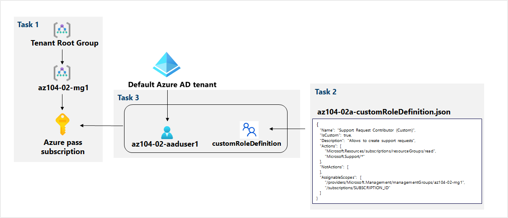

---
lab:
  title: 02a - Gérer les abonnements et RBAC
  module: Administer Governance and Compliance
---

# <a name="lab-02a---manage-subscriptions-and-rbac"></a>Labo 02a - Gérer les abonnements et RBAC
# <a name="student-lab-manual"></a>Manuel de labo pour l’étudiant

## <a name="lab-requirements"></a>Configuration de laboratoire requise

Ce labo nécessite des autorisations pour créer des utilisateurs Azure Active Directory (Azure AD), créer des rôles Contrôle d’accès en fonction du rôle (RBAC) personnalisés et attribuer ces rôles aux utilisateurs Azure AD. Tous les hôtes de laboratoire ne peuvent pas fournir cette fonctionnalité. Demandez à votre formateur la disponibilité de ce laboratoire.

## <a name="lab-scenario"></a>Scénario du labo

Pour améliorer la gestion des ressources Azure dans Contoso, vous avez été chargé d’implémenter les fonctionnalités suivantes :

- Création d’un groupe d’administration qui inclurait tous les abonnements Azure de Contoso

- Octroi d’autorisations pour envoyer des demandes de support pour tous les abonnements du groupe d’administration à un utilisateur Azure Active Directory désigné. Les autorisations de cet utilisateur doivent être limitées uniquement aux éléments suivants : 

    - Création de tickets de demande de support
    - Affichage des groupes de ressources

**Remarque :** Une **[simulation de labo interactive](https://mslabs.cloudguides.com/guides/AZ-104%20Exam%20Guide%20-%20Microsoft%20Azure%20Administrator%20Exercise%202)** est disponible et vous permet de progresser à votre propre rythme. Il peut exister de légères différences entre la simulation interactive et le labo hébergé. Toutefois, les concepts et idées de base présentés sont identiques.

## <a name="objectives"></a>Objectifs

Dans ce labo, vous allez :

+ Tâche 1 : Implémenter des groupes d’administration
+ Tâche 2 : Créer des rôles RBAC personnalisés 
+ Tâche 3 : Attribuer des rôles RBAC


## <a name="estimated-timing-30-minutes"></a>Durée estimée : 30 minutes

## <a name="architecture-diagram"></a>Diagramme de l'architecture




## <a name="instructions"></a>Instructions

### <a name="exercise-1"></a>Exercice 1

#### <a name="task-1-implement-management-groups"></a>Tâche 1 : Implémenter des groupes d’administration

Dans cette tâche, vous allez créer et configurer des groupes d’administration. 

1. Connectez-vous au [**portail Azure**](http://portal.azure.com).

1. Recherchez et sélectionnez **Groupes d’administration** pour accéder au panneau **Groupes d’administration**.

1. Passez en revue les messages en haut du panneau **Groupes d’administration**. Si vous voyez le message **Vous êtes inscrit en tant qu’administrateur d’annuaire, mais ne disposez pas des autorisations nécessaires pour accéder au groupe d’administration racine**, suivez la séquence d’étapes suivante :

    1. Dans le Portail Azure, recherchez et sélectionnez **Azure Active Directory**.
    
    1.  Dans le volet qui affiche les propriétés de votre locataire Azure Active Directory, accédez au menu vertical sur le côté gauche, et sélectionnez **Propriétés** parmi les sections dans **Gérer**.
    
    1.  Dans le panneau **Propriétés** de votre locataire Azure Active Directory, dans la section **Gestion des accès pour les ressources Azure**, sélectionnez **Oui**, puis sélectionnez **Enregistrer**.
    
    1.  Revenez au panneau **Groupes d’administration**, puis sélectionnez **Actualiser**.

1. Dans le panneau **Groupes d’administration**, cliquez sur **+ Créer**.

    >**Remarque** : Si vous n’avez pas encore créé de groupes d’administration, sélectionnez **Commencer à utiliser des groupes d’administration**

1. Créez un groupe d'administration avec les paramètres suivants :

    | Paramètre | Valeur |
    | --- | --- |
    | ID du groupe d'administration | **az104-02-mg1** |
    | Nom d’affichage du groupe d’administration | **az104-02-mg1** |

1. Dans la liste des groupes d’administration, cliquez sur l’entrée représentant le groupe d’administration nouvellement créé.

1. Dans le panneau **az104-02-mg1**, cliquez sur **Abonnements**. 

1. Dans le panneau **Abonnements az104-02-mg1\|** , cliquez sur **+ Ajouter**, dans le panneau **Ajouter un abonnement**, dans la liste déroulante **Abonnement**, sélectionnez l’abonnement que vous utilisez dans ce labo, puis cliquez sur **Enregistrer**.

    >**Remarque** : Dans le panneau **Abonnements az104-02-mg1\|** , copiez l’ID de votre abonnement Azure dans le Presse-papiers. Vous en aurez besoin dans la prochaine tâche.

#### <a name="task-2-create-custom-rbac-roles"></a>Tâche 2 : Créer des rôles RBAC personnalisés

Dans cette tâche, vous allez créer une définition d’un rôle RBAC personnalisé.

1. À partir de l’ordinateur de labo, ouvrez le fichier **\\Allfiles\\Labs\\02\\az104-02a-customRoleDefinition.json** dans Bloc-notes et passez en revue son contenu :

   ```json
   {
      "Name": "Support Request Contributor (Custom)",
      "IsCustom": true,
      "Description": "Allows to create support requests",
      "Actions": [
          "Microsoft.Resources/subscriptions/resourceGroups/read",
          "Microsoft.Support/*"
      ],
      "NotActions": [
      ],
      "AssignableScopes": [
          "/providers/Microsoft.Management/managementGroups/az104-02-mg1",
          "/subscriptions/SUBSCRIPTION_ID"
      ]
   }
   ```
    > **Remarque** : Si vous ne savez pas où les fichiers sont stockés localement dans votre environnement de laboratoire, demandez à votre instructeur.

1. Remplacez l’espace réservé `SUBSCRIPTION_ID` dans le fichier JSON par l’ID d’abonnement que vous avez copié dans le Presse-papiers et enregistrez la modification.

1. Dans le portail Azure, ouvrez le volet **Cloud Shell** en cliquant sur l’icône de barre d’outils juste à droite de la zone de texte de recherche.

1. Lorsque vous êtes invité à sélectionner **Bash** ou **PowerShell**, sélectionnez **PowerShell**. 

    >**Remarque** : Si c’est la première fois que vous démarrez **Cloud Shell** et que vous voyez le message **Vous n’avez aucun stockage monté**, sélectionnez l’abonnement que vous utilisez dans ce labo, puis sélectionnez **Créer un stockage**. 

1. Dans la barre d'outils du volet Cloud Shell, cliquez sur l'icône **Télécharger des fichiers**, dans le menu déroulant, cliquez sur **Charger** et téléchargez le fichier **\\Allfiles\\Labs\\02\\az104-02a-customRoleDefinition.json** dans le répertoire d'origine de Cloud Shell.

1. Dans le volet Cloud Shell, exécutez la commande suivante pour créer la définition de rôle personnalisée :

   ```powershell
   New-AzRoleDefinition -InputFile $HOME/az104-02a-customRoleDefinition.json
   ```

1. Fermez le volet Cloud Shell.

#### <a name="task-3-assign-rbac-roles"></a>Tâche 3 : Attribuer des rôles RBAC

Dans cette tâche, vous allez créer un utilisateur Azure Active Directory, attribuer le rôle RBAC que vous avez créé dans la tâche précédente à cet utilisateur et vérifier que l’utilisateur peut effectuer la tâche spécifiée dans la définition de rôle RBAC.

1. Dans le portail Azure, recherchez et sélectionnez **Azure Active Directory**, dans le panneau Azure Active Directory, cliquez sur **Utilisateurs**, puis sur **+ Nouvel utilisateur**.

1. Créez un nouvel utilisateur avec les paramètres suivants (laissez les autres avec leurs valeurs par défaut) :

    | Paramètre | Valeur |
    | --- | --- |
    | Nom d’utilisateur | **az104-02-aaduser1**|
    | Nom | **az104-02-aaduser1**|
    | Création du mot de passe | enabled |
    | Mot de passe initial | **Choisissez un mot de passe sécurisé** |

    >**Remarque** : **Copiez dans le presse-papier** le **nom d'utilisateur** complet. Vous en aurez besoin plus tard dans ce laboratoire.

1. Dans le portail Azure, revenez au groupe d’administration **az104-02-mg1** et affichez ses **détails**.

1. Cliquez sur **Contrôle d’accès (IAM)** , sur **+ Ajouter**, puis sur **Ajouter une attribution de rôle**. Sous l’onglet **Rôle**, recherchez **Contributeur de demande de support (personnalisé)** . 

    >**Remarque** : Si votre rôle personnalisé n’est pas visible, sachez qu’il peut prendre jusqu’à 10 minutes avant de s’afficher après sa création.

1. Sélectionnez le **Rôle** et cliquez sur **Suivant**. Sous l’onglet **Membres**, cliquez sur **+ Sélectionner des membres**, puis **sélectionnez** le compte d’utilisateur az104-***********************.**********.onmicrosoft.com. Cliquez sur **Suivant**, puis sur **Vérifier et affecter**.

1. Ouvrez une fenêtre de navigateur **InPrivate** et connectez-vous au [portail Azure](https://portal.azure.com) à l’aide du compte utilisateur que vous venez de créer. Lorsque vous êtes invité à mettre à jour le mot de passe, modifiez le mot de passe de l’utilisateur.

    >**Remarque** : Au lieu de taper le nom d’utilisateur (y compris le nom de domaine), vous pouvez coller le contenu du Presse-papiers.

1. Dans la fenêtre du navigateur **InPrivate**, dans le Portail Azure, recherchez et sélectionnez **Groupes de ressources** pour vérifier que l’utilisateur az104-02-aaduser1 peut voir tous les groupes de ressources.

1. Dans la fenêtre du navigateur **InPrivate**, dans le portail Azure, recherchez et sélectionnez **Toutes les ressources** pour vérifier que l’utilisateur az104-02-aaduser1 ne peut pas voir de ressources.

1. Dans la fenêtre du navigateur **InPrivate**, dans le portail Azure, recherchez et sélectionnez **Aide + support**, puis cliquez sur **+ Créer une demande de support**. 

1. Dans la fenêtre du navigateur **InPrivate**, sous l’onglet **Description/Résumé du problème** du panneau **Aide et support - Nouvelle demande de support**, tapez **Limites de service et d’abonnement** dans le champ Résumé, puis sélectionnez le type de problème **Limites de service et d’abonnement (quotas)** . Notez que l’abonnement que vous utilisez dans ce labo est répertorié dans la liste déroulante **Abonnement**.

    >**Remarque** : La présence de l’abonnement que vous utilisez dans ce labo dans la liste déroulante **Abonnement** indique que le compte que vous utilisez dispose des autorisations requises pour créer la demande de support spécifique à l’abonnement.

    >**Remarque** : Si vous ne voyez pas l’option **Limites de service et d’abonnement (quotas),** déconnectez-vous du portail Azure et reconnectez-vous.

1. Ne poursuivez pas la création de la demande de support. À la place, déconnectez-vous du compteur utilisateur az104-02-aaduser1 à partir du portail Azure et fermez la fenêtre de navigateur InPrivate.

#### <a name="task-4-clean-up-resources"></a>Tâche 4 : Nettoyer les ressources

   >**Remarque** : N’oubliez pas de supprimer toutes les nouvelles ressources Azure que vous n’utilisez plus. La suppression des ressources inutilisées vous permet d'éviter des frais inattendus, mais n'oubliez pas que les stratégies d'Azure n'entraînent pas de frais supplémentaires.

   >**Remarque** : Ne vous inquiétez pas si les ressources de laboratoire ne peuvent pas être immédiatement supprimées. Parfois, les ressources ont des dépendances et leur suppression prend plus de temps. Il s’agit d’une tâche d’administrateur courante pour surveiller l’utilisation des ressources. Il vous suffit donc de consulter régulièrement vos ressources dans le portail pour voir comment se passe le nettoyage.

1. Dans le portail Azure, recherchez et sélectionnez **Azure Active Directory**, dans le panneau Azure Active Directory, cliquez sur **Utilisateurs**.

1. Dans le panneau **Utilisateurs - Tous les utilisateurs**, cliquez sur **az104-02-aaduser1**.

1. Dans le panneau **az104-02-aaduser1 - Profil**, copiez la valeur de l’attribut **ID d’objet**.

1. Dans le portail Azure, démarrez une session **PowerShell** dans **Cloud Shell**.

1. Dans le volet Cloud Shell, exécutez la commande suivante pour supprimer l’attribution de la définition de rôle personnalisé (remplacez l’espace réservé `[object_ID]` par la valeur de l’attribut **ID d’objet** du compte d'utilisateur Azure Active Directory **az104-02-aaduser1** que vous avez copié précédemment dans cette tâche) :

   ```powershell
   
    $scope = (Get-AzRoleDefinition -Name 'Support Request Contributor (Custom)').AssignableScopes | Where-Object {$_ -like '*managementgroup*'}
    
    Remove-AzRoleAssignment -ObjectId '[object_ID]' -RoleDefinitionName 'Support Request Contributor (Custom)' -Scope $scope
   ```

1. Dans le volet Cloud Shell, exécutez la commande suivante pour créer la définition de rôle personnalisée :

   ```powershell
   Remove-AzRoleDefinition -Name 'Support Request Contributor (Custom)' -Force
   ```

1. Dans le portail Azure, revenez au panneau **Utilisateurs - Tous les utilisateurs** de **Azure Active Directory**, puis supprimez le compte d’utilisateur **az104-02-aaduser1**.

1. Dans le portail Azure, revenez au panneau **Groupes d’administration**. 

1. Dans le panneau **Groupes d’administration**, sélectionnez l’icône représentant des **Points de suspension** en regard de votre abonnement sous le groupe d’administration **az104-02-mg1**, puis sélectionnez **Déplacer** pour déplacer l’abonnement vers le **groupe d’administration racine du locataire**.

   >**Remarque** : Il est probable que le groupe d’administration cible soit le **groupe d’administration racine du locataire**, sauf si vous avez créé une hiérarchie de groupe d’administration personnalisée avant d’exécuter ce labo.
   
1. Sélectionnez **Actualiser** pour vérifier que l’abonnement a été déplacé vers le **groupe d’administration racine du locataire**.

1. Revenez au panneau **Groupes d’administration**, cliquez sur l’icône **Points de suspension** à droite du groupe d’administration **az104-02-mg1**, puis cliquez sur **Supprimer**.
  >**Remarque** : Si vous ne parvenez pas à supprimer le **groupe d’administration racine du locataire**, il est probable que l’**Abonnement Azure** se trouve sous le groupe d’administration. Vous devez déplacer l’**abonnement Azure** hors du **groupe d’administration racine du locataire**, puis supprimer le groupe.

#### <a name="review"></a>Révision

Dans cet exercice, vous avez :

- Implémenté des groupes d’administration
- Créé des rôles RBAC personnalisés 
- Attribué des rôles RBAC
