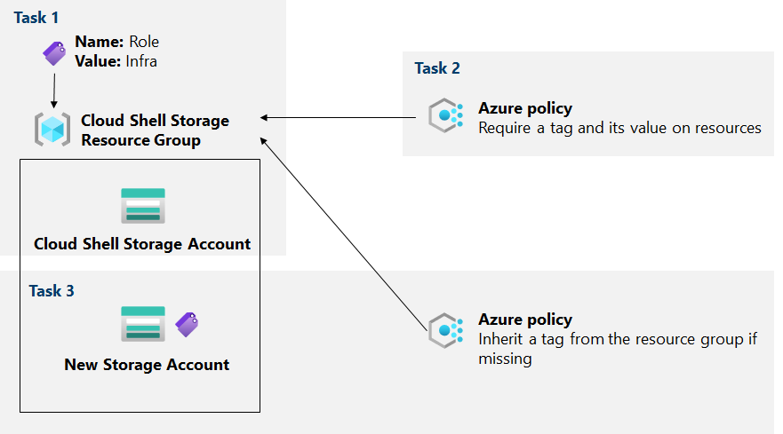

---
lab:
  title: "Labo 02b\_: Gérer la gouvernance via Azure Policy"
  module: Administer Governance and Compliance
---

# Labo 02b - Gérer la gouvernance via Azure Policy
# Manuel de labo pour l’étudiant

## Scénario du labo

Pour améliorer la gestion des ressources Azure dans Contoso, vous avez été chargé d’implémenter les fonctionnalités suivantes :

- Étiqueter des groupes de ressources qui incluent uniquement des ressources d’infrastructure (telles que des comptes de stockage Cloud Shell)

- S’assurer que seules les ressources d’infrastructure correctement étiquetées peuvent être ajoutées aux groupes de ressources d’infrastructure

- Corriger toutes les ressources non conformes

**Remarque :** Une **[simulation de labo interactive](https://mslabs.cloudguides.com/guides/AZ-104%20Exam%20Guide%20-%20Microsoft%20Azure%20Administrator%20Exercise%203)** est disponible et vous permet de progresser à votre propre rythme. Il peut exister de légères différences entre la simulation interactive et le labo hébergé. Toutefois, les concepts et idées de base présentés sont identiques. 

## Objectifs

Dans ce labo, nous allons :

+ Tâche 1 : Créer et attribuer des étiquettes via le portail Azure
+ Tâche 2 : Mettre en oeuvre l’étiquetage via une stratégie Azure
+ Tâche 3 : Appliquer l’étiquetage via une stratégie Azure

## Durée estimée : 30 minutes

## Diagramme de l'architecture



### Instructions

## Exercice 1

## Tâche 1 : Attribuer des balises via le portail Azure

Dans cette tâche, vous allez créer et affecter une étiquette à un groupe de ressources Azure via le portail Azure.

1. Dans le portail Azure, démarrez une session **PowerShell** dans **Cloud Shell**.

    >**Remarque** : Si c’est la première fois que vous démarrez **Cloud Shell** et que vous voyez le message **Vous n’avez aucun stockage monté**, sélectionnez l’abonnement que vous utilisez dans ce labo, puis sélectionnez **Créer un stockage**. 

1. Dans le volet Cloud Shell, exécutez la commande suivante pour identifier le nom du compte de stockage utilisé par Cloud Shell :

   ```powershell
   df
   ```

1. Dans la sortie de la commande, notez la première partie du chemin complet désignant le montage de lecteur d’accueil Cloud Shell (marqué ici comme `xxxxxxxxxxxxxx`suit :

   ```
   //xxxxxxxxxxxxxx.file.core.windows.net/cloudshell   (..)  /usr/csuser/clouddrive
   ```

1. Dans le portail Azure, recherchez et sélectionnez **Comptes de stockage** et, dans la liste des comptes de stockage, cliquez sur l’entrée représentant le compte de stockage que vous avez identifié à l’étape précédente.

1. Dans le panneau du compte de stockage, cliquez sur le lien représentant le nom du groupe de ressources contenant le compte de stockage.

    **Remarque** : Notez le groupe de ressources dans lequel se trouve le compte de stockage, vous en aurez besoin plus tard dans le labo.

1. Dans le panneau du groupe de ressources, cliquez sur **Étiquettes** dans le menu de gauche, puis créez une étiquette.

1. Créez une étiquette avec les paramètres suivants et appliquez votre modification :

    | Paramètre | Valeur |
    | --- | --- |
    | Nom | **Rôle** |
    | Valeur | **Infra** |

1. Cliquez sur **Appliquer**, puis fermez la fenêtre d’édition d’étiquette pour revenir au volet du compte de stockage. Cliquez sur les points de suspension dans le compte de stockage, puis sélectionnez **Modifier les étiquettes** pour noter que la nouvelle étiquette n’a pas été automatiquement attribuée au compte de stockage. 

## Tâche 2 : Mettre en oeuvre l’étiquetage via une stratégie Azure

Dans cette tâche, vous allez affecter la stratégie intégrée *Exiger une étiquette et sa valeur sur les ressources* au groupe de ressources et évaluer le résultat. 

1. Dans le portail Azure, recherchez et sélectionnez **Stratégie**. 

1. Dans la section **Création**, cliquez sur **Définitions**. Prenez le temps de parcourir la liste des définitions de stratégies intégrées que vous pouvez utiliser. Répertoriez toutes les stratégies intégrées qui impliquent l’utilisation de balises en sélectionnant l’entrée **Balises** (et en désélectionnant toutes les autres entrées) dans la liste déroulante **Catégorie**. 

1. Cliquez sur l’entrée représentant la stratégie intégrée **Exiger une étiquette et sa valeur sur les ressources** et passez en revue sa définition.

1. Dans le panneau de définition de la stratégie intégrée **Exiger une étiquette et sa valeur sur les ressources**, cliquez sur **Affecter**.

1. Spécifiez **l’étendue** en cliquant sur le bouton Points de suspension et en sélectionnant les valeurs suivantes :

    | Paramètre | Valeur |
    | --- | --- |
    | Abonnement | le nom de l’abonnement Azure que vous utilisez dans ce labo |
    | Groupe de ressources | nom du groupe de ressources contenant le compte Cloud Shell que vous avez identifié dans la tâche précédente |

    >**Remarque** : Une étendue détermine les ressources ou les groupes de ressources où l’affectation de stratégie prend effet. Vous pouvez affecter des stratégies au niveau du groupe d’administration, de l’abonnement ou du groupe de ressources. Vous avez également la possibilité de spécifier des exclusions, telles que des abonnements individuels, des groupes de ressources ou des ressources (en fonction de l’étendue d’affectation). 

1. Configurez les propriétés **de base** de l’affectation en spécifiant les paramètres suivants (laissez les autres avec leurs valeurs par défaut) :

    | Paramètre | Valeur |
    | --- | --- |
    | Nom de l’attribution | **Exiger une balise de rôle avec une valeur Infra**|
    | Description | **Exiger une balise de rôle avec une valeur Infra pour toutes les ressources du groupe de ressources Cloud Shell**|
    | Application de stratégies | activé |

    >**Remarque** : Le **Nom de l’attribution** est automatiquement rempli avec le nom de stratégie que vous avez sélectionné, mais vous pouvez le modifier. Vous pouvez également ajouter une **Description** (facultatif). **Affecté par** est automatiquement renseigné en fonction du nom d’utilisateur qui crée l’affectation. 

1. Cliquez deux fois sur **Suivant**, puis définissez **Paramètres** sur les valeurs suivantes :

    | Paramètre | Valeur |
    | --- | --- |
    | Nom de la balise | **Rôle** |
    | Valeur de la balise | **Infra** |

1. Cliquez sur **Suivant** et passez en revue l'onglet **Correction**. Laissez la case **Créer une identité managée** non cochée. 

    >**Remarque** : Ce paramètre peut être utilisé lorsque la stratégie ou l’initiative inclut l’effet **deployIfNotExists** ou **Modify**.

1. Cliquez sur **Vérifier + créer**, puis cliquez sur **Créer**.

    >**Remarque** : Vous allez maintenant vérifier que la nouvelle attribution de stratégie est en vigueur en essayant de créer un autre compte stockage Azure dans le groupe de ressources sans ajouter explicitement la balise requise. 
    
    >**Remarque** : La mise en œuvre de la stratégie peut prendre entre 5 et 15 minutes.

1. Revenez au panneau du groupe de ressources hébergeant le compte de stockage utilisé pour le lecteur de base Cloud Shell, que vous avez identifié dans la tâche précédente.

1. Dans le panneau du groupe de ressources, cliquez sur **+ Créer**, puis recherchez **Compte de stockage**, puis cliquez sur **+ Créer**. 

1. Sous l’onglet **Informations de base** du volet **Créer un compte de stockage**, vérifiez que vous utilisez le groupe de ressources auquel la stratégie a été appliquée, spécifiez les paramètres suivants (laissez les autres avec leurs valeurs par défaut), et cliquez sur **Vérifier**, puis sur **Créer** :

    | Paramètre | Valeur |
    | --- | --- |
    | Nom du compte de stockage | toute combinaison globale unique entre 3 et 24 lettres minuscules et chiffres, en commençant par une lettre |

    >**Remarque** : Il est possible que vous receviez une erreur **Échec de validation. Cliquez ici pour plus d’informations**. Dans ce cas, cliquez sur le message d’erreur pour identifier la raison de l’échec et ignorer l’étape suivante. 

1. Une fois le déploiement créé, vous devez voir le message **Échec du déploiement** dans la liste **Notifications** du portail. Dans la liste **Notifications**, accédez à la vue d'ensemble du déploiement et cliquez sur le message **Échec du déploiement. Cliquez ici pour obtenir des détails** pour identifier la raison de l'échec. 

    >**Remarque** : Vérifiez si le message d’erreur indique que le déploiement de ressources a été interdit par la stratégie. 

    >**Remarque** : En cliquant sur l’onglet **Erreur brute**, vous trouverez plus d’informations sur l’erreur, notamment le nom de la définition de rôle **Exiger une balise de rôle avec la valeur Infra**. Le déploiement a échoué, car le compte de stockage que vous avez tenté de créer n’a pas d’étiquette nommée **Role** avec sa valeur définie sur **Infra**.

## Tâche 3 : Appliquer l’étiquetage via une stratégie Azure

Dans cette tâche, nous allons utiliser une définition de stratégie différente pour corriger toutes les ressources non conformes. 

1. Dans le portail Azure, recherchez et sélectionnez **Stratégie**. 

1. Dans la section **Création**, cliquez sur **Affectations**. 

1. Dans la liste des affectations, cliquez sur l’icône Points de suspension dans la ligne représentant l’affectation de stratégie **Exiger une étiquette de rôle avec une valeur Infra** et utilisez l’élément de menu **Supprimer l’affectation** pour supprimer l’affectation.

1. Cliquez sur **Affecter une stratégie** et spécifiez **l’étendue** en cliquant sur le bouton Points de suspension et en sélectionnant les valeurs suivantes :

    | Paramètre | Valeur |
    | --- | --- |
    | Abonnement | le nom de l’abonnement Azure que vous utilisez dans ce labo |
    | Groupe de ressources | nom du groupe de ressources contenant le compte Cloud Shell que vous avez identifié dans la première tâche |

1. Pour spécifier la **définition de stratégie**, cliquez sur le bouton Points de suspension, puis recherchez et sélectionnez **Hériter d’une étiquette du groupe de ressources si elle est manquante**.

1. Configurez les propriétés **de base** restantes de l’affectation en spécifiant les paramètres suivants (laissez les autres avec leurs valeurs par défaut) :

    | Paramètre | Valeur |
    | --- | --- |
    | Nom de l’attribution | **Hériter de la balise Role et de sa valeur Infra du groupe de ressources Cloud Shell si elles manquent**|
    | Description | **Hériter de la balise Role et de sa valeur Infra du groupe de ressources Cloud Shell si elles manquent**|
    | Application de stratégies | activé |

1. Cliquez deux fois sur **Suivant**, puis définissez **Paramètres** sur les valeurs suivantes :

    | Paramètre | Valeur |
    | --- | --- |
    | Nom de la balise | **Rôle** |

1. Cliquez sur **Suivant** et, dans l’onglet **Correction**, configurez les paramètres suivants (et conservez les valeurs par défaut des autres) :

    | Paramètre | Valeur |
    | --- | --- |
    | Créer une tâche de correction | enabled |
    | Stratégie à corriger | **Hériter d’une étiquette du groupe de ressources en cas d’absence** |

    >**Remarque** : Cette définition de stratégie inclut l’effet **Modifier**.

1. Cliquez sur **Vérifier + créer**, puis cliquez sur **Créer**.

    >**Remarque** : Pour vérifier si la nouvelle affectation de stratégie est en vigueur, vous allez créer un autre compte stockage Azure dans le même groupe de ressources sans ajouter explicitement la balise requise. 
    
    >**Remarque** : La mise en œuvre de la stratégie peut prendre entre 5 et 15 minutes.

1. Revenez au panneau du groupe de ressources hébergeant le compte de stockage utilisé pour le lecteur d’accueil Cloud Shell, que vous avez identifié dans la première tâche.

1. Dans le panneau du groupe de ressources, cliquez sur **+ Créer**, puis recherchez **Compte de stockage**, puis cliquez sur **+ Créer**. 

1. Sous l’onglet **Informations de base** du volet **Créer un compte de stockage**, vérifiez que vous utilisez le groupe de ressources auquel la stratégie a été appliquée et spécifiez les paramètres suivants (laissez les autres avec leurs valeurs par défaut), puis cliquez sur **Vérifier** :

    | Paramètre | Valeur |
    | --- | --- |
    | Nom du compte de stockage | toute combinaison globale unique entre 3 et 24 lettres minuscules et chiffres, en commençant par une lettre |

1. Vérifiez que cette fois la validation a passé et cliquez sur **Créer**.

1. Une fois le nouveau compte de stockage configuré, cliquez sur le bouton **Accéder à la ressource** et, dans le panneau **Vue d’ensemble** du compte de stockage nouvellement créé, notez que la balise **Rôle** avec la valeur **Infra** a été automatiquement affectée à la ressource.

## Tâche 4 : Nettoyer les ressources

   >**Remarque** : N’oubliez pas de supprimer toutes les nouvelles ressources Azure que vous n’utilisez plus. La suppression des ressources inutilisées vous permet d'éviter des frais inattendus, mais n'oubliez pas que les stratégies d'Azure n'entraînent pas de frais supplémentaires.
   
   >**Remarque** :  Ne vous inquiétez pas si les ressources de laboratoire ne peuvent pas être immédiatement supprimées. Parfois, les ressources ont des dépendances et leur suppression prend plus de temps. Il s’agit d’une tâche d’administrateur courante pour surveiller l’utilisation des ressources. Il vous suffit donc de consulter régulièrement vos ressources dans le portail pour voir comment se passe le nettoyage. 

1. Dans le portail, recherchez et sélectionnez **Stratégie**.

1. Dans la section **Création** , cliquez sur **Affectations**, cliquez sur l’icône Points de suspension à droite de l’affectation que vous avez créée dans la tâche précédente, puis cliquez sur **Supprimer l’affectation**. 

1. Dans le portail, recherchez et sélectionnez **Comptes de stockage**.

1. Dans la liste des comptes de stockage, sélectionnez le groupe de ressources correspondant au compte de stockage que vous avez créé dans la dernière tâche de ce laboratoire. Sélectionnez **Étiquettes**, cliquez sur **Supprimer** (Corbeille à droite) l’étiquette **Role:Infra**, puis appuyez sur **Appliquer**. 

1. Cliquez sur **Vue d’ensemble**, puis cliquez sur **Supprimer** en haut du panneau du compte de stockage. Lorsque vous y êtes invité, dans le panneau **Supprimer le compte de stockage**, tapez le nom du compte de stockage pour confirmer et cliquer sur **Supprimer**. 

## Révision

Dans cet exercice, vous avez :

- Créé et affecté des balises via le portail Azure
- Mis en œuvre un balisage via une stratégie Azure
- Appliqué un balisage via une stratégie Azure
