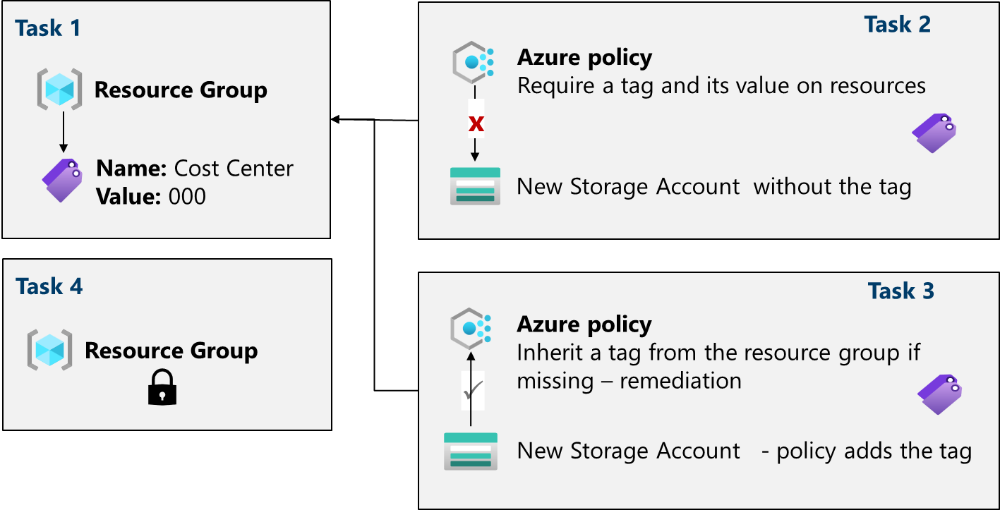

---
lab:
  title: "Labo 02b\_: Gérer la gouvernance via Azure Policy"
  module: Administer Governance and Compliance
---

# Labo 02b - Gérer la gouvernance via Azure Policy

## Présentation du labo

Dans ce labo, vous apprenez à implémenter les plans de gouvernance de votre organisation. Vous découvrez comment les stratégies Azure peuvent veiller à ce que des décisions opérationnelles soient appliquées au sein de l’organisation. Vous apprenez à utiliser le balisage des ressources pour améliorer la création de rapports. 

Ce labo nécessite un abonnement Azure. Le type de votre abonnement peut affecter la disponibilité des fonctionnalités dans ce labo. Vous pouvez changer la région, mais les étapes sont écrites de façon à utiliser **USA Est**. 

## Durée estimée : 30 minutes

## Scénario du labo

L’empreinte cloud de votre organisation a considérablement augmenté l’année dernière. Au cours d’un audit récent, vous avez découvert un nombre important de ressources qui n’ont aucun propriétaire, projet ou centre de coûts défini. Pour améliorer la gestion des ressources Azure dans votre organisation, vous décidez d’implémenter les fonctionnalités suivantes :

- appliquer des balises aux ressources pour attacher des métadonnées importantes aux ressources Azure

- appliquer l’utilisation de balises de ressources pour les nouvelles ressources en utilisant une stratégie Azure

- mettre à jour des ressources existantes avec des balises de ressources

- utiliser des verrous de ressources pour protéger des ressources configurées

## Simulations de labo interactives

Il existe plusieurs simulations de laboratoire interactives qui peuvent vous être utiles pour ce sujet. La simulation vous permet de parcourir un scénario similaire, à votre propre rythme. Il existe des différences entre la simulation interactive et ce labo, mais bon nombre des principaux concepts sont les mêmes. Un abonnement Azure n’est pas nécessaire. 

+ [Gérez les verrous des ressources](https://mslearn.cloudguides.com/en-us/guides/AZ-900%20Exam%20Guide%20-%20Azure%20Fundamentals%20Exercise%2015). Ajoutez un verrou de ressource et effectuez des tests pour confirmer.
  
+ [Créez une stratégie Azure](https://mslearn.cloudguides.com/en-us/guides/AZ-900%20Exam%20Guide%20-%20Azure%20Fundamentals%20Exercise%2017). Créez une stratégie Azure qui limite l’emplacement des ressources. Créez une ressource et vérifiez l’application de la stratégie. 

+ [Gérez la gouvernance via une stratégie Azure](https://mslabs.cloudguides.com/guides/AZ-104%20Exam%20Guide%20-%20Microsoft%20Azure%20Administrator%20Exercise%203). Créez et attribuez des balises via le Portail Azure. Créez une stratégie Azure qui exige le balisage. Corrigez les ressources non conformes.

## Diagramme de l'architecture

## Compétences de tâche

+ Tâche 1 : Créer et attribuer des étiquettes via le portail Azure.
+ Tâche 2 : Exécutez un balisage via une stratégie Azure Policy.
+ Tâche 3 : Appliquez un balisage via une stratégie Azure Policy.
+ Tâche 4 : Configurez et testez les verrous d’une ressource. 

## Tâche 1 : Attribuer des balises via le portail Azure

Dans cette tâche, vous allez créer et affecter une étiquette à un groupe de ressources Azure via le portail Azure. Les balises constituent un composant essentiel d’une stratégie de gouvernance, comme décrit par l’ensemble Microsoft Well-Architected Framework et Cloud Adoption Framework. Les balises peuvent vous permettre d’identifier rapidement les propriétaires de ressources, les dates de coucher de soleil, les contacts de groupe et d’autres paires nom/valeur que votre organisation juge importants. Pour cette tâche, vous affectez une balise identifiant le rôle de ressource (« Infra » pour « Infrastructure »).

1. Connectez-vous au **portail Azure** - `https://portal.azure.com`.
      
1. Recherchez et sélectionnez `Resource groups`.

1. Dans le Groupes de ressources, sélectionnez **+ Créer**.

    | Paramètre | Valeur |
    | --- | --- |
    | Nom d’abonnement | votre abonnement |
    | Nom du groupe ressources | `az104-rg2` |
    | Emplacement | **USA Est** |

    >**Remarque :** Pour chaque labo de ce cours, vous allez créer un groupe de ressources. Cela vous permet de localiser et de gérer rapidement vos ressources de labo. 

1. Sélectionnez **Suivant : Balises** et créez une étiquette.

    | Paramètre | Valeur |
    | --- | --- |
    | Nom | `Cost Center` |
    | Valeur | `000` |

1. Sélectionnez **Vérifier + créer**, puis **Créer**.

## Tâche 2 : Exécutez un balisage via une stratégie Azure Policy.

Dans cette tâche, vous allez affecter la stratégie intégrée *Exiger une étiquette et sa valeur sur les ressources* au groupe de ressources et évaluer le résultat. Vous pouvez utiliser Azure Policy pour appliquer une configuration et, dans ce cas, la gouvernance dans vos ressources Azure. 

1. Dans le portail Azure, recherchez et sélectionnez `Policy`. 

1. Dans le panneau **Création**, sélectionnez **Définitions**. Prenez un moment pour parcourir la liste des [définitions de stratégie intégrées](https://learn.microsoft.com/azure/governance/policy/samples/built-in-policies) disponibles que vous pouvez utiliser. Notez que vous pouvez également rechercher une définition.

    

1. Cliquez sur l’entrée représentant la stratégie intégrée **Exiger une balise et sa valeur sur les ressources**. Prenez le temps de passer la définition. 

1. Dans le panneau de définition de la stratégie intégrée **Exiger une étiquette et sa valeur sur les ressources**, cliquez sur **Affecter**.

1. Spécifiez l’**Étendue** en cliquant sur le bouton des points de suspension et en sélectionnant les valeurs suivantes. Cliquez sur **Sélectionner** lorsque vous avez terminé. 

    | Paramètre | Valeur |
    | --- | --- |
    | Abonnement | *votre abonnement* |
    | Groupe de ressources | **az104-rg2** |

    >**Remarque** : Vous pouvez affecter des stratégies au niveau du groupe d’administration, de l’abonnement ou du groupe de ressources. Vous avez également la possibilité de spécifier des exclusions, telles que des abonnements individuels, des groupes de ressources ou des ressources. Dans ce scénario, nous voulons que la balise soit sur toutes les ressources du groupe de ressources.

1. Configurez les propriétés **de base** de l’affectation en spécifiant les paramètres suivants (laissez les autres avec leurs valeurs par défaut) :

    | Paramètre | Valeur |
    | --- | --- |
    | Nom de l’attribution | `Require Cost Center tag with Default value`|
    | Description | `Require Cost Center tag with default value for all resources in the resource group`|
    | Application de stratégies | activé |

    >**Remarque** : Le **Nom de l’attribution** est automatiquement rempli avec le nom de stratégie que vous avez sélectionné, mais vous pouvez le modifier. La **description** est facultative. Notez que vous pouvez désactiver la stratégie à tout moment. 

1. Cliquez deux fois sur **Suivant**, puis définissez **Paramètres** sur les valeurs suivantes :

    | Paramètre | Valeur |
    | --- | --- |
    | Nom de la balise | `Cost Center` |
    | Valeur de la balise | `000` |

1. Cliquez sur **Suivant** et passez en revue l'onglet **Correction**. Laissez la case **Créer une identité managée** non cochée. 

1. Cliquez sur **Vérifier + créer**, puis cliquez sur **Créer**.

    >**Remarque** : Vous allez maintenant vérifier que la nouvelle attribution de stratégie est en vigueur en essayant de créer un compte Stockage Azure dans le groupe de ressources. Vous allez créer le compte de stockage sans ajouter la balise requise. 
    
    >**Remarque** : L’application de la stratégie peut prendre entre 5 et 10 minutes.

1. Dans le portail, recherchez et sélectionnez `Storage Account`, puis **+ Créer**. 

1. Sous l’onglet **Informations de base** du panneau **Créer un compte de stockage**, terminez la configuration.

    | Paramètre | Valeur |
    | --- | --- |
    | Groupe de ressources | **az104-rg2** |
    | Nom du compte de stockage | *toute combinaison globale unique de 3 à 24 lettres minuscules et chiffres, commençant par une lettre* |

1. Sélectionnez **Vérifier**, puis cliquez sur **Créer**.

1. Vous devez recevoir un message indiquant que la **validation a échoué**. Consultez le message pour identifier la raison de l’échec. Vérifiez que le message d’erreur indique que le déploiement de la ressource a été interdit par la stratégie. 

     

>**Remarque** : En cliquant sur l’onglet **Erreur brute**, vous trouverez plus d’informations sur l’erreur, notamment le nom de la définition de rôle **Exiger une balise Centre de coûts avec la valeur Par défaut**. Désolé... Nous n’avons pas pu effectuer le déploiement, car le compte de stockage que vous avez tenté de créer n’avait pas de balise nommée **Centre de coûts** avec sa valeur définie sur **Par défaut**.

## Tâche 3 : Appliquer l’étiquetage via une stratégie Azure

Dans cette tâche, nous allons utiliser la nouvelle définition de stratégie pour corriger toutes les ressources non conformes. Dans ce scénario, nous allons faire hériter toutes les ressources enfants d’un groupe de ressources de la balise **Centre de coûts** définie sur le groupe de ressources.

1. Dans le portail Azure, recherchez et sélectionnez `Policy`. 

1. Dans la section **Création**, cliquez sur **Affectations**. 

1. Dans la liste des affectations, cliquez sur l’icône des points de suspension sur la ligne représentant l’affectation de stratégie **Exiger une balise Centre de coûts avec la valeur Par défaut** et utilisez l’élément de menu **Supprimer l’affectation** pour supprimer l’affectation.

1. Cliquez sur **Affecter une stratégie** et spécifiez **l’étendue** en cliquant sur le bouton Points de suspension et en sélectionnant les valeurs suivantes :

    | Paramètre | Valeur |
    | --- | --- |
    | Abonnement | votre abonnement Azure |
    | Groupe de ressources | `az104-rg2` |

1. Pour spécifier la **Définition de stratégie**, cliquez sur le bouton des points de suspension, puis recherchez et sélectionnez `Inherit a tag from the resource group if missing`.

1. Sélectionnez **Ajouter**, puis configurez les propriétés **De base** restantes de l’affectation.

    | Paramètre | Valeur |
    | --- | --- |
    | Nom de l’attribution | `Inherit the Cost Center tag and its value 000 from the resource group if missing` |
    | Description | `Inherit the Cost Center tag and its value 000 from the resource group if missing` |
    | Application de stratégies | activé |

1. Cliquez deux fois sur **Suivant**, puis définissez **Paramètres** sur les valeurs suivantes :

    | Paramètre | Valeur |
    | --- | --- |
    | Nom de la balise | `Cost Center` |

1. Cliquez sur **Suivant** et, dans l’onglet **Correction**, configurez les paramètres suivants (et conservez les valeurs par défaut des autres) :

    | Paramètre | Valeur |
    | --- | --- |
    | Créer une tâche de correction | enabled |
    | Stratégie à corriger | **Hériter d’une étiquette du groupe de ressources en cas d’absence** |

    >**Remarque** : Cette définition de stratégie inclut l’effet **Modifier**. Par conséquent, une identité managée est nécessaire. 

     

1. Cliquez sur **Vérifier + créer**, puis cliquez sur **Créer**.

    >**Remarque** : Pour vérifier si la nouvelle affectation de stratégie est en vigueur, vous allez créer un autre compte de stockage Azure dans le même groupe de ressources sans ajouter explicitement la balise requise. 
    
    >**Remarque** : L’application de la stratégie peut prendre entre 5 et 10 minutes.

1. Recherchez et sélectionnez `Storage Account`, puis cliquez sur **+ Créer**. 

1. Sous l’onglet **Informations de base** du volet **Créer un compte de stockage**, vérifiez que vous utilisez le groupe de ressources auquel la stratégie a été appliquée et spécifiez les paramètres suivants (laissez les autres avec leurs valeurs par défaut), puis cliquez sur **Vérifier** :

    | Paramètre | Valeur |
    | --- | --- |
    | Nom du compte de stockage | *toute combinaison globale unique de 3 à 24 lettres minuscules et chiffres, commençant par une lettre* |

1. Vérifiez que cette fois la validation a passé et cliquez sur **Créer**.

1. Une fois le nouveau compte de stockage configuré, cliquez sur **Accéder à la ressource**.

1. Dans le panneau **Balises**, notez que l’étiquette **Centre de coûts** avec la valeur **000** a été automatiquement affectée à la ressource.

    >**Le saviez-vous ?** Si vous recherchez et sélectionnez **Balises** dans le portail, vous pouvez afficher les ressources avec une balise spécifique. 

## Tâche 4 : Configurez et testez les verrous d’une ressource.

Dans cette tâche, vous configurez et testez un verrou de ressource. Les verrous empêchent les suppressions ou les modifications d’une ressource. 

1. Recherchez et sélectionnez votre groupe de ressources.
   
1. Dans le panneau **Paramètres**, sélectionnez **Verrous**.

1. Sélectionnez **Ajouter** et remplissez les informations sur le verrou de ressource. Une fois terminé, sélectionnez **OK**. 

    | Paramètre | Value |
    | --- | --- |
    | Nom du verrou | `rg-lock` |
    | Type de verrou | **supprimer** (notez la sélection en lecture seule) |
    
1. Accédez au panneau **Vue d’ensemble** du groupe de ressources, puis sélectionnez **Supprimer le groupe de ressources**.

1. Dans la zone de texte **Entrer le nom du groupe de ressources pour confirmer la suppression**, indiquez le nom du groupe de ressources, `az104-rg2`. Notez que vous pouvez copier et coller le nom du groupe de ressources. 

1. Notez l’avertissement : La suppression de ce groupe de ressources et de ses ressources dépendantes est une action définitive et ne peut pas être annulée. Sélectionnez **Supprimer**.

1. Vous devriez recevoir une notification refusant la suppression. 

     

## Nettoyage de vos ressources

Si vous travaillez avec **votre propre abonnement**, prenez un moment pour supprimer les ressources du labo. Ceci garantit que les ressources sont libérées et que les coûts sont réduits. Le moyen le plus simple de supprimer les ressources du labo est de supprimer le groupe de ressources du labo. 

+ Dans le Portail Azure, sélectionnez le groupe de ressources, **Supprimer le groupe de ressources**, **Entrer le nom du groupe de ressources**, puis cliquez sur **Supprimer**.
+ `Remove-AzResourceGroup -Name resourceGroupName` en utilisant Azure PowerShell.
+ `az group delete --name resourceGroupName` en utilisant l’interface CLI.

## Points clés

Félicitations, vous avez terminé le labo. Voici les principaux points à retenir de ce labo. 

+ Les balises Azure sont des métadonnées qui se composent d’une paire clé-valeur. Les balises décrivent une ressource particulière dans votre environnement. En particulier, le balisage dans Azure vous permet d’étiqueter vos ressources de manière logique.
+ Azure Policy établit des conventions pour les ressources. Les définitions de stratégie décrivent les conditions de la conformité des ressources et l’effet à exécuter si une condition est remplie. Une condition compare un champ ou une valeur de propriété de ressource à une valeur requise. Il existe de nombreuses définitions de stratégie intégrées et vous pouvez personnaliser les stratégies. 
+ Vous utilisez la fonctionnalité de tâche de correction Azure Policy pour rendre des ressources conformes en fonction d’une définition et d’une affectation. Les ressources non conformes à une attribution de définition modify ou deployIfNotExist peuvent être mises en conformité à l’aide d’une tâche de correction.
+ Vous pouvez configurer un verrou de ressource sur un abonnement, un groupe de ressources ou une ressource. Le verrou peut protéger une ressource contre les suppressions et modifications accidentelles des utilisateurs. Le verrou remplace toutes les autorisations que les utilisateurs ont.
+ Azure Policy est une pratique de sécurité en prédéploiement. Les verrous de ressources et RBAC constituent une pratique de sécurité postérieure au déploiement. 

## En savoir plus grâce à l’apprentissage auto-rythmé

+ [Concevez une stratégie de gouvernance d’entreprise](https://learn.microsoft.com/training/modules/enterprise-governance/). Utilisez RBAC et Azure Policy pour limiter l’accès à vos solutions Azure et déterminer la méthode qui convient le mieux à vos objectifs de sécurité.
  

