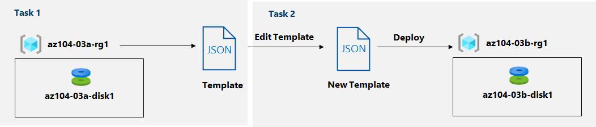

---
lab:
  title: "03b : Gérer les ressources Azure à l’aide de modèles\_ARM"
  module: Administer Azure Resources
---

# <a name="lab-03b---manage-azure-resources-by-using-arm-templates"></a>Labo 03b : Gérer les ressources Azure à l’aide de modèles ARM
# <a name="student-lab-manual"></a>Manuel de labo de l’étudiant

## <a name="lab-scenario"></a>Scénario du labo
Maintenant que vous avez exploré les fonctionnalités d’administration Azure de base associées à l’approvisionnement des ressources et à leur organisation en fonction de groupes de ressources à l’aide du portail Azure, vous devez effectuer la tâche équivalente à l’aide des modèles Azure Resource Manager.

**Remarque :** Une **[simulation de labo interactive](https://mslabs.cloudguides.com/guides/AZ-104%20Exam%20Guide%20-%20Microsoft%20Azure%20Administrator%20Exercise%205)** est disponible et vous permet de progresser à votre propre rythme. Il peut exister de légères différences entre la simulation interactive et le labo hébergé. Toutefois, les concepts et idées de base présentés sont identiques. 

## <a name="objectives"></a>Objectifs

Dans ce labo, vous allez :

+ Tâche 1 : Passer en revue un modèle ARM pour le déploiement d’un disque managé Azure
+ Tâche 2 : Créer un disque managé Azure à l’aide d’un modèle ARM
+ Tâche 3 : Passer en revue le déploiement basé sur le modèle ARM du disque managé

## <a name="estimated-timing-20-minutes"></a>Durée estimée : 20 minutes

## <a name="architecture-diagram"></a>Diagramme de l'architecture



## <a name="instructions"></a>Instructions

### <a name="exercise-1"></a>Exercice 1

#### <a name="task-1-review-an-arm-template-for-deployment-of-an-azure-managed-disk"></a>Tâche 1 : Passer en revue un modèle ARM pour le déploiement d’un disque managé Azure

1. Connectez-vous au [**portail Azure**](http://portal.azure.com).

1. Depuis le portail Azure, recherchez et sélectionnez **Groupes de ressources**. 

1. Dans la liste des groupes de ressources, cliquez sur **az104-03a-rg1**.

1. Dans le volet du groupe de ressources **az104-03a-rg1**, dans la section **Paramètres**, cliquez sur **Déploiements**.

1. Dans le panneau **az104-03a-rg1 - Déploiements**, cliquez sur la première entrée dans la liste des déploiements.

1. Dans le volet **Microsoft.ManagedDisk-* XXXXXXXXX* \| Vue d’ensemble**, cliquez sur **Modèle**.

    >**Remarque** : Passez en revue le contenu du modèle et notez que vous avez la possibilité de le **télécharger** sur l’ordinateur local, de l’**ajouter à la bibliothèque** ou de le **déployer** à nouveau.

1. Cliquez sur **Télécharger** et enregistrez le fichier compressé contenant le modèle et les fichiers de paramètres dans le dossier **Téléchargements** sur votre ordinateur de labo.

1. Dans le volet **Microsoft.ManagedDisk-* XXXXXXXXX* \| Modèle**, cliquez sur **Entrées**.

1. Notez la valeur du paramètre d'**emplacement**. Vous en aurez besoin dans la prochaine tâche.

1. Extrayez le contenu du fichier téléchargé dans le dossier **Téléchargements** sur votre ordinateur de labo.

    >**Remarque** : Ces fichiers sont également disponibles en tant que **\\Allfiles\\Labs\\03\\az104-03b-md-template.json** et **\\Allfiles\\Labs\\03\\az104-03b-md-parameters.json**.
    
1. Fermez toutes les fenêtres de l’**Explorateur de fichiers**.

#### <a name="task-2-create-an-azure-managed-disk-by-using-an-arm-template"></a>Tâche 2 : Créer un disque managé Azure à l’aide d’un modèle ARM

1. Dans le portail Azure, recherchez et sélectionnez **Déployer un modèle personnalisé**.

1. Dans le volet **Déploiement personnalisé**, cliquez sur **Créer votre propre modèle dans l’éditeur**.

1. Dans le volet **Modifier le modèle**, cliquez sur **Charger le fichier** et chargez le fichier **template.json** que vous avez téléchargé dans la tâche précédente.

1. Dans le volet de l’éditeur, supprimez les lignes suivantes :

   ```json
   "sourceResourceId": {
       "type": "String"
   },
   ```

   ```json
   "hyperVGeneration": {
       "defaultValue": "V1",
       "type": "String"
   },      
   ```

    >**Remarque** : Ces paramètres sont supprimés, car ils ne sont pas applicables au déploiement actuel. Plus particulièrement, les paramètres sourceResourceId, sourceUri, osType et hyperVGeneration s’appliquent à la création d’un disque Azure à partir d’un fichier VHD existant.

1. **Enregistrez** les modifications.

1. Dans le volet **Déploiement personnalisé**, cliquez sur **Modifier les paramètres**. 

1. Dans le volet **Modifier les paramètres**, cliquez sur **Charger le fichier** et chargez le fichier **parameters.json** que vous avez téléchargé dans la tâche précédente, puis **enregistrez** les modifications.

1. Dans le volet **Déploiement personnalisé**, spécifiez les paramètres suivants :

    | Paramètre | Valeur |
    | --- |--- |
    | Abonnement | *le nom de l’abonnement Azure que vous utilisez dans ce labo* |
    | Groupe de ressources | le nom d’un **nouveau** groupe de ressources **az104-03b-rg1** |
    | Région | le nom de n’importe quelle région Azure disponible dans l’abonnement que vous utilisez dans ce labo |
    | Nom du disque | **az104-03b-disk1** |
    | Emplacement | la valeur du paramètre d’emplacement que vous avez noté dans la tâche précédente |
    | Sku | **Standard_LRS** |
    | Taille de disque en Go | **32** |
    | Créer une option | **empty** |
    | Type de jeu de chiffrement de disque | **EncryptionAtRestWithPlatformKey** |
    | Stratégie d'accès réseau | **AllowAll** |

1. Sélectionnez **Vérifier + créer**, puis sélectionnez **Créer**.

1. Vérifiez que le déploiement a abouti.

#### <a name="task-3-review-the-arm-template-based-deployment-of-the-managed-disk"></a>Tâche 3 : Passer en revue le déploiement basé sur le modèle ARM du disque managé

1. Depuis le portail Azure, recherchez et sélectionnez **Groupes de ressources**. 

1. Dans la liste des groupes de ressources, cliquez sur **az104-03b-rg1**.

1. Dans le volet du groupe de ressources **az104-03b-rg1**, dans la section **Paramètres**, cliquez sur **Déploiements**.

1. Dans le panneau **az104-03b-rg1 - Déploiements** ,cliquez sur la première entrée dans la liste des déploiements et passez en revue le contenu des panneaux **Entrée** et **Modèle**.

#### <a name="clean-up-resources"></a>Nettoyer les ressources

   >**Remarque** : Ne supprimez pas les ressources que vous avez déployées dans ce labo. Vous en aurez besoin dans le labo suivant de ce module.

#### <a name="review"></a>Révision

Dans ce labo, vous avez :

- Passé en revue un modèle ARM pour le déploiement d’un disque managé Azure
- Créé un disque managé Azure à l’aide d’un modèle ARM
- Passé en revue le déploiement basé sur le modèle ARM du disque managé
