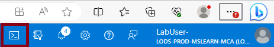

---
lab:
  title: 'Lab 03 : Gérer des ressources Azure en utilisant des modèles Azure Resource Manager'
  module: Administer Azure Resources
---

# Labo 03 : gérer des ressources Azure en utilisant des modèles Azure Resource Manager

## Présentation du labo

Dans ce labo, vous apprenez à automatiser les déploiements de ressources. Vous découvrez plus d’informations sur les modèles Azure Resource Manager et Bicep. Vous découvrez les différentes manières de déployer les modèles. 

Ce labo nécessite un abonnement Azure. Le type de votre abonnement peut affecter la disponibilité des fonctionnalités dans ce labo. Vous pouvez changer la région, mais les étapes sont écrites de façon à utiliser **USA Est**. 

## Durée estimée : 50 minutes

## Simulations de labo interactives

Il existe des simulations de labo interactives qui peuvent vous être utiles pour cette rubrique. La simulation vous permet de parcourir un scénario similaire, à votre propre rythme. Il existe des différences entre la simulation interactive et ce labo, mais bon nombre des principaux concepts sont les mêmes. Un abonnement Azure n’est pas nécessaire. 

+ [Gérez des ressources Azure en utilisant des modèles Azure Resource Manager](https://mslabs.cloudguides.com/guides/AZ-104%20Exam%20Guide%20-%20Microsoft%20Azure%20Administrator%20Exercise%205). Passez en revue, créez et déployez des disques managés avec un modèle.
  
+ [Créez une machine virtuelle avec un modèle](https://mslearn.cloudguides.com/en-us/guides/AZ-900%20Exam%20Guide%20-%20Azure%20Fundamentals%20Exercise%209). Déployez une machine virtuelle avec des modèles de démarrage rapide.
  
## Scénario du labo

Votre équipe souhaite connaître les moyens d’automatiser et de simplifier les déploiements de ressources. Votre organisation cherche comment diminuer la surcharge administrative, réduire les erreurs humaines et augmenter la cohérence.  

## Diagramme de l'architecture


## Compétences de tâche

+ Tâche 1 : créer un modèle Azure Resource Manager.
+ Tâche 2 : modifier un modèle Azure Resource Manager et redéployer le modèle.
+ Tâche 3 : configurer Cloud Shell et déployer un modèle avec Azure PowerShell.
+ Tâche 4 : déployer des modèles Azure avec l’interface CLI. 
+ Tâche 5 : Déployez une ressource en tirant parti d’Azure Bicep.

## Tâche 1 : Créer un modèle Azure Resource Manager

Dans cette tâche, nous allons créer un disque managé dans le Portail Azure. Les disques managés constituent un stockage conçu pour être utilisé avec des machines virtuelles. Une fois le disque déployé, vous allez exporter un modèle qu’il vous sera possible d’utiliser dans d’autres déploiements.

1. Connectez-vous au **portail Azure** - `https://portal.azure.com`.

1. Recherchez et sélectionnez `Disks`. 
   
1. Dans la page Disques, sélectionnez **Créer**.

1. Dans la page **Créer un disque managé**, configurez le disque, puis sélectionnez **OK**. 
    
    | Paramètre | Valeur |
    | --- | --- |
    | Abonnement | *votre abonnement* | 
    | Groupe de ressources | `az104-rg3` (Si nécessaire, sélectionnez **Créer**.)
    | Nom du disque | `az104-disk1` | 
    | Région | **USA Est** |
    | Zone de disponibilité | **Aucune redondance de l’infrastructure requise** | 
    | Type de source | **Aucun** |
    | Performances | **HDD Standard** (modifier la taille) |
    | Taille | **32 Gio** | 

    >**Remarque :** Nous créons un disque managé simple pour vous permettre d’utiliser des modèles. Les disques managés Azure sont des volumes de stockage au niveau du bloc gérés par Azure.

1. Cliquez sur **Vérifier + créer**, puis sélectionnez **Créer**.

1. Surveillez les notifications (en haut à droite) et, après le déploiement, sélectionnez **Accéder à la ressource**. 

1. Dans le panneau **Automatisation**, sélectionnez **Exporter un modèle**. 

1. Prenez quelques instants pour passer en revue les fichiers **Modèle** et **Paramètres**.

1. Cliquez sur **Télécharger** et enregistrez les modèles sur le lecteur local. Cette opération crée un fichier compressé zippé. 

1. Utilisez Explorateur de fichiers pour extraire le contenu du fichier téléchargé dans le dossier **Téléchargements** sur votre ordinateur. Remarquez qu’il existe deux fichiers JSON (modèle et paramètres). 

   >**Le saviez-vous ?**  Vous pouvez exporter un groupe de ressources complet ou simplement des ressources spécifiques au sein de ce groupe de ressources.

## Tâche 2 : Modifiez un modèle Azure Resource Manager, puis redéployez-le.

Dans cette tâche, vous utilisez le modèle téléchargé pour déployer un nouveau disque managé. Cette tâche explique comment répéter rapidement et facilement des déploiements. 

1. Dans le portail Azure, recherchez et sélectionnez `Deploy a custom template`.

1. Dans le panneau **Déploiement personnalisé**, notez qu’il est possible d’utiliser des **Modèles de démarrage rapide**. Il existe de nombreux modèles intégrés comme illustré dans le menu déroulant. 

1. Au lieu d’utiliser un Démarrage rapide, sélectionnez **Créer votre propre modèle dans l’éditeur**.

1. Dans le panneau **Modifier le modèle**, cliquez sur **Charger le fichier**, puis chargez le fichier **template.json** téléchargé sur le disque local.

1. Au sein du volet de l’éditeur, apportez ces modifications.

    + Remplacez **disks_az104_disk1_name** par `disk_name` (deux emplacements à modifier)
    + Remplacez **az104-disk1** par `az104-disk2` (un emplacement à modifier).

1. Notez qu’il s’agit d’un disque **Standard**. L’emplacement est **eastus**. La taille du disque est **32 Go**.

1. **Enregistrez** les changements apportés.

1. N’oubliez pas le fichier de paramètres. Sélectionnez **Modifier les paramètres**, cliquez sur **Charger le fichier**, puis chargez le fichier **parameters.json**. 

1. Apportez cette modification pour qu’elle corresponde au fichier du modèle.

    Remplacez **disks_az104_disk1_name** par **disk_name** (un emplacement à modifier)

1. **Enregistrez** les changements apportés. 

1. Terminez les paramètres de déploiement personnalisés :

    | Paramètre | Valeur |
    | --- |--- |
    | Abonnement | *votre abonnement* |
    | Groupe de ressources | `az104-rg3` |
    | Région | **(États-Unis) USA Est** |
    | Disk_name | `az104-disk2` |

1. Sélectionnez **Vérifier + créer**, puis sélectionnez **Créer**.

1. Sélectionnez **Accéder à la ressource**. Vérifiez que **az104-disk2** a été créé.

1. Dans le panneau **Vue d’ensemble**, sélectionnez le groupe de ressources, **az104-rg3**. Vous devriez maintenant avoir deux disques.
   
1. Dans la section **Paramètres**, cliquez sur **Déploiements**.

    >**Remarque :** Toutes les informations sur les déploiements sont documentées dans le groupe de ressources. Il est recommandé de passer en revue les premiers déploiements basés sur un modèle afin de favoriser la réussite avant d’utiliser les modèles pour des opérations à grande échelle.

1. Sélectionnez un déploiement, puis passez en revue le contenu des panneaux **Entrée** et **Modèle**.

## Tâche 3 : Configurez le service Cloud Shell et déployez un modèle avec PowerShell 

Dans cette tâche, vous travaillez avec le service Azure Cloud Shell et Azure PowerShell. Azure Cloud Shell est un terminal interactif, authentifié et accessible par navigateur qui permet de gérer les ressources Azure. Il vous donne la possibilité de choisir l'expérience d'interpréteur de commandes la plus adaptée à votre façon de travailler, qu'il s'agisse de Bash ou de PowerShell. Dans cette tâche, vous utilisez PowerShell pour déployer un modèle. 

1. Sélectionnez l’icône **Cloud Shell** en haut à droite du Portail Azure. Vous pouvez également directement accéder à `https://shell.azure.com`.

   

1. Lorsque vous êtes invité à sélectionner **Bash** ou **PowerShell**, sélectionnez **PowerShell**. 

    >**Le saviez-vous ?**  Si vous travaillez principalement avec des systèmes Linux, Bash (interface CLI) semble plus familier. Si vous travaillez principalement avec des systèmes Windows, Azure PowerShell semble plus familier. 

1. Dans l’écran de **prise en main**, sélectionnez **Monter un compte de stockage**, sélectionnez votre **abonnement au compte de stockage**, puis sélectionnez **Appliquer**.

1. Sélectionnez **Je souhaite créer un compte de stockage**, puis **Suivant**. Pour plus d’informations, consultez **Créer un compte de stockage**. 
    
    | Paramètres | Valeurs |
    |  -- | -- |
    | Groupe de ressources | **az104-rg3** |
    | Région | *sélectionnez votre région* | 
    | Compte de stockage (Créer) | *doit être globalement unique, comprendre entre 3 et 24 caractères et comporter uniquement des chiffres et des lettres en minuscules* |
    | Partage de fichiers (Créer) | `fs-cloudshell` |

1. Une fois terminé, sélectionnez **Créer**.

    >L’approvisionnement du stockage prend quelques minutes.

1. Sélectionnez **Paramètres** (barre supérieure), puis **Accéder à la version classique**.

1. Sélectionnez l’icône **Charger/Télécharger des fichiers** (barre supérieure), puis sélectionnez **Charger**.

1. Chargez les fichiers de modèle et de paramètres à partir du répertoire **Téléchargements**. 

1. Sélectionnez l’icône **Éditeur** (accolades) et accédez au fichier JSON de modèle à gauche dans le volet de navigation.

1. Apportez la modification souhaitée. Par exemple, remplacez le nom du disque par **az104-disk3**. Utilisez les touches **Ctrl+S** pour enregistrer vos modifications. 

    >**Remarque** : Vous pouvez cibler le déploiement de votre modèle au niveau d’un groupe de ressources, d’un abonnement, d’un groupe d’administration ou d’un tenant. Les commandes à utiliser diffèrent en fonction de l’étendue du déploiement.

1. Pour un déploiement dans un groupe de ressources, utilisez **New-AzResourceGroupDeployment**.

    ```powershell
    New-AzResourceGroupDeployment -ResourceGroupName az104-rg3 -TemplateFile template.json -TemplateParameterFile parameters.json
    ```
1. Vérifiez que la commande se termine et que ProvisioningState indique une **Réussite**.

1. Confirmez la création du disque.

   ```powershell
   Get-AzDisk
   ```
   
## Tâche 4 : Déployez un modèle avec l’interface CLI. 

1. Poursuivez dans **Cloud Shell**, sélectionnez **Bash**. **Confirmez** votre choix.

1. Vérifiez que vos fichiers sont disponibles dans le stockage Cloud Shell. Si vous avez achevé la tâche précédente, vos fichiers de modèle doivent être disponibles. 

    ```sh
    ls
    ```

1. Sélectionnez l’icône **Éditeur** (accolades) et accédez au fichier JSON de modèle.

1. Apportez la modification souhaitée. Par exemple, remplacez le nom du disque par **az104-disk4**. Utilisez les touches **Ctrl+S** pour enregistrer vos modifications. 

    >**Remarque** : Vous pouvez cibler le déploiement de votre modèle au niveau d’un groupe de ressources, d’un abonnement, d’un groupe d’administration ou d’un tenant. Les commandes à utiliser diffèrent en fonction de l’étendue du déploiement.

1. Pour un déploiement dans un groupe de ressources, utilisez **az deployment group create**.

    ```sh
    az deployment group create --resource-group az104-rg3 --template-file template.json --parameters parameters.json
    ```
    
1. Vérifiez que la commande se termine et que ProvisioningState indique une **Réussite**.

1. Confirmez la création du disque.

     ```sh
     az disk list --output table
     ```
   
## Tâche 5 : Déployez une ressource en tirant parti d’Azure Bicep.

Dans cette tâche, vous allez utiliser un fichier Bicep pour déployer un disque managé. Bicep est un outil d’automatisation déclaratif qui repose sur des modèles ARM.

1. Recherchez le fichier **\Allfiles\Lab03\azuredeploydisk.bicep**.

1. Continuez à travailler dans le service **Cloud Shell** d’une session **Bash**.

1. Sélectionnez **Gérer les fichiers**, puis **chargez** le fichier Bicep dans Cloud Shell. 

1. Cliquez sur **Éditeur** et lorsque vous y êtes invité,**confirmez** le basculement vers Classic Cloud Shell.

1. Sélectionner le fichier **azuredeploydisk.bicep** 

1. Prenez une minute pour parcourir le modèle de fichier Bicep. Notez la manière dont la ressource de disque est définie. 
   
1. Apportez les modifications suivantes :

    + Remplacez la valeur **managedDiskName**, ligne 4, par Disk4.
    + Remplacez la valeur du **nom de la référence SKU**, ligne 26, par StandardSSD_LRS.
    + Remplacez la valeur **diskSizeinGiB**, ligne 7, par 32.

    >**Note :** un modèle Bicep terminé est disponible dans les fichiers de labo.
    
1. Utilisez les touches **Ctrl+S** pour enregistrer vos modifications.

1. Déployez maintenant le modèle.

    ```
    az deployment group create --resource-group az104-rg3 --template-file azuredeploydisk.bicep
    ```

1. Confirmez la création du disque.

    ```sh
    az disk list --output table
    ```

    >**Remarque :** Vous avez correctement déployé cinq disques managés, chacun d’une manière différente. Bravo !

## Nettoyage de vos ressources

Si vous travaillez avec **votre propre abonnement**, prenez un moment pour supprimer les ressources du labo. Ceci garantit que les ressources sont libérées et que les coûts sont réduits. Le moyen le plus simple de supprimer les ressources du labo est de supprimer le groupe de ressources du labo. 

+ Dans le Portail Azure, sélectionnez le groupe de ressources, **Supprimer le groupe de ressources**, **Entrer le nom du groupe de ressources**, puis cliquez sur **Supprimer**.
+ `Remove-AzResourceGroup -Name resourceGroupName` en utilisant Azure PowerShell.
+ `az group delete --name resourceGroupName` en utilisant l’interface CLI.

## Développer votre apprentissage avec Copilot

Copilot peut vous aider à apprendre à utiliser les outils de script Azure. Copilot peut également aider dans des domaines non couverts dans le labo ou quand vous avez besoin de plus d’informations. Ouvrez un navigateur Edge et choisissez Copilot (en haut à droite), ou accédez à *copilot.microsoft.com*. Prenez quelques minutes pour essayer ces prompts.

+ Quel est le format du fichier de modèle Azure Resource Manager ? Expliquez chaque composant à l’aide d’exemples. 
+ Comment puis-je utiliser un modèle Azure Resource Manager existant ?
+ Comparez et mettez en contraste les modèles Azure Resource Manager et les modèles Bicep. 


## En savoir plus grâce à l’apprentissage auto-rythmé

+ [Déployez une infrastructure Azure en utilisant des modèles ARM JSON](https://learn.microsoft.com/training/modules/create-azure-resource-manager-template-vs-code/). Rédigez des modèles Azure Resource Manager JSON (modèles ARM) en utilisant Visual Studio Code pour déployer votre infrastructure de manière cohérente et fiable sur Azure.
+ [Passez en revue les fonctionnalités et les outils d’Azure Cloud Shell](https://learn.microsoft.com/training/modules/review-features-tools-for-azure-cloud-shell/). Fonctionnalités et outils Cloud Shell. 
+ [Gérez des ressources Azure avec Windows PowerShell](https://learn.microsoft.com/training/modules/manage-azure-resources-windows-powershell/). Ce module explique comment installer les modules nécessaires à la gestion des services cloud et comment utiliser les commandes PowerShell pour effectuer des tâches administratives simples sur des ressources cloud telles que des machines virtuelles Azure, des abonnements Azure et des comptes de stockage Azure.
+ [Présentation de Bash](https://learn.microsoft.com/training/modules/bash-introduction/). Utilisez Bash pour gérer l’infrastructure informatique.
+ [Créer votre premier modèle Bicep](https://learn.microsoft.com/training/modules/build-first-bicep-template/). Définissez des ressources Azure dans un modèle Bicep. Améliorez la cohérence et la fiabilité de vos déploiements, réduisez l’effort manuel requis et mettez à l’échelle vos déploiements dans différents environnements. Votre modèle sera flexible et réutilisable grâce à l’utilisation de paramètres, de variables, d’expressions et de modules.

## Points clés

Félicitations, vous avez terminé le labo. Voici les principaux points à retenir de ce labo. 

+ Les modèles Resource Manager vous permettent de déployer, gérer et surveiller toutes les ressources de votre solution en tant que groupe, plutôt que de gérer ces ressources individuellement.
+ Un modèle Azure Resource Manager est un fichier JSON (JavaScript Object Notation) qui vous permet de gérer votre infrastructure de manière déclarative plutôt qu’avec des scripts.
+ Au lieu de passer des paramètres en tant que valeurs inline dans votre modèle, vous pouvez utiliser un fichier JSON distinct qui contient les valeurs des paramètres.
+ Vous pouvez déployer des modèles Azure Resource Manager de différentes façons, notamment le Portail Azure, Azure PowerShell et l’interface CLI.
+ Bicep est une alternative aux modèles Azure Resource Manager. Bicep utilise une syntaxe déclarative pour déployer des ressources Azure.
+ Bicep fournit une syntaxe concise, une cohérence des types fiable et une prise en charge de la réutilisation du code. Bicep offre la meilleure expérience de création pour vos solutions d’infrastructure en tant que code dans Azure.


