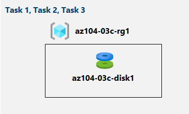

---
lab:
  title: '03c : Gérer des ressources Azure à l’aide d’Azure PowerShell'
  module: Module 03 - Azure Administration
ms.openlocfilehash: 4210a06af5b873e1031e2224239dd8738e97f23d
ms.sourcegitcommit: a8c7d995806dcf8eaad35b204e87bde178f28443
ms.translationtype: HT
ms.contentlocale: fr-FR
ms.lasthandoff: 02/08/2022
ms.locfileid: "145198129"
---
# <a name="lab-03c---manage-azure-resources-by-using-azure-powershell"></a>Labo 03c : Gérer des ressources Azure à l’aide d’Azure PowerShell
# <a name="student-lab-manual"></a>Manuel de labo pour étudiant

## <a name="lab-scenario"></a>Scénario du labo

Maintenant que vous avez exploré les fonctionnalités d’administration Azure de base associées à l’approvisionnement des ressources et en les organisant en fonction de groupes de ressources à l’aide du Portail Azure et des modèles Azure Resource Manager, vous devez effectuer la tâche équivalente à l’aide d’Azure PowerShell. Pour éviter d’installer les modules Azure PowerShell, vous utiliserez l’environnement PowerShell disponible dans Azure Cloud Shell.

## <a name="objectives"></a>Objectifs

Dans ce labo, vous allez :

+ Tâche 1 : Démarrer une session PowerShell dans Azure Cloud Shell
+ Tâche 2 : Créer un groupe de ressources et un disque managé Azure à l’aide d’Azure PowerShell
+ Tâche 3 : Configurer le disque managé à l’aide d’Azure PowerShell

## <a name="estimated-timing-20-minutes"></a>Durée estimée : 20 minutes

## <a name="architecture-diagram"></a>Diagramme de l'architecture



## <a name="instructions"></a>Instructions

> **Remarque** :  Créez toujours votre propre mot de passe sécurisé pour toute machine virtuelle ou compte d’utilisateur que vous créez. Si la machine virtuelle est créée pour vous, utilisez l’option **Réinitialiser le mot de passe** dans le portail pour mettre à jour le mot de passe. 

### <a name="exercise-1"></a>Exercice 1

#### <a name="task-1-start-a-powershell-session-in-azure-cloud-shell"></a>Tâche 1 : Démarrer une session PowerShell dans Azure Cloud Shell

Dans cette tâche, vous allez ouvrir une session PowerShell dans Cloud Shell. 

1. Dans le portail, ouvrez **Azure Cloud Shell** en cliquant sur l’icône située en haut à droite du portail Azure.

1. Lorsque vous êtes invité à sélectionner **Bash** ou **PowerShell**, sélectionnez **PowerShell**. 

    >**Remarque** : Si c’est la première fois que vous démarrez **Cloud Shell** et que vous voyez le message **Vous n’avez aucun stockage monté**, sélectionnez l’abonnement que vous utilisez dans ce labo, puis sélectionnez **Créer un stockage**. 

1. Si vous y êtes invité, cliquez sur **Créer un stockage** et attendez que le volet Azure Cloud Shell s’affiche. 

1. Vérifiez que **PowerShell** apparaît dans le menu déroulant en haut à gauche du volet Cloud Shell.

#### <a name="task-2-create-a-resource-group-and-an-azure-managed-disk-by-using-azure-powershell"></a>Tâche 2 : Créer un groupe de ressources et un disque managé Azure à l’aide d’Azure PowerShell

Dans cette tâche, vous allez créer un groupe de ressources et un disque managé Azure à l’aide d’une session Azure PowerShell dans Cloud Shell.

1. Pour créer un groupe de ressources dans la même région Azure que le groupe de ressources **az104-03b-rg1** que vous avez créé dans le labo précédent, à partir de la session PowerShell dans Cloud Shell, exécutez ce qui suit :

   ```powershell
   $location = (Get-AzResourceGroup -Name az104-03b-rg1).Location

   $rgName = 'az104-03c-rg1'

   New-AzResourceGroup -Name $rgName -Location $location
   ```
1. Pour récupérer les propriétés du groupe de ressources nouvellement créé, exécutez ce qui suit :

   ```powershell
   Get-AzResourceGroup -Name $rgName
   ```
1. Pour créer un disque managé avec les mêmes caractéristiques que celles que vous avez créées dans les laboratoires précédents de ce module, exécutez les commandes suivantes :

   ```powershell
   $diskConfig = New-AzDiskConfig `
    -Location $location `
    -CreateOption Empty `
    -DiskSizeGB 32 `
    -Sku Standard_LRS

   $diskName = 'az104-03c-disk1'

   New-AzDisk `
    -ResourceGroupName $rgName `
    -DiskName $diskName `
    -Disk $diskConfig
   ```

1. Pour récupérer les propriétés du disque nouvellement créé, exécutez ce qui suit :

   ```powershell
   Get-AzDisk -ResourceGroupName $rgName -Name $diskName
   ```

#### <a name="task-3-configure-the-managed-disk-by-using-azure-powershell"></a>Tâche 3 : Configurer le disque managé à l’aide d’Azure PowerShell

Dans cette tâche, vous allez gérer la configuration du disque managé Azure à l’aide d’une session Azure PowerShell dans Cloud Shell. 

1. Pour augmenter la taille du disque managé Azure à **64 Go**, à partir de la session PowerShell dans Cloud Shell, exécutez les opérations suivantes :

   ```powershell
   New-AzDiskUpdateConfig -DiskSizeGB 64 | Update-AzDisk -ResourceGroupName $rgName -DiskName $diskName
   ```

1. Pour vérifier que la modification a pris effet, exécutez ce qui suit :

   ```powershell
   Get-AzDisk -ResourceGroupName $rgName -Name $diskName
   ```

1. Pour vérifier la référence SKU actuelle en tant que **Standard_LRS**, exécutez les commandes suivantes :

   ```powershell
   (Get-AzDisk -ResourceGroupName $rgName -Name $diskName).Sku
   ```

1. Pour remplacer la référence SKU des performances du disque par **Premium_LRS**, à partir de la session PowerShell dans Cloud Shell, exécutez les commandes suivantes :

   ```powershell
   New-AzDiskUpdateConfig -Sku Premium_LRS | Update-AzDisk -ResourceGroupName $rgName -DiskName $diskName
   ```

1. Pour vérifier que la modification a pris effet, exécutez ce qui suit :

   ```powershell
   (Get-AzDisk -ResourceGroupName $rgName -Name $diskName).Sku
   ```

#### <a name="clean-up-resources"></a>Nettoyer les ressources

   >**Remarque** : Ne supprimez pas les ressources que vous avez déployées dans ce labo. Vous en aurez besoin dans le labo suivant de ce module.

#### <a name="review"></a>Révision

Dans cet exercice, vous avez :

- Démarré une session PowerShell dans Azure Cloud Shell
- Créé un groupe de ressources et un disque managé Azure à l’aide d’Azure PowerShell
- Configuré le disque managé à l’aide d’Azure PowerShell
