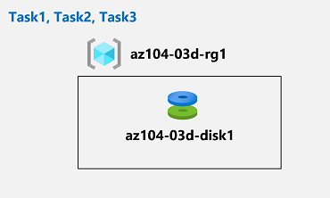

---
lab:
  title: "Labo\_03d\_: Gérer les ressources Azure à l’aide d’Azure\_CLI (facultatif)"
  module: Administer Azure Resources
---

# Labo 03d - Gérer des ressources Azure à l’aide d’Azure CLI
# Manuel de labo de l’étudiant

## Scénario du labo

Maintenant que vous avez exploré les fonctionnalités d’administration Azure de base associées à l’approvisionnement des ressources et en les organisant en fonction de groupes de ressources à l’aide des modèles Portail Azure, d’Azure Resource Manager et de Azure PowerShell, vous devez effectuer la tâche équivalente à l’aide d’Azure CLI. Pour éviter d’installer Azure CLI, vous allez tirer parti de l’environnement Bash disponible dans Azure Cloud Shell.

**Remarque :** Une **[simulation de labo interactive](https://mslabs.cloudguides.com/guides/AZ-104%20Exam%20Guide%20-%20Microsoft%20Azure%20Administrator%20Exercise%207)** est disponible et vous permet de progresser à votre propre rythme. Il peut exister de légères différences entre la simulation interactive et le labo hébergé. Toutefois, les concepts et idées de base présentés sont identiques. 

## Objectifs

Dans ce labo, vous allez :

+ Tâche 1 : Démarrer une session Bash dans Azure Cloud Shell
+ Tâche 2 : Créer un groupe de ressources et un disque managé Azure à l’aide d’Azure CLI
+ Tâche 3 : Configurer le disque managé à l’aide d’Azure CLI

## Durée estimée : 20 minutes

## Diagramme de l'architecture



### Instructions

## Exercice 1

## Tâche 1 : Démarrer une session Bash dans Azure Cloud Shell

Dans cette tâche, vous allez ouvrir une session Bash dans Cloud Shell. 

1. Dans le portail, ouvrez **Azure Cloud Shell** en cliquant sur l’icône située en haut à droite du portail Azure.

1. Si vous êtes invité à sélectionner **Bash** ou **PowerShell**, sélectionnez **Bash**. 

    >**Remarque** : Si c’est la première fois que vous démarrez **Cloud Shell** et que vous voyez le message **Vous n’avez aucun stockage monté**, sélectionnez l’abonnement que vous utilisez dans ce labo, puis sélectionnez **Créer un stockage**. 

1. Si vous y êtes invité, cliquez sur **Créer un stockage** et attendez que le volet Azure Cloud Shell s’affiche. 

1. Vérifiez que **Bash** apparaît dans le menu déroulant en haut à gauche du volet Cloud Shell.

## Tâche 2 : Créer un groupe de ressources et un disque managé Azure à l’aide d’Azure CLI

Dans cette tâche, vous allez créer un groupe de ressources et un disque managé Azure à l’aide d’une session Azure CLI dans Cloud Shell.

1. Pour créer un groupe de ressources dans la même région Azure que le groupe de ressources **az104-03c-rg1** que vous avez créé dans le labo précédent, à partir de la session Bash dans Cloud Shell, exécutez ce qui suit :

   ```sh
   LOCATION=$(az group show --name 'az104-03c-rg1' --query location --out tsv)

   RGNAME='az104-03d-rg1'

   az group create --name $RGNAME --location $LOCATION
   ```
1. Pour récupérer les propriétés du groupe de ressources nouvellement créé, exécutez ce qui suit :

   ```sh
   az group show --name $RGNAME
   ```
1. Pour créer un disque managé avec les mêmes caractéristiques que celles que vous avez créées dans les laboratoires précédents de ce module, à partir de la session Bash dans Cloud Shell, exécutez les commandes suivantes :

   ```sh
   DISKNAME='az104-03d-disk1'

   az disk create \
   --resource-group $RGNAME \
   --name $DISKNAME \
   --sku 'Standard_LRS' \
   --size-gb 32
   ```
    >**Remarque** : Lorsque vous utilisez la syntaxe multiligne, assurez-vous que chaque ligne se termine par une barre oblique inverse (`\`) sans espaces de fin et qu’il n’y a pas d’espaces de début au début de chaque ligne.

1. Pour récupérer les propriétés du disque nouvellement créé, exécutez ce qui suit :

   ```sh
   az disk show --resource-group $RGNAME --name $DISKNAME
   ```

## Tâche 3 : Configurer le disque managé à l’aide d’Azure CLI

Dans cette tâche, vous allez gérer la configuration du disque managé Azure à l’aide d’une session Azure CLI dans Cloud Shell. 

1. Pour augmenter la taille du disque managé Azure à **64 Go**, à partir de la session Bash au sein de Cloud Shell, exécutez les commandes suivantes :

   ```sh
   az disk update --resource-group $RGNAME --name $DISKNAME --size-gb 64
   ```

1. Pour vérifier que la modification a pris effet, exécutez ce qui suit :

   ```sh
   az disk show --resource-group $RGNAME --name $DISKNAME --query diskSizeGB
   ```

1. Pour remplacer la référence SKU des performances du disque par **Premium_LRS**, à partir de la session Bash dans Cloud Shell, exécutez les commandes suivantes :

   ```sh
   az disk update --resource-group $RGNAME --name $DISKNAME --sku 'Premium_LRS'
   ```

1. Pour vérifier que la modification a pris effet, exécutez ce qui suit :

   ```sh
   az disk show --resource-group $RGNAME --name $DISKNAME --query sku
   ```

## Nettoyer les ressources

 > **Remarque** : N’oubliez pas de supprimer toutes les nouvelles ressources Azure que vous n’utilisez plus. La suppression des ressources inutilisées vous évitera d’encourir des frais inattendus.

 > **Remarque** :  Ne vous inquiétez pas si les ressources de laboratoire ne peuvent pas être immédiatement supprimées. Parfois, les ressources ont des dépendances et leur suppression prend plus de temps. Il s’agit d’une tâche d’administrateur courante pour surveiller l’utilisation des ressources. Il vous suffit donc de consulter régulièrement vos ressources dans le portail pour voir comment se passe le nettoyage. 

1. Dans le Portail Azure, ouvrez la session shell **Bash** dans le volet **Cloud Shell**.

1. Listez tous les groupes de ressources créés dans les labos de ce module en exécutant la commande suivante :

   ```sh
   az group list --query "[?starts_with(name,'az104-03')].name" --output tsv
   ```

1. Supprimez tous les groupes de ressources que vous avez créés dans les labos de ce module en exécutant la commande suivante :

   ```sh
   az group list --query "[?starts_with(name,'az104-03')].[name]" --output tsv | xargs -L1 bash -c 'az group delete --name $0 --no-wait --yes'
   ```

    >**Remarque** : La commande s’exécute de façon asynchrone (comme déterminé par le paramètre --no-wait). Par conséquent, vous serez en mesure d’exécuter une autre commande Azure CLI immédiatement après au cours de la même session Bash, mais la suppression réelle du groupe de ressources prendra quelques minutes.

## Révision

Dans cet exercice, vous avez :

- Démarré une session Bash dans Azure Cloud Shell
- Créé un groupe de ressources et un disque managé Azure à l’aide d’Azure CLI
- Configuré le disque managé à l’aide d’Azure CLI
