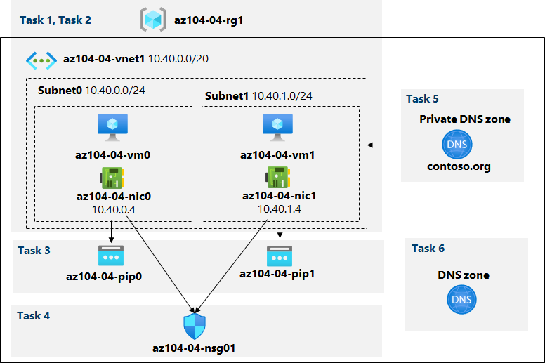

---
lab:
  title: "Labo\_04\_: Implémenter des réseaux virtuels"
  module: Administer Virtual Networking
---

# Labo 04 : Implémenter des réseaux virtuels

# Manuel de labo de l’étudiant

## Scénario du labo

Vous devez explorer les fonctionnalités de mise en réseau virtuelle Azure. Pour commencer, vous envisagez de créer un réseau virtuel dans Azure qui hébergera deux machines virtuelles Azure. Étant donné que vous envisagez d’implémenter la segmentation basée sur le réseau, vous les déployez dans différents sous-réseaux du réseau virtuel. Vous souhaitez également vous assurer que leurs adresses IP privées et publiques ne changeront pas au fil du temps. Pour respecter les exigences de sécurité de Contoso, vous devez protéger les points de terminaison publics des machines virtuelles Azure accessibles à partir d’Internet. Enfin, vous devez implémenter la résolution de noms DNS pour les machines virtuelles Azure à la fois au sein du réseau virtuel et à partir d’Internet.

**Remarque :** Une **[simulation de labo interactive](https://mslabs.cloudguides.com/guides/AZ-104%20Exam%20Guide%20-%20Microsoft%20Azure%20Administrator%20Exercise%208)** est disponible et vous permet de progresser à votre propre rythme. Il peut exister de légères différences entre la simulation interactive et le labo hébergé. Toutefois, les concepts et idées de base présentés sont identiques. 

## Objectifs

Dans ce labo, vous allez :

+ Tâche 1 : Créer et configurer un réseau virtuel
+ Tâche 2 : Déployer des machines virtuelles dans le réseau virtuel
+ Tâche 3 : Configurer les adresses IP privées et publiques des machines virtuelles Azure
+ Tâche 4 : Configurer des groupes de sécurité réseau
+ Tâche 5 : Configurer Azure DNS pour la résolution de noms interne
+ Tâche 6 : Configurer Azure DNS pour la résolution de noms externe

## Durée estimée : 40 minutes

## Diagramme de l'architecture



### Instructions

## Exercice 1

## Tâche 1 : Créer et configurer un réseau virtuel

Dans cette tâche, vous allez créer un réseau virtuel avec plusieurs sous-réseaux à l’aide du portail Azure

1. Connectez-vous au [portail Azure](https://portal.azure.com).

1. Dans le portail Azure, recherchez et sélectionnez **Réseaux virtuels**, puis, dans le panneau **Réseaux virtuels**, cliquez sur **+ Créer**.

1. Créez un réseau virtuel avec les paramètres suivants (laissez les autres avec leurs valeurs par défaut) :

    | Paramètre | Valeur |
    | --- | --- |
    | Abonnement | le nom de l’abonnement Azure que vous utilisez dans ce labo |
    | Groupe de ressources | le nom d’un **nouveau** groupe de ressources **az104-04-rg1** |
    | Nom | **az104-04-vnet1** |
    | Région | nom de n’importe quelle région Azure disponible dans l’abonnement que vous utiliserez dans ce labo |

1. Cliquez sur **Suivant : Adresses IP**. L’**adresse de début** est **10.40.0.0**. La **Taille de l’espace d’adressage** est **/20**. Veillez à cliquer sur **Ajouter**. 

1. Cliquez sur **+ Ajouter un sous-réseau**, entrez les valeurs suivantes et cliquez sur **Ajouter**.

    | Paramètre | Valeur |
    | --- | --- |
    | Nom du sous-réseau | **subnet0** |
    | Adresse de début | **10.40.0.0** |
    | Taille du sous-réseau | **/24 (256 adresses)** |

1. Acceptez les autres valeurs par défaut et cliquez sur **Vérifier + créer**. Laissez la validation se produire, puis appuyez sur **Créer** à nouveau pour envoyer votre déploiement.

    >**Remarque :** Attendez que le réseau virtuel soit approvisionné. L’opération doit prendre moins d’une minute.

1. Cliquez sur **Accéder à la ressource**

1. Dans le panneau de réseau virtuel **az104-04-vnet1**, cliquez sur **Sous-réseaux**, puis sur **+ Sous-réseau**.

1. Créez un sous-réseau avec les paramètres suivants (laissez les autres avec leurs valeurs par défaut) :

    | Paramètre | Valeur |
    | --- | --- |
    | Nom | **subnet1** |
    | Plage d’adresses (bloc CIDR) | **10.40.1.0/24** |
    | Groupe de sécurité réseau | **Aucun** |
    | Table de routage | **Aucun** |

1. Cliquez sur **Enregistrer**.

## Tâche 2 : Déployer des machines virtuelles dans le réseau virtuel

Dans cette tâche, vous allez déployer des machines virtuelles Azure dans différents sous-réseaux du réseau virtuel à l’aide d’un modèle ARM

1. Dans le portail Azure, ouvrez **Azure Cloud Shell** en cliquant sur l’icône située en haut à droite du portail Azure.

1. Lorsque vous êtes invité à sélectionner **Bash** ou **PowerShell**, sélectionnez **PowerShell**.

    >**Remarque** : Si c’est la première fois que vous démarrez **Cloud Shell** et que vous voyez le message **Vous n’avez aucun stockage monté**, sélectionnez l’abonnement que vous utilisez dans ce labo, puis sélectionnez **Créer un stockage**.

1. Dans la barre d’outils du volet Cloud Shell, cliquez sur l'icône **Charger/télécharger des fichiers**, et dans le menu déroulant, cliquez sur **Charger**. Chargez **\\Allfiles\\Labs\\04\\az104-04-vms-loop-template.json** et **\\Allfiles\\Labs\\04\\az104-04-vms-loop-parameters.json** dans le répertoire de base de Cloud Shell.

    >**Remarque** : Vous devez charger chaque fichier séparément. Après le chargement, utilisez **dir** pour vous assurer que les deux fichiers ont été correctement chargés.

1. Dans le panneau Cloud Shell, exécutez ce qui suit pour déployer deux machines virtuelles à l’aide des fichiers de modèle et de paramètres :
    >**Remarque** : Vous serez invité à fournir un mot de passe d’administrateur.
    
   ```powershell
   $rgName = 'az104-04-rg1'

   New-AzResourceGroupDeployment `
      -ResourceGroupName $rgName `
      -TemplateFile $HOME/az104-04-vms-loop-template.json `
      -TemplateParameterFile $HOME/az104-04-vms-loop-parameters.json
   ```
   
    >**Remarque** : Cette méthode de déploiement de modèles ARM utilise Azure PowerShell. Vous pouvez effectuer la même tâche en exécutant la commande Azure CLI équivalente **az deployment create** (pour plus d’informations, voir [Déployer des ressources avec des modèles Resource Manager et Azure CLI](https://docs.microsoft.com/en-us/azure/azure-resource-manager/templates/deploy-cli)).

    >**Remarque** : Attendez que le déploiement se termine avant de passer à la tâche suivante. Ce processus prend environ 2 minutes.

    >**Remarque** : Si vous avez reçu une erreur indiquant que la taille de machine virtuelle n’est pas disponible, demandez à votre instructeur de l’aide et essayez ces étapes :
    > 1. Cliquez sur le bouton `{}` dans votre CloudShell, sélectionnez le fichier **az104-04-vms-loop-parameters.json** dans la barre latérale gauche et prenez note de la valeur de paramètre `vmSize`.
    > 1. Vérifiez l’emplacement dans lequel le groupe de ressources « az104-04-rg1 » est déployé. Vous pouvez exécuter `az group show -n az104-04-rg1 --query location` dans votre CloudShell pour l’obtenir.
    > 1. Exécutez `az vm list-skus --location <Replace with your location> -o table --query "[? contains(name,'Standard_D2s')].name"` dans votre CloudShell. S’il n’y a pas de références SKU répertoriées (c’est-à-dire qu’il n’y a aucun résultat), vous ne pouvez pas déployer de machines virtuelles D2S dans cette région. Vous devez trouver une région qui vous permettra de déployer des machines virtuelles D2S. Une fois que vous avez choisi un emplacement approprié, supprimez le groupe de ressources AZ104-04-rg1 et redémarrez le labo.
    > 1. Remplacez la valeur du paramètre `vmSize` par l’une des valeurs retournées par la commande que vous venez d’exécuter.
    > 1. Redéployez maintenant vos modèles en exécutant à nouveau la commande `New-AzResourceGroupDeployment`. Vous pouvez appuyer sur le bouton en haut quelques fois, ce qui amènerait la dernière commande exécutée.

1. Fermez le volet Cloud Shell.

#### Tâche 3 : Configurer les adresses IP privées et publiques des machines virtuelles Azure

Dans cette tâche, vous allez configurer l’affectation statique d’adresses IP publiques et privées affectées aux interfaces réseau des machines virtuelles Azure.

   >**Remarque** : Les adresses IP privées et publiques sont réellement affectées aux interfaces réseau, qui, à leur tour, sont attachées aux machines virtuelles Azure, mais il est assez courant de faire référence aux adresses IP affectées aux machines virtuelles Azure.

   >**Remarque** : Vous aurez besoin de **deux** adresses IP publiques pour effectuer ce labo. 

1. Dans le portail Azure, recherchez et sélectionnez **Adresses IP publiques**, puis sélectionnez **+ Créer**.

1. Vérifiez que le **groupe de ressources** est **az104-04-rg1**.

1. Dans les **Détails de la configuration**, vérifiez que le **nom** est **az104-04-pip0**.

1. Sélectionnez **Vérifier et créer**, puis **Créer**.

1. Dans le portail Azure, recherchez et sélectionnez **Adresses IP publiques**, puis sélectionnez **+ Créer**.

1. Vérifiez que le **groupe de ressources** est **az104-04-rg1**.

1. Dans les **Détails de la configuration**, vérifiez que le **nom** est **az104-04-pip1**.

1. Sélectionnez **Vérifier et créer**, puis **Créer**.

1. Dans le portail Azure, recherchez et sélectionnez **Groupes de ressources**, puis, dans le panneau **Groupes de ressources**, cliquez sur **az104-04-rg1**.

1. Dans l’onglet du groupe de ressources **az104-04-rg1**, dans la liste de ses ressources, cliquez sur **az104-04-vnet1**.

1. Dans le panneau du réseau virtuel **az104-04-vnet1**, passez en revue la section **Appareils connectés** et vérifiez qu’il existe deux interfaces réseau **az104-04-nic0** et **az104-04-nic1** attachées au réseau virtuel.

1. Cliquez sur **az104-04-nic0** et, dans le panneau **az104-04-nic0**, cliquez sur **Configurations IP**.

    >**Remarque** : Vérifiez que **ipconfig1** est actuellement configuré avec une adresse IP privée dynamique.

1. Dans la liste des configurations IP, cliquez sur **ipconfig1**.

1. Vérifiez que **Allocation** est **Statique**.

1. Sélectionnez **Associer une adresse IP publique** puis, dans la liste déroulante **Adresse IP publique**, sélectionnez **az104-04-pip0**.

1. Sélectionnez **Enregistrer**.

1. Revenir au volet **az104-04-vnet1**.

1. Cliquez sur **az104-04-nic1** et, dans le panneau **az104-04-nic1**, cliquez sur **Configurations IP**.

    >**Remarque** : Vérifiez que **ipconfig1** est actuellement configuré avec une adresse IP privée dynamique.

1. Dans la liste des configurations IP, cliquez sur **ipconfig1**.

1. Vérifiez que **Allocation** est **Statique**.

1. Sélectionnez **Associer une adresse IP publique** puis, dans la liste déroulante **Adresse IP publique**, sélectionnez **az104-04-pip1**.

1. Sélectionnez **Enregistrer**.
   
1. Revenez au panneau du groupe de ressources **az104-04-rg1**, dans la liste de ses ressources, cliquez sur **az104-04-vm0** et à partir du panneau de machine virtuelle **az104-04-vm0**, notez l’entrée d’adresse IP publique.

1. Revenez au panneau du groupe de ressources **az104-04-rg1**, dans la liste de ses ressources, cliquez sur **az104-04-vm1** et à partir du panneau de machine virtuelle **az104-04-vm1**, notez l’entrée d’adresse IP publique.

    >**Remarque** : Vous aurez besoin des deux adresses IP dans la dernière tâche de ce laboratoire.

## Tâche 4 : Configurer des groupes de sécurité réseau

Dans cette tâche, vous allez configurer des groupes de sécurité réseau afin d’autoriser la connectivité restreinte aux machines virtuelles Azure.

1. Dans le portail Azure, revenez au panneau du groupe de ressources **az104-04-rg1**, puis, dans la liste de ses ressources, cliquez sur **az104-04-vm0**.

1. Dans le panneau de vue d’ensemble **az104-04-vm0**, cliquez sur **Connecter**, puis sur **RDP** dans le menu déroulant, dans le panneau **Connecter avec RDP**, cliquez sur **Télécharger le fichier RDP** à l’aide de l’adresse IP publique et suivez les invites pour démarrer la session Bureau à distance.

1. Notez que la tentative de connexion échoue.

    >**Remarque** : Cet échec est normal, car les adresses IP publiques de la référence SKU Standard, par défaut,nécessitent que les interfaces réseau auxquelles elles sont affectées soient protégées par Groupe de sécurité réseau. Pour autoriser les connexions Bureau à distance, vous allez créer Groupe de sécurité réseau explicitement permettant le trafic RDP entrant à partir d’Internet et l’affecter aux interfaces réseau des deux machines virtuelles.

1. Arrêtez les machines virtuelles **az104-04-vm0** et **az104-04-vm1**.

    >**Remarque** : Ceci est fait pour des raisons de commodité de labo. Si les machines virtuelles s’exécutent lorsqu’un groupe de sécurité réseau est attaché à leur interface réseau, il peut prendre plus de 30 minutes pour que la pièce jointe prenne effet. Une fois le groupe de sécurité réseau créé et attaché, les machines virtuelles seront redémarrées et l’attachement sera immédiatement appliqué.

1. Dans le portail Azure, recherchez et sélectionnez les **Groupes de sécurité réseau**, puis, dans le panneau **Groupes de sécurité réseau**, cliquez sur **+ Créer**.

1. Créez Groupe de sécurité réseau avec les paramètres suivants (laissez les autres avec leurs valeurs par défaut) :

    | Paramètre | Value |
    | --- | --- |
    | Abonnement | le nom de l’abonnement Azure que vous utilisez dans ce labo |
    | Groupe de ressources | **az104-04-rg1** |
    | Nom | **az104-04-nsg01** |
    | Région | le nom de la région Azure dans laquelle vous avez déployé toutes les autres ressources dans ce laboratoire |

1. Cliquez sur **Examiner et créer**. Laissez la validation se produire, puis appuyez sur **Créer** à nouveau pour envoyer votre déploiement.

    >**Remarque** : Attendez la fin du déploiement. Ce processus prend environ 2 minutes.

1. Dans le panneau de déploiement, cliquez sur **Accéder à la ressource** pour ouvrir l’onglet du groupe de sécurité réseau **az104-04-nsg01**.

1. Dans l’onglet du groupe de sécurité réseau **az104-04-nsg01**, dans la section **Paramètres**, cliquez sur **Règles de sécurité entrantes**.

1. Ajoutez une règle de sécurité entrante avec les paramètres suivants (laissez les autres avec leurs valeurs par défaut) :

    | Paramètre | Valeur |
    | --- | --- |
    | Source | **Any** |
    | Source port ranges | * |
    | Destination | **Any** |
    | Service | **RDP** |
    | Action | **Autoriser** |
    | Priority | **300** |
    | Nom | **AllowRDPInBound** |

1. Dans l’onglet du groupe de sécurité réseau **az104-04-nsg01**, dans la section **Paramètres**, cliquez sur **Interfaces réseau**, puis sur **+ Associer**.

1. Associez le groupe de sécurité réseau **az104-04-nsg01** aux interfaces réseau **az104-04-nic0** et **az104-04-nic1**.

    >**Remarque** : Cela peut prendre jusqu’à 5 minutes pour que les règles du groupe de sécurité réseau nouvellement créé soient appliquées à la carte d’interface réseau.

1. Arrêtez les machines virtuelles **az104-04-vm0** et **az104-04-vm1**.

1. Revenez au panneau de machine virtuelle **az104-04-vm0**.

    >**Remarque** : Dans les étapes suivantes, vous allez vérifier que vous pouvez vous connecter avec succès à la machine virtuelle cible.

1. Dans le panneau de vue d’ensemble **az104-04-vm0**, cliquez sur **Connecter**, puis sur **RDP**, dans le panneau **Connecter avec RDP**, cliquez sur **Télécharger le fichier RDP** à l’aide de l’adresse IP publique et suivez les invites pour démarrer la session Bureau à distance.

    >**Remarque** : Cette étape fait référence à la connexion via le Bureau à distance à partir d’un ordinateur Windows. Sur un Mac, vous pouvez utiliser le client Bureau à distance disponible sur le Mac App Store. Sur un ordinateur Linux, vous pouvez utiliser un logiciel client RDP open source.

    >**Remarque** : Vous pouvez ignorer toutes les invites d’avertissement lors de la connexion aux machines virtuelles cibles.

1. Lorsque vous y êtes invité, connectez-vous avec l’utilisateur et le mot de passe dans le fichier de paramètres.

    >**Remarque** : Gardez cette session Bureau à distance ouverte. Vous en aurez besoin dans la prochaine tâche.

#### Tâche 5 : Configurer Azure DNS pour la résolution de noms interne

Dans cette tâche, vous allez configurer la résolution de noms DNS dans un réseau virtuel à l’aide de zones DNS privées Azure.

1. Dans le portail Azure, recherchez et sélectionnez **Zones DNS privées**, puis, dans le panneau **Zones DNS privées**, cliquez sur **+ Créer**.

1. Créez une zone DNS privée avec les paramètres suivants (laissez les autres avec leurs valeurs par défaut) :

    | Paramètre | Value |
    | --- | --- |
    | Abonnement | le nom de l’abonnement Azure que vous utilisez dans ce labo |
    | Groupe de ressources | **az104-04-rg1** |
    | Nom | **contoso.org** |

1. Cliquez sur **Examiner et créer**. Laissez la validation se produire, puis appuyez sur **Créer** à nouveau pour envoyer votre déploiement.

    >**Remarque** : Attendez que la zone DNS privée soit créée. Ce processus prend environ 2 minutes.

1. Cliquez sur **Accéder à la ressource** pour ouvrir l’onglet de zone privée DNS **contoso.org**.

1. Dans le panneau de zone DNS privée**contoso.org**, dans la section **Paramètres**, cliquez sur **Liens de réseau virtuel**.

1. Cliquez sur **+ Ajouter** pour créer un lien de réseau virtuel avec les paramètres suivants (laissez les autres avec leur valeur par défaut) :

    | Paramètre | Valeur |
    | --- | --- |
    | Nom de la liaison | **az104-04-vnet1-link** |
    | Abonnement | le nom de l’abonnement Azure que vous utilisez dans ce labo |
    | Réseau virtuel | **az104-04-vnet1** |
    | Activer l’inscription automatique | enabled |

1. Cliquez sur **OK**.

    >**Remarque :** Attendez que le lien du réseau virtuel soit créé. Cela devrait prendre moins d’une minute.

1. Dans le panneau de zone DNS privée **contoso.org**, dans la barre latérale, cliquez sur **Vue d’ensemble**

1. Vérifiez que les enregistrements DNS pour **az104-04-vm0** et **az104-04-vm1** apparaissent dans la liste des jeux d’enregistrements **Inscrits automatiquement**.

    >**Remarque :** Vous devrez peut-être attendre quelques minutes et actualiser la page si les jeux d’enregistrements ne sont pas répertoriés.

1. Basculez vers la session Bureau à distance vers **az104-04-vm0**, cliquez avec le bouton droit de la souris sur le bouton **Démarrer** et, dans le menu contextuel, cliquez sur **Windows PowerShell (Admin)** .

1. Dans la fenêtre de console Windows PowerShell, exécutez la commande suivante pour tester la résolution de noms interne dans la zone DNS privée nouvellement créée :

   ```powershell
   nslookup az104-04-vm0.contoso.org
   nslookup az104-04-vm1.contoso.org
   ```

1. Vérifiez que la sortie de la commande inclut l’adresse IP privée **az104-04-vm1** (**10.40.1.4).**

## Tâche 6 : Configurer Azure DNS pour la résolution de noms externe

Dans cette tâche, vous allez configurer la résolution de noms DNS externe à l’aide de zones DNS publiques Azure.

1. Dans un navigateur web, ouvrez un nouvel onglet et accédez à <https://www.godaddy.com/domains/domain-name-search>.

1. Utilisez la recherche de noms de domaine pour identifier un nom de domaine qui n’est pas utilisé.

1. Dans le portail Azure, recherchez et sélectionnez **Zones DNS privées**, puis, dans le panneau **Zones DNS privées**, cliquez sur **+ Créer**.

1. Créez une zone DNS avec les paramètres suivants (laissez les autres avec leurs valeurs par défaut) :

    | Paramètre | Value |
    | --- | --- |
    | Abonnement | le nom de l’abonnement Azure que vous utilisez dans ce labo |
    | Groupe de ressources | **az104-04-rg1** |
    | Nom | le nom de domaine DNS que vous avez identifié précédemment dans cette tâche |

1. Cliquez sur **Examiner et créer**. Laissez la validation se produire, puis appuyez sur **Créer** à nouveau pour envoyer votre déploiement.

    >**Remarque** : Attendez que la zone DNS soit créée. Ce processus prend environ 2 minutes.

1. Cliquez sur **Accéder à la ressource** pour ouvrir le panneau de la zone DNS nouvellement créée.

1. Sur le panneau de la zone DNS, cliquez sur **+ Jeu d’enregistrements**.

1. Créez un jeu d’enregistrements avec les paramètres suivants (laissez les autres avec leurs valeurs par défaut) :

    | Paramètre | Value |
    | --- | --- |
    | Nom | **az104-04-vm0** |
    | Type | **A** |
    | Jeu d’enregistrements d’alias | **Non** |
    | TTL | **1** |
    | Unité de durée de vie | **Heures** |
    | Adresse IP | l’adresse IP publique d’**az104-04-vm0** que vous avez identifiée dans le troisième exercice de ce laboratoire |

1. Cliquez sur **OK**

1. Sur le panneau de la zone DNS, cliquez sur **+ Jeu d’enregistrements**.

1. Créez un jeu d’enregistrements avec les paramètres suivants (laissez les autres avec leurs valeurs par défaut) :

    | Paramètre | Value |
    | --- | --- |
    | Nom | **az104-04-vm1** |
    | Type | **A** |
    | Jeu d’enregistrements d’alias | **Non** |
    | TTL | **1** |
    | Unité de durée de vie | **Heures** |
    | Adresse IP | l’adresse IP publique d’**az104-04-vm1** que vous avez identifiée dans le troisième exercice de ce laboratoire |

1. Cliquez sur **OK**

1. Dans l’onglet de zone DNS, notez le nom de l’entrée **Serveur de noms 1**.

1. Dans le portail Azure, ouvrez une session **PowerShell** dans **Cloud Shell** en cliquant sur l’icône située en haut à droite du portail Azure.

1. Dans le volet Cloud Shell, exécutez ce qui suit pour tester la résolution de noms externes du jeu d’enregistrements DNS **az104-04-vm0** dans la zone DNS nouvellement créée (remplacez l’espace réservé `[Name server 1]` par le nom du **Serveur de noms 1** que vous avez noté précédemment dans cette tâche et l’espace réservé `[domain name]` par le nom du domaine DNS que vous avez créé précédemment dans cette tâche) :

   ```powershell
   nslookup az104-04-vm0.[domain name] [Name server 1]
   ```

1. Vérifiez que la sortie de la commande inclut l’adresse IP publique **az104-04-vm0**.

1. Dans le volet Cloud Shell, exécutez ce qui suit pour tester la résolution de noms externes du jeu d’enregistrements DNS **az104-04-vm1** dans la zone DNS nouvellement créée (remplacez l’espace réservé `[Name server 1]` par le nom du **Serveur de noms 1** que vous avez noté précédemment dans cette tâche et l’espace réservé `[domain name]` par le nom du domaine DNS que vous avez créé précédemment dans cette tâche) :

   ```powershell
   nslookup az104-04-vm1.[domain name] [Name server 1]
   ```

1. Vérifiez que la sortie de la commande inclut l’adresse IP publique d’**az104-04-vm1**.

## Nettoyer les ressources

 > **Remarque** : N’oubliez pas de supprimer toutes les nouvelles ressources Azure que vous n’utilisez plus. La suppression des ressources inutilisées vous évitera d’encourir des frais inattendus.

 > **Remarque** :  Ne vous inquiétez pas si les ressources de laboratoire ne peuvent pas être immédiatement supprimées. Parfois, les ressources ont des dépendances et leur suppression prend plus de temps. Il s’agit d’une tâche d’administrateur courante pour surveiller l’utilisation des ressources. Il vous suffit donc de consulter régulièrement vos ressources dans le portail pour voir comment se passe le nettoyage. 

1. Dans le portail Azure, ouvrez la session **PowerShell** dans le volet **Cloud Shell**.

1. Listez tous les groupes de ressources créés dans les labos de ce module en exécutant la commande suivante :

   ```powershell
   Get-AzResourceGroup -Name 'az104-04*'
   ```

1. Supprimez tous les groupes de ressources que vous avez créés dans les labos de ce module en exécutant la commande suivante :

   ```powershell
   Get-AzResourceGroup -Name 'az104-04*' | Remove-AzResourceGroup -Force -AsJob
   ```

    >**Remarque** : La commande s’exécute de façon asynchrone (tel que déterminé par le paramètre -AsJob). Vous pourrez donc exécuter une autre commande PowerShell immédiatement après au cours de la même session PowerShell, mais la suppression effective du groupe de ressources peut prendre quelques minutes.

## Révision

Dans cet exercice, vous avez :

+ Créé et configuré un réseau virtuel
+ Déployé des machines virtuelles dans le réseau virtuel
+ Configuré les adresses IP privées et publiques des machines virtuelles Azure
+ Configuré des groupes de sécurité réseau
+ Configuré Azure DNS pour la résolution de noms interne
+ Configuré Azure DNS pour la résolution de noms externe
