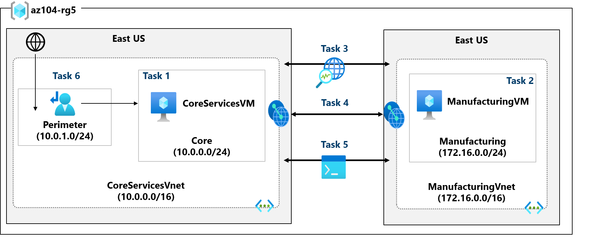
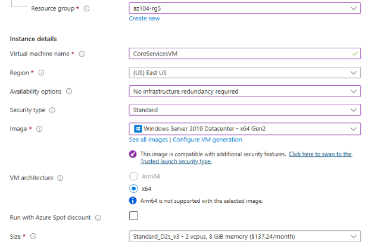
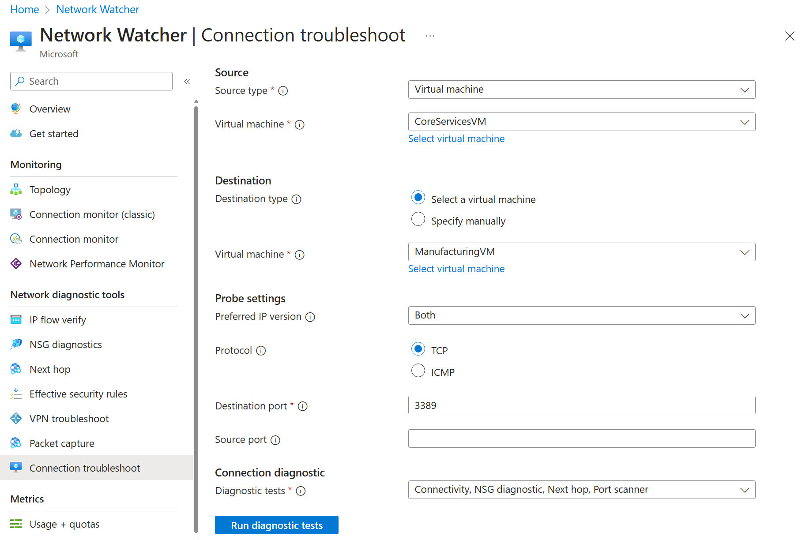

---
lab:
  title: 'Labo 05 : Implémenter une connectivité intersites'
  module: Administer Intersite Connectivity
---

# Labo 05 - Implémenter une connectivité intersites

## Présentation du labo

Dans ce labo, vous explorez la communication entre réseaux virtuels. Vous implémentez l’appairage de réseaux virtuels et testez des connexions. Vous allez également créer une route personnalisée. 

Ce labo nécessite un abonnement Azure. Le type de votre abonnement peut affecter la disponibilité des fonctionnalités dans ce labo. Vous pouvez changer la région, mais les étapes sont écrites de façon à utiliser **USA Est**. 

## Durée estimée : 50 minutes
    
## Scénario du labo 

Votre organisation segmente les principales applications et services informatiques (tels que les services DNS et de sécurité) d’autres parties de l’entreprise, notamment votre service de fabrication. Toutefois, dans certains scénarios, les applications et les services dans la zone principale doivent communiquer avec des applications et des services dans la zone de fabrication. Dans ce labo, vous configurez la connectivité entre les zones segmentées. Il s’agit d’un scénario courant pour séparer la production du développement ou séparer une filiale d’une autre.  

## Diagramme de l'architecture



## Compétences de tâche

+ Tâche 1 : Créez une machine virtuelle dans un réseau virtuel.
+ Tâche 2 : Créez une machine virtuelle dans un autre réseau virtuel.
+ Tâche 3 : Utilisez Network Watcher pour tester la connexion entre machines virtuelles. 
+ Tâche 4 : Configurez des appairages de réseaux virtuels entre différents réseaux virtuels.
+ Tâche 5 : Utilisez Azure PowerShell pour tester la connexion entre machines virtuelles.
+ Tâche 6 : créer un cheminement personnalisé. 

## Tâche 1 :  Créez un réseau virtuel et une machine virtuelle des principaux services

Dans cette tâche, vous créez un réseau virtuel des principaux services avec une machine virtuelle. 

1. Connectez-vous au **portail Azure** - `https://portal.azure.com`.

1. Recherchez et sélectionnez `Virtual Machines`.

1. Sur la page des machines virtuelles, sélectionnez **Créer**, puis **Machine virtuelle Azure**.

1. Sous l’onglet Informations de base, utilisez les informations suivantes pour remplir le formulaire, puis sélectionnez **Suivant : Disques >**. Si un paramètre n’est pas spécifié, laissez la valeur par défaut.
 
    | Paramètre | Valeur | 
    | --- | --- |
    | Abonnement |  *votre abonnement* |
    | Resource group |  `az104-rg5` (si nécessaire, **Créez-en un**. )
    | Nom de la machine virtuelle |    `CoreServicesVM` |
    | Région | **(États-Unis) USA Est** |
    | Options de disponibilité | Aucune redondance de l’infrastructure requise |
    | Type de sécurité | **Standard** |
    | Image | **Windows Server 2019 Datacenter : x64 Gen2** (notez vos autres choix) |
    | Taille | **Standard_DS2_v3** |
    | Nom d’utilisateur | `localadmin` | 
    | Mot de passe | **Fournir mot de passe complexe** |
    | Aucun port d’entrée public | **Aucun** |

    
   
1. Sous l’onglet **Disques**, prenez les valeurs par défaut, puis sélectionnez **Suivant : Mise en réseau >**.

1. Sous l’onglet **Mise en réseau**, pour Réseau virtuel, sélectionnez **Créer**.

1. Utilisez les informations suivantes pour configurer le réseau virtuel, puis sélectionnez **OK**. Si nécessaire, supprimez ou remplacez les informations existantes.

    | Paramètre | Valeur | 
    | --- | --- |
    | Nom | `CoreServicesVnet` (Créer) |
    | Plage d’adresses | `10.0.0.0/16`  |
    | Nom du sous-réseau | `Core` | 
    | Plage d’adresses de sous-réseau | `10.0.0.0/24` |

1. Sélectionnez l’onglet **Supervision**. Pour Diagnostics de démarrage, sélectionnez **Désactiver**.

1. Sélectionnez **Vérifier + créer**, puis **Créer**.

1. Vous n’avez pas besoin d’attendre la création des ressources. Passez à la tâche suivante.

    >**Remarque :** Avez-vous remarqué dans cette tâche que vous avez créé le réseau virtuel lors de la création de la machine virtuelle ? Vous pouvez également créer l’infrastructure de réseau virtuel, puis ajoutez les machines virtuelles. 

## Tâche 2 : Créez une machine virtuelle dans un autre réseau virtuel.

Dans cette tâche, vous créez un réseau virtuel de services de fabrication avec une machine virtuelle. 

1. Dans le Portail Azure, recherchez et accédez à **Machines virtuelles**.

1. Sur la page des machines virtuelles, sélectionnez **Créer**, puis **Machine virtuelle Azure**.

1. Sous l’onglet Informations de base, utilisez les informations suivantes pour remplir le formulaire, puis sélectionnez **Suivant : Disques >**. Si un paramètre n’est pas spécifié, laissez la valeur par défaut.
 
    | Paramètre | Valeur | 
    | --- | --- |
    | Abonnement |  *votre abonnement* |
    | Resource group |  `az104-rg5` |
    | Nom de l’ordinateur virtuel |    `ManufacturingVM` |
    | Région | **(États-Unis) USA Est** |
    | Type de sécurité | **Standard** |
    | Options de disponibilité | Aucune redondance de l’infrastructure requise |
    | Image | **Windows Server 2019 Datacenter : x64 Gen2** |
    | Taille | **Standard_DS2_v3** | 
    | Nom d’utilisateur | `localadmin` | 
    | Mot de passe | **Fournir mot de passe complexe** |
    | Aucun port d’entrée public | **Aucun** |

1. Sous l’onglet **Disques**, prenez les valeurs par défaut, puis sélectionnez **Suivant : Mise en réseau >**.

1. Sous l’onglet Mise en réseau, pour Réseau virtuel, sélectionnez **Créer**.

1. Utilisez les informations suivantes pour configurer le réseau virtuel, puis sélectionnez **OK**.  Le cas échéant, supprimez ou remplacez la plage d’adresses existante.

    | Paramètre | Valeur | 
    | --- | --- |
    | Nom | `ManufacturingVnet` |
    | Plage d’adresses | `172.16.0.0/16`  |
    | Nom du sous-réseau | `Manufacturing` |
    | Plage d’adresses de sous-réseau | `172.16.0.0/24` |

1. Sélectionnez l’onglet **Supervision**. Pour Diagnostics de démarrage, sélectionnez **Désactiver**.

1. Sélectionnez **Vérifier + créer**, puis **Créer**.

## Tâche 3 : Utilisez Network Watcher pour tester la connexion entre machines virtuelles. 


Dans cette tâche, vous vérifiez que les ressources des réseaux virtuels appairés peuvent communiquer entre elles. Network Watcher sera utilisé pour tester la connexion. Avant de continuer, vérifiez que les deux machines virtuelles sont déployées et en cours d’exécution. 

1. Dans le Portail Azure, recherchez et sélectionnez `Network Watcher`.

1. Dans Network Watcher, dans le menu Outils de diagnostic réseau, sélectionnez **Résolution des problèmes de connexion**.

1. Utilisez les informations suivantes pour remplir les champs de la page **Résolution des problèmes de connexion**.

    | Champ | Valeur | 
    | --- | --- |
    | Type de source           | **Machine virtuelle**   |
    | Machine virtuelle       | **CoreServicesVM**    | 
    | Type de destination      | **Machine virtuelle**   |
    | Machine virtuelle       | **ManufacturingVM**   | 
    | Version d’IP préférée  | **Les deux**              | 
    | Protocole              | **TCP**               |
    | Port de destination      | `3389`                |  
    | Port source           | *Vide*         |
    | Tests de diagnostic      | *Defaults*      |

    

1. Sélectionnez **Exécuter les tests de diagnostic**.

    >**Remarque** : Le retour des résultats peut prendre quelques minutes. Les sélections d’écran seront grisées pendant la collecte des résultats. Notez que le **Test de connectivité** affiche **Inaccessible**. C’est normal, car les machines virtuelles se trouvent dans des réseaux virtuels différents. 

 
## Tâche 4 : Configurer des appairages de réseaux virtuels entre réseaux virtuels

Dans cette tâche, vous créez un appairage de réseaux virtuels pour activer les communications entre les ressources des réseaux virtuels. 

1. Dans le Portail Azure, sélectionnez le réseau virtuel `CoreServicesVnet`.

1. Dans CoreServicesVnet, sous **Paramètres**, sélectionnez **Peerings**.

1. Sur CoreServicesVnet, sous Peerings, sélectionnez **+ Ajouter**. Si elle n’est pas spécifiée, elle prend la valeur par défaut. 

    | **Paramètre**                                    | **Valeur**                             |
    | --------------------------------------------- | ------------------------------------- |                                
    | Nom du lien de peering                             | `CoreServicesVnet-to-ManufacturingVnet` |
    | Réseau virtuel    | **ManufacturingVM-net (az104-rg5)**  |
    | Autoriser ManufacturingVnet à accéder à CoreServicesVnet  | sélectionné (par défaut) |
    | Autoriser ManufacturingVnet à recevoir le trafic transféré à partir de CoreServicesVnet | sélectionné  |
    | Nom du lien de peering                             | `ManufacturingVnet-to-CoreServicesVnet` |
    | Autoriser CoreServicesVnet à accéder au réseau virtuel appairé            | sélectionné (par défaut) |
    | Autoriser CoreServicesVnet à recevoir le trafic transféré à partir du réseau virtuel appairé | sélectionné |

4. Cliquez sur **Ajouter**.

5. Dans CoreServicesVnet, sous Peerings, vérifiez que le peering **CoreServicesVnet-ManufacturingVnet** est répertorié. Actualisez la page pour vérifier que l’**État de l’appairage** est **Connecté**.

6. Basculez vers **ManufacturingVnet**, puis vérifiez que l’appairage **ManufacturingVnet-to-CoreServicesVnet** est répertorié. Vérifiez que l’**État de l’appairage** est **Connecté**. Vous devrez peut-être **actualiser** la page. 

## Tâche 5 : Utiliser Azure PowerShell pour tester la connexion entre machines virtuelles

Dans cette tâche, vous testez à nouveau la connexion entre les machines virtuelles dans différents réseaux virtuels. 

### Vérifier l’adresse IP privée de CoreServicesVM

1. Dans le Portail Azure, recherchez et sélectionnez la machine virtuelle `CoreServicesVM`.

1. Dans le panneau **Vue d’ensemble**, dans la section **Mise en réseau**, enregistrez l’**Adresse IP privée** de la machine. Vous avez besoin de ces informations pour tester la connexion.
   
### Testez la connexion à CoreServicesVM à partir de **ManufacturingVM**.

>**Le saviez-vous ?** Il existe plusieurs façons de vérifier des connexions. Dans cette tâche, vous utilisez **Exécuter la commande**. Vous pouvez également continuer à utiliser Network Watcher. Vous pouvez également utiliser une [connexion Bureau à distance](https://learn.microsoft.com/azure/virtual-machines/windows/connect-rdp#connect-to-the-virtual-machine) pour accéder à la machine virtuelle. Une fois connecté, utilisez **test-connection**. Comme vous avez du temps, essayez RDP. 

1. Basculez vers la machine virtuelle `ManufacturingVM`.

1. Dans le panneau **Opérations**, sélectionnez le panneau **Exécuter la commande**.

1. Sélectionnez **RunPowerShellScript** et exécutez la commande **Test-NetConnection**. Veillez à utiliser l’adresse IP privée de **CoreServicesVM**.

    ```Powershell
    Test-NetConnection <CoreServicesVM private IP address> -port 3389
    ```
1. Le délai d’expiration du script peut prendre quelques minutes. Le haut de la page montre un message d’information *Exécution de script en cours.*

   
1. La connexion de test doit réussir car l’appairage a été configuré. Le nom de votre ordinateur et l’adresse distante dans ce graphique peuvent être différents. 
   
   

## Tâche 6 : Créer une route personnalisée 

Dans cette tâche, vous souhaitez contrôler le trafic réseau entre le sous-réseau de périmètre et le sous-réseau des principaux services internes. Un commutateur virtuel sera installé dans le sous-réseau périphérique et tout le trafic devra y être acheminé. 

1. Recherchez pour sélectionner `CoreServicesVnet`.

1. Cliquez sur **Sous-réseaux**, puis sur **+ Sous-réseau**. Veillez à sélectionner **Ajouter** pour enregistrer vos modifications. 

    | Paramètre | Valeur | 
    | --- | --- |
    | Nom | `perimeter` |
    | Adresse de début | `10.0.1.0/24`  |

   
1. Dans le portail Azure, recherchez et sélectionnez `Route tables`, sélectionnez  **+ Créer**.

1. Saisissez les informations suivantes, sélectionnez **Examiner et créer**, puis sélectionnez **Créer**. 

    | Paramètre | Valeur | 
    | --- | --- |
    | Abonnement | votre abonnement |
    | Resource group | `az104-rg5`  |
    | Région | **USA Est** |
    | Nom | `rt-CoreServices` |
    | Propager des itinéraires de passerelle | **Non** |

1. Une fois la table de route déployée, recherchez et sélectionnez **Tables de route**.
   
1. Sélectionnez la ressource (et non la case à cocher) **rt-CoreServices**

1. Développez **Paramètres**, puis sélectionnez **Itinéraires**, puis **Ajouter**. Créez une route à partir d’une future appliance virtuelle réseau (NVA) vers le réseau virtuel CoreServices. 

    | Paramètre | Valeur | 
    | --- | --- |
    | Nom de l’itinéraire | `PerimetertoCore` |
    | Type de destination | **Adresses IP** |
    | Adresses IP de destination | `10.0.0.0/16` (réseau virtuel des principaux services) |
    | Type de tronçon suivant | **Appliance virtuelle** (notez vos autres choix) |
    | adresse de tronçon suivant | `10.0.1.7` (future appliance virtuelle réseau) |

1. Sélectionnez **Ajouter**. La dernière chose à faire consiste à associer la route au sous-réseau.

1. Sélectionnez **Sous-réseaux**, puis **+ Associer**. Terminez la configuration.

    | Paramètre | Valeur | 
    | --- | --- |
    | Réseau virtuel | **CoreServicesVnet** |
    | Sous-réseau | **Core** |    

>**Remarque** : Vous avez créé une route définie par l’utilisateur pour diriger le trafic de la zone DMZ vers la nouvelle appliance virtuelle réseau.  

## Nettoyage de vos ressources

Si vous travaillez avec **votre propre abonnement**, prenez un moment pour supprimer les ressources du labo. Ceci garantit que les ressources sont libérées et que les coûts sont réduits. Le moyen le plus simple de supprimer les ressources du labo est de supprimer le groupe de ressources du labo. 

+ Dans le Portail Azure, sélectionnez le groupe de ressources, **Supprimer le groupe de ressources**, **Entrer le nom du groupe de ressources**, puis cliquez sur **Supprimer**.
+ `Remove-AzResourceGroup -Name resourceGroupName` en utilisant Azure PowerShell.
+ `az group delete --name resourceGroupName` en utilisant l’interface CLI.

## Développer votre apprentissage avec Copilot
Copilot peut vous aider à apprendre à utiliser les outils de script Azure. Copilot peut également aider dans des domaines non couverts dans le labo ou quand vous avez besoin de plus d’informations. Ouvrez un navigateur Edge et choisissez Copilot (en haut à droite), ou accédez à *copilot.microsoft.com*. Prenez quelques minutes pour essayer ces prompts.

+ Comment puis-je utiliser les commandes Azure PowerShell ou Azure CLI pour ajouter un appairage de réseaux virtuels entre vnet1 et vnet2 ?
+ Créez une table mettant en évidence divers outils de surveillance tiers et Azure pris en charge sur Azure. Mettez en évidence le moment où utiliser chaque outil. 
+ Quand puis-je créer une route réseau personnalisée dans Azure ?

## En savoir plus grâce à l’apprentissage auto-rythmé

+ [Distribuez vos services sur des réseaux virtuels Azure et les intégrer en utilisant l’appairage de réseaux virtuels](https://learn.microsoft.com/en-us/training/modules/integrate-vnets-with-vnet-peering/). Utilisez le peering de réseaux virtuels pour activer la communication entre des réseaux virtuels de façon sécurisée et peu complexe.
+ [Gérez et contrôlez le flux de trafic dans votre déploiement Azure à l’aide de routes](https://learn.microsoft.com/training/modules/control-network-traffic-flow-with-routes/). Découvrez comment contrôler le trafic du réseau virtuel Azure en implémentant des routes personnalisées.


## Points clés

Félicitations, vous avez terminé le labo. Voici les principaux points à retenir pour ce labo. 

+ Par défaut, les ressources de différents réseaux virtuels ne peuvent pas communiquer.
+ L’appairage de réseaux virtuels vous permet de connecter en toute transparence deux ou plusieurs réseaux virtuels dans Azure.
+ Les réseaux virtuels appairés apparaissent comme un seul réseau à des fins de connectivité.
+ Le trafic entre les machines virtuelles des réseaux virtuels appairés utilise l'infrastructure principale de Microsoft.
+ Les routes définies par le système sont automatiquement créées pour chaque sous-réseau d’un réseau virtuel. Les routes définies par l’utilisateur remplacent les routes système par défaut ou s’y ajoutent. 
+ Azure Network Watcher fournit une suite d’outils pour surveiller, diagnostiquer et afficher les journaux d’activité et les métriques des ressources infrastructure as a service Azure.
