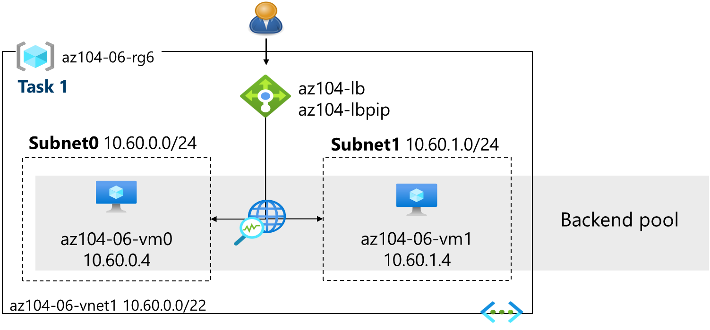
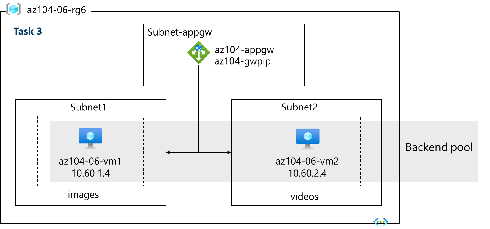
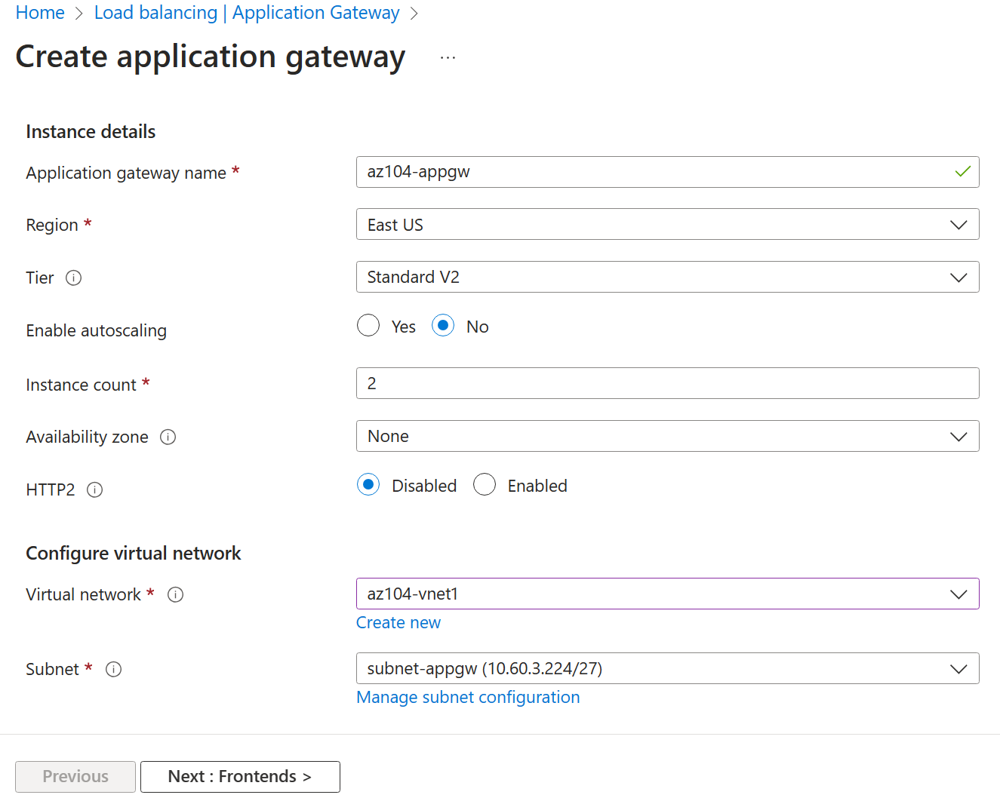

---
lab:
  title: "Labo\_06\_: Implémenter la gestion du trafic"
  module: Administer Network Traffic Management
---

# Labo 06 : Implémenter la gestion du trafic

## Présentation du labo

Dans ce labo, vous découvrez comment configurer et tester un équilibreur de charge public et une passerelle applicative.

Ce labo nécessite un abonnement Azure. Le type de votre abonnement peut affecter la disponibilité des fonctionnalités dans ce labo. Vous pouvez changer la région, mais les étapes sont écrites de façon à utiliser **USA Est**.

## Durée estimée : 50 minutes

## Scénario du labo

Votre organisation a un site web public. Vous devez équilibrer la charge des requêtes publiques entrantes sur différentes machines virtuelles. Vous devez également fournir des images et des vidéos depuis différentes machines virtuelles. Vous prévoyez d’implémenter un équilibreur de charge Azure et une passerelle applicative Azure. Toutes les ressources se trouvent dans la même région.

## Simulations de labo interactives

Il existe des simulations de labo interactives qui peuvent vous être utiles pour cette rubrique. La simulation vous permet de parcourir un scénario similaire, à votre propre rythme. Il existe des différences entre la simulation interactive et ce labo, mais bon nombre des principaux concepts sont les mêmes. Un abonnement Azure n’est pas nécessaire.

+ [Créer et configurer un équilibreur de charge Azure](https://mslabs.cloudguides.com/guides/AZ-700%20Lab%20Simulation%20-%20Create%20and%20configure%20an%20Azure%20load%20balancer). Créer un réseau virtuel, des serveurs back-ends, un équilibreur de charge, puis tester l’équilibreur de charge.
+ [Déployer une passerelle applicative Azure](https://mslabs.cloudguides.com/guides/AZ-700%20Lab%20Simulation%20-%20Deploy%20Azure%20Application%20Gateway). Créer une passerelle applicative, créer des machines virtuelles, créer le pool de back-ends et tester la passerelle.
+ [Implémenter la gestion du trafic](https://mslabs.cloudguides.com/guides/AZ-104%20Exam%20Guide%20-%20Microsoft%20Azure%20Administrator%20Exercise%2010). Implémenter un réseau hub-and-spoke complet, y compris les machines virtuelles, les réseaux virtuels, le peering, l’équilibreur de charge et la passerelle applicative.

## Compétences de tâche

+ Tâche 1 : Utiliser un modèle pour provisionner une infrastructure.
+ Tâche 2 : Configurer un équilibreur de charge Azure.
+ Tâche 3 : Configurer une passerelle applicative Azure.

## Tâche 1 : Utiliser un modèle pour provisionner une infrastructure

Dans cette tâche, vous allez utiliser un modèle pour déployer un réseau virtuel, un groupe de sécurité réseau et deux machines virtuelles.

1. Téléchargez les fichiers du labo **\\Allfiles\\Lab06** (modèles et paramètres).

1. Connectez-vous au **portail Azure** - `https://portal.azure.com`.

1. Recherchez et sélectionnez `Deploy a custom template`.

1. Dans la page du déploiement personnalisé, sélectionnez **Créer votre propre modèle dans l’éditeur**.

1. Dans le volet Modifier le modèle, sélectionnez **Charger le fichier**.

1. Recherchez et sélectionnez le fichier **\\Allfiles\\Lab06\\az104-06-vms-template.json**, puis sélectionnez **Ouvrir**.

1. Sélectionnez **Enregistrer**.

1. Sélectionnez **Modifier les paramètres**, puis chargez le fichier **\\Allfiles\\Lab06\\az104-06-vms-parameters.json**.

1. Sélectionnez **Enregistrer**.

1. Utilisez les informations suivantes pour compléter les champs de la page du déploiement personnalisé, en laissant tous les autres champs avec leur valeur par défaut.

    | Paramètre       | Valeur         |
    | ---           | ---           |
    | Abonnement  | votre abonnement Azure |
    | Resource group | `az104-rg6` (Si nécessaire, sélectionnez **Créer nouveau**x) |
    | Mot de passe      | Choisissez un mot de passe sécurisé |

    >**Remarque** : Si vous recevez une erreur indiquant que la taille de la machine virtuelle n’est pas disponible, sélectionnez une référence SKU disponible dans votre abonnement et qui comporte au moins 2 cœurs.

1. Sélectionnez **Vérifier + créer**, puis sélectionnez **Créer**.

    >**Remarque** : Attendez que le déploiement se termine avant de passer à la tâche suivante. Le déploiement doit prendre environ 5 minutes.

    >**Remarque** : Passez en revue les ressources déployées. Il y aura un réseau virtuel avec trois sous-réseaux. Chaque sous-réseau aura une machine virtuelle.

## Tâche 2 : Configurer un équilibreur de charge Azure

Dans cette tâche, vous implémentez un équilibreur de charge Azure devant les deux machines virtuelles Azure du réseau virtuel. Les équilibreurs de charge dans Azure fournissent une connectivité de couche 4 entre des ressources, comme des machines virtuelles. La configuration de l’équilibreur de charge inclut une adresse IP frontale pour accepter les connexions, un pool de back-ends et des règles qui définissent la façon dont les connexions doivent traverser l’équilibreur de charge.

## Diagramme de l’architecture – Équilibreur de charge

>**Remarque** : Notez que l’équilibreur de charge effectue une distribution entre deux machines virtuelles dans le même réseau virtuel.

1. Dans le portail Azure, recherchez et sélectionnez `Load balancers` puis, dans le panneau **Équilibreurs de charge**, cliquez sur **+ Créer**.

1. Créez un équilibreur de charge avec les paramètres suivants (laissez les autres avec leur valeur par défaut), puis cliquez sur **Suivant : Configuration IP front-end** :

    | Paramètre | Valeur |
    | --- | --- |
    | Abonnement | votre abonnement Azure |
    | Resource group | **az104-rg6** |
    | Nom | `az104-lb` |
    | Région | La **même** région que celle que vous avez déployé les machines virtuelles |
    | Référence (SKU)  | **Standard** |
    | Type | **Public** |
    | Niveau | **Regional** |

     

1. Sous l’onglet **Configuration IP frontale**, cliquez sur **Ajouter une configuration IP frontale** et utilisez les paramètres suivants :  

    | Paramètre | Valeur |
    | --- | --- |
    | Nom | `az104-fe` |
    | Type IP | Adresse IP |
    | Équilibreur de charge de passerelle | Aucun |
    | Adresse IP publique | Sélectionnez **Créer nouveau** (utilisez les instructions de l’étape suivante) |

1. Dans la fenêtre contextuelle **Ajouter une adresse IP publique**, utilisez les paramètres suivants avant de cliquer sur **OK** et sur **Ajouter**. Quand vous avez terminé, cliquez sur **Suivant : Pools de back-ends**.

    | Paramètre | Valeur |
    | --- | --- |
    | Nom | `az104-lbpip` |
    | Référence (SKU) | Standard |
    | Niveau | Régionale |
    | Affectation | statique |
    | Préférence de routage | **Réseau Microsoft** |

    >**Remarque :** La référence SKU Standard fournit une adresse IP statique. Les adresses IP statiques sont affectées à la ressource quand elle est créée et sont libérées lors de la suppression de la ressource.  

1. Sous l’onglet **Pools de back-ends**, cliquez sur **Ajouter un pool de back-ends** avec les paramètres suivants (laissez les autres valeurs par défaut). Cliquez sur **+ Ajouter** (deux fois), puis cliquez sur **Suivant : Règles de trafic entrant**.

    | Paramètre | Valeur |
    | --- | --- |
    | Nom | `az104-be` |
    | Réseau virtuel | **az104-06-vnet1** |
    | Configuration d’un pool de back-ends | **Carte d’interface réseau** |
    | Cliquer sur **Ajouter** pour ajouter une machine virtuelle |  |
    | az104-06-vm0 | **Cocher la case** |
    | az104-06-vm1 | **Cocher la case** |

1. Si vous avez le temps, passez en revue les autres onglets, puis cliquez sur **Vérifier et créer**. Vérifiez qu’il n’existe aucune erreur de validation, puis cliquez sur **Créer**.

1. Patientez jusqu’à ce que l’équilibreur de charge soit déployé, puis cliquez sur **Accéder à la ressource**.

**Ajouter une règle pour déterminer comment le trafic entrant est distribué**

1. Dans le panneau **Paramètres**, cliquez sur **Règles d’équilibrage de charge**.

1. Sélectionnez **Ajouter une règle d’équilibrage de charge**. Ajoutez une règle d’équilibrage de charge avec les paramètres suivants (laissez les autres valeurs par défaut).  Quand vous configurez la règle, utilisez les icônes d’information pour en savoir plus sur chaque paramètre. Quand vous avez terminé, cliquez sur **Enregistrer**.

    | Paramètre | Valeur |
    | --- | --- |
    | Nom | `az104-lbrule` |
    | Version de l’adresse IP | **IPv4** |
    | Adresse IP du front-end | **az104-fe** |
    | Pool principal | **az104-be** |
    | Protocole | **TCP** |
    | Port | `80` |
    | Port principal | `80` |
    | Sonde d’intégrité | **Création** |
    | Nom | `az104-hp` |
    | Protocole | **TCP** |
    | Port | `80` |
    | Intervalle | `5` |
    | Fermer la fenêtre de création d’une sonde d’intégrité | **Save** |
    | Persistance de session | **Aucun** |
    | Délai d’inactivité (minutes). | `4` |
    | Réinitialisation du protocole TCP | **Désactivé** |
    | IP flottante | **Désactivé** |
    | Traduction d’adresses réseau (SNAT) sources sortante | **Recommended** |

1. Sélectionnez **Configuration d’adresse IP frontale** dans la page de l’équilibreur de charge. Copiez l’adresse IP publique.

1. Ouvrez un autre onglet de navigateur et accédez à l’adresse IP. Vérifiez que la fenêtre du navigateur affiche le message **Hello World à partir d’az104-06-vm0** ou **Hello World à partir d’az104-06-vm1**.

1. Actualisez la fenêtre pour vérifier que le message passe à l’autre machine virtuelle. Cela montre la rotation de l’équilibreur de charge entre les machines virtuelles.

    > **Remarque** : Vous devrez peut être actualiser plusieurs fois ou ouvrir une nouvelle fenêtre de navigateur en mode InPrivate.

## Tâche 3 : Configurer une passerelle applicative Azure

Dans cette tâche, vous implémentez une passerelle applicative Azure devant les deux machines virtuelles Azure. Une passerelle applicative fournit l’équilibrage de charge de couche 7, le pare-feu d’applications web (WAF), l’arrêt SSL et le chiffrement de bout en bout pour les ressources définies dans le pool de back-ends. La passerelle applicative route les images vers une machine virtuelle et les vidéos vers l’autre machine virtuelle.

## Diagramme de l’architecture – Passerelle applicative

>**Remarque** : Cette passerelle applicative fonctionne dans le même réseau virtuel que l’équilibreur de charge. Ce ne sera généralement pas le cas dans un environnement de production classique.

1. Dans le portail Azure, recherchez et sélectionnez `Virtual networks`.

1. Dans le panneau **Réseaux virtuels**, dans la liste des réseaux virtuels, cliquez sur **az104-vnet1**.

1. Dans le panneau du réseau virtuel **az104-vnet1**, dans la section **Paramètres**, cliquez sur **Sous-réseaux**, puis sur **+ Sous-réseau**.

1. Ajoutez un sous-réseau avec les paramètres suivants (laissez les autres avec leur valeur par défaut).

    | Paramètre | Valeur |
    | --- | --- |
    | Nom | `subnet-appgw` |
    | Plage d’adresses de sous-réseau | `10.60.3.224/27` |

1. Cliquez sur **Enregistrer**.

    > **Remarque** : Ce sous-réseau sera utilisé par la passerelle applicative Azure. Application Gateway nécessite un sous-réseau dédié de /27 ou de taille supérieure.

1. Dans le portail Azure, recherchez et sélectionnez `Application Gateways` puis, dans le panneau **Passerelles applicatives**, cliquez sur **+ Créer**.

1. Sous l’onglet **Informations de base**, spécifiez les paramètres suivants (laissez les autres valeurs par défaut) :

    | Paramètre | Valeur |
    | --- | --- |
    | Abonnement | votre abonnement Azure |
    | Resource group | `az104-rg6` |
    | Nom de passerelle applicative | `az104-appgw` |
    | Région | La **même** région Azure que celle que vous avez utilisée dans la tâche 1 |
    | Niveau | **Standard V2** |
    | Activer la mise à l’échelle automatique | **Aucun** |
    | Nombre d’instances minimal | `2` |
    | Zone de disponibilité | **Aucun** |
    | HTTP2 | **Désactivé** |
    | Réseau virtuel | **az104-06-vnet1** |
    | Sous-réseau | **subnet-appgw (10.60.3.224/27)** |

    

1. Cliquez sur **Suivant : Front-ends >** et spécifiez les paramètres suivants (laissez les autres valeurs par défaut). Lorsque vous avez terminé, cliquez sur **OK**.

    | Paramètre | Valeur |
    | --- | --- |
    | Type d'adresse IP de front-end | **Public** |
    | Adresse IP publique| **Ajouter nouveau** |
    | Nom | `az104-gwpip` |
    | Zone de disponibilité | **Aucun** |

    >**Remarque :** La passerelle applicative peut avoir une adresse IP publique et une adresse IP privée.
 
1. Cliquez sur **Suivant : Back-ends >** , puis sur **Ajouter un pool de back-ends**. Spécifiez les paramètres suivants (laissez les autres valeurs par défaut). Quand vous avez terminé, cliquez sur **Ajouter**.

    | Paramètre | Valeur |
    | --- | --- |
    | Nom | `az104-appgwbe` |
    | Ajouter un pool back-end sans cible | **Aucun** |
    | Machine virtuelle | **az104-rg6-nic1 (10.60.1.4)** |
    | Machine virtuelle | **az104-rg6-nic2 (10.60.2.4)** |

1. Cliquez sur **Ajouter un pool de back-ends**. Il s’agit du pool de back-ends pour les **images**. Spécifiez les paramètres suivants (laissez les autres valeurs par défaut). Quand vous avez terminé, cliquez sur **Ajouter**.

    | Paramètre | Valeur |
    | --- | --- |
    | Nom | `az104-imagebe` |
    | Ajouter un pool back-end sans cible | **Aucun** |
    | Machine virtuelle | **az104-rg6-nic1 (10.60.1.4)** |

1. Cliquez sur **Ajouter un pool de back-ends**. Il s’agit du pool de back-ends pour les **vidéos**. Spécifiez les paramètres suivants (laissez les autres valeurs par défaut). Quand vous avez terminé, cliquez sur **Ajouter**.

    | Paramètre | Valeur |
    | --- | --- |
    | Nom | `az104-videobe` |
    | Ajouter un pool back-end sans cible | **Aucun** |
    | Machine virtuelle | **az104-rg6-nic2 (10.60.2.4)** |

1. Sélectionnez **Suivant : Configuration**, puis sur **Ajouter des règles de routage**. Renseignez les informations.

    | Paramètre | Valeur |
    | --- | --- |
    | Nom de la règle | `az104-gwrule` |
    | Priority | `10` |
    | Nom de l’écouteur | `az104-listener` |
    | Adresse IP du front-end | **Public** |
    | Protocol | **HTTP** |
    | Port | `80` |
    | Type d’écouteur | **De base** |

1. Accédez à l’onglet **Cibles de back-end**. Sélectionnez **Ajouter** une fois les informations de base renseignées.

   | Paramètre | Valeur |
    | --- | --- |
    | Cible de back-end | `az104-appgwbe` |
    | Paramètres du back-end | `az104-http` (créer nouveau) |

   >**Remarque :** Prenez un moment pour lire les informations sur l’**affinité basée sur des cookies** et sur le **drainage de connexion**.

1. Sous **Routage basé sur le chemin**, sélectionnez **Ajouter plusieurs cibles pour créer une règle basée sur le chemin**. Vous allez créer deux règles. Cliquez sur **Ajouter** après la première règle, puis ajoutez la deuxième règle. 

    **Règle : routage vers le back-end d’images**

    | Paramètre | Valeur |
    | --- | --- |
    | Chemin d’accès | `/image/*` |
    | Nom de la cible | `images` |
    | Paramètres du back-end | **az104-http** |
    | Cible de back-end | `az104-imagebe` |

    **Règle : routage vers le back-end de vidéos**

    | Paramètre | Valeur |
    | --- | --- |
    | Chemin d’accès | `/video/*` |
    | Nom de la cible | `videos` |
    | Paramètres du back-end | **az104-http** |
    | Cible de back-end | `az104-videobe` |

1. Veillez à **Enregistrer** et à vérifier vos modifications, puis sélectionnez **Suivant : Étiquettes >**. Aucune modification n’est requise.

1. Sélectionnez **Suivant : Vérifier + créer**, puis sur **Créer**.

    > **Remarque** : Attendez la création de l’instance Application Gateway. Cette opération va prendre environ 5 à 10 minutes. Pendant que vous attendez, vous pouvez examiner quelques-uns des liens de formation auto-rythmées à la fin de cette page.

1. Une fois la passerelle d’application déployée, recherchez et sélectionnez **az104-appgw**.

1. Dans la ressource **Passerelle applicative**, dans la section **Surveillance**, sélectionnez **Intégrité principale**.

1. Vérifiez que les deux serveurs du pool de back-ends affichent **Sain**.

1. Dans le panneau **Vue d’ensemble**, copiez la valeur de **Adresses IP publiques frontales**.

1. Démarrez une autre fenêtre de navigateur et testez cette URL : `http://<frontend ip address>/image/`.

1. Vérifiez que vous êtes dirigé vers le serveur d’images (vm1).

1. Démarrez une autre fenêtre de navigateur et testez cette URL : `http://<frontend ip address>/video/`.

1. Vérifiez que vous êtes dirigé vers le serveur de vidéos (vm2).

> **Remarque** : Vous devrez peut être actualiser plusieurs fois ou ouvrir une nouvelle fenêtre de navigateur en mode InPrivate.

## Nettoyage de vos ressources

Si vous travaillez avec **votre propre abonnement**, prenez un moment pour supprimer les ressources du labo. Ceci garantit que les ressources sont libérées et que les coûts sont réduits. Le moyen le plus simple de supprimer les ressources du labo est de supprimer le groupe de ressources du labo. 

+ Dans le Portail Azure, sélectionnez le groupe de ressources, **Supprimer le groupe de ressources**, **Entrer le nom du groupe de ressources**, puis cliquez sur **Supprimer**.
+ `Remove-AzResourceGroup -Name resourceGroupName` en utilisant Azure PowerShell.
+ `az group delete --name resourceGroupName` en utilisant l’interface CLI.
  
## Points clés

Félicitations, vous avez terminé le labo. Voici les principaux points à retenir pour ce labo.

+ Azure Load Balancer est un excellent choix pour distribuer le trafic réseau sur plusieurs machines virtuelles au niveau de la couche de transport (couche OSI 4 – TCP et UDP).
+ Les équilibreurs de charge publics sont utilisés pour équilibrer la charge du trafic Internet sur vos machines virtuelles. Un équilibreur de charge interne (ou privé) est utilisé lorsque des adresses IP privées sont nécessaires uniquement au niveau du serveur front-end.
+ L’équilibreur de charge De base est destiné aux applications à petite échelle qui n’ont pas besoin de la haute disponibilité ou de la redondance. L’équilibreur de charge Standard est conçu pour des performances élevées et une latence ultra-faible.
+ Azure Application Gateway est un équilibreur de charge de trafic web (couche OSI 7) qui vous permet de gérer le trafic vers vos applications web.
+ Le niveau Standard d’Application Gateway offre toutes les fonctionnalités L7, notamment l’équilibrage de charge. Le niveau WAF ajoute un pare-feu pour détecter le trafic malveillant.
+ Une passerelle applicative peut prendre des décisions de routage basées sur des attributs supplémentaires d’une requête HTTP, par exemple des en-têtes d’hôte ou de chemin d’URI.

## En savoir plus grâce à l’apprentissage auto-rythmé

+ [Améliorer la scalabilité et la résilience des applications en utilisant Azure Load Balancer](https://learn.microsoft.com/training/modules/improve-app-scalability-resiliency-with-load-balancer/). Découvrez les différents équilibreurs de charge disponibles dans Azure et comment choisir la solution d’équilibreur de charge Azure la mieux adaptée à vos besoins.
+ [Équilibrer la charge du trafic de votre service web avec Application Gateway](https://learn.microsoft.com/training/modules/load-balance-web-traffic-with-application-gateway/). Améliorez la résilience des applications en répartissant la charge entre plusieurs serveurs, et utilisez le routage basé sur le chemin pour le trafic web direct.
