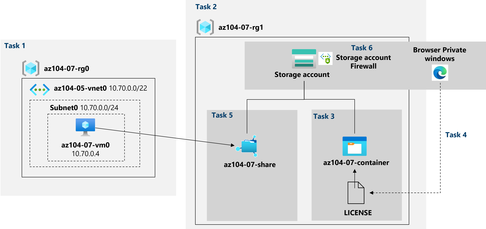

---
lab:
  title: "Labo\_07\_: Gérer Stockage Azure"
  module: Administer Azure Storage
---

# Labo 07 : Gérer le Stockage Azure
# Manuel de labo de l’étudiant

## Scénario du labo

Vous devez évaluer l’utilisation du stockage Azure pour stocker des fichiers résidant actuellement dans des magasins de données locaux. Bien que la majorité de ces fichiers ne soient pas consultés fréquemment, il y a des exceptions. Vous voulez réduire le coût du stockage en plaçant les fichiers moins fréquemment consultés dans des niveaux de stockage moins chers. Vous voulez également explorer différents mécanismes de protection offerts par le Stockage Azure, notamment l’accès réseau, l’authentification, l’autorisation et la réplication. Enfin, vous voulez déterminer si le service Azure Files peut convenir pour héberger vos partages de fichiers locaux.

**Remarque :** Une **[simulation de labo interactive](https://mslabs.cloudguides.com/guides/AZ-104%20Exam%20Guide%20-%20Microsoft%20Azure%20Administrator%20Exercise%2011)** est disponible et vous permet de progresser à votre propre rythme. Il peut exister de légères différences entre la simulation interactive et le labo hébergé. Toutefois, les concepts et idées de base présentés sont identiques. 

## Objectifs

Dans ce labo, vous allez :

+ Tâche 1 : Approvisionner l’environnement de laboratoire
+ Tâche 2 : Créer et configurer des comptes de Stockage Azure
+ Tâche 3 : Gérer le stockage d’objets blob
+ Tâche 4 : Gérer l’authentification et l’autorisation pour le Stockage Azure
+ Tâche 5 : Créer et configurer un partage de fichiers Azure Files
+ Tâche 6 : Gérer l’accès réseau pour le Stockage Azure

## Durée estimée : 40 minutes

## Diagramme de l'architecture




### Instructions

## Exercice 1

## Tâche 1 : Approvisionner l’environnement de laboratoire

Dans cette tâche, vous allez déployer une machine virtuelle Azure que vous utiliserez plus tard dans ce labo.

1. Connectez-vous au **[portail Azure](https://portal.azure.com)**.

1. Dans le portail Azure, ouvrez **Azure Cloud Shell** en cliquant sur l’icône située en haut à droite du portail Azure.

1. Lorsque vous êtes invité à sélectionner **Bash** ou **PowerShell**, sélectionnez **PowerShell**.

    >**Remarque** : Si c’est la première fois que vous démarrez **Cloud Shell** et que vous voyez le message **Vous n’avez aucun stockage monté**, sélectionnez l’abonnement que vous utilisez dans ce labo, puis sélectionnez **Créer un stockage**.

1. Dans la barre d'outils du panneau Cloud Shell, cliquez sur l'icône **Charger/Télécharger des fichiers**, dans le menu déroulant, cliquez sur **Charger** et téléchargez les fichiers **\\Allfiles\\Labs\\07\\az104-07-vm-template.json** et **\\Allfiles\\Labs\\07\\az104-07-vm-parameters.json** dans le répertoire d'origine de Cloud Shell.

1. Dans le panneau Cloud Shell, exécutez la commande suivante pour créer le groupe de ressources qui hébergera les machines virtuelles (remplacez l’espace réservé [Azure_region] par le nom d’une région Azure dans laquelle vous envisagez de déployer la machine virtuelle Azure)

    >**Remarque** : Pour répertorier les noms des régions Azure, exécutez `(Get-AzLocation).Location`.
    >**Remarque** : Chaque commande ci-dessous doit être tapée séparément

    ```powershell
    $location = '[Azure_region]'
    ```
  
    ```powershell
     $rgName = 'az104-07-rg0'
    ```

    ```powershell
    New-AzResourceGroup -Name $rgName -Location $location
    ```
    
1. Dans le panneau Cloud Shell, exécutez ce qui suit pour déployer la machine virtuelle à l’aide des fichiers de modèle et de paramètres chargés :

    >**Remarque** : Vous serez invité à fournir un mot de passe d’administrateur.

   ```powershell
   New-AzResourceGroupDeployment `
      -ResourceGroupName $rgName `
      -TemplateFile $HOME/az104-07-vm-template.json `
      -TemplateParameterFile $HOME/az104-07-vm-parameters.json `
      -AsJob
   ```

    >**Remarque** : N’attendez pas que le déploiement se termine, mais passez à la tâche suivante.

    >**Remarque** : Si vous avez reçu une erreur indiquant que la taille de machine virtuelle n’est pas disponible, demandez à votre instructeur de l’aide et essayez ces étapes.
    > 1. Cliquez sur le bouton `{}` dans votre CloudShell, sélectionnez le fichier **az104-07-vm-parameters.json** dans la barre latérale gauche et prenez note de la valeur de paramètre `vmSize`.
    > 1. Vérifiez l’emplacement dans lequel le groupe de ressources « az104-04-rg1 » est déployé. Vous pouvez exécuter `az group show -n az104-04-rg1 --query location` dans votre CloudShell pour l’obtenir.
    > 1. Exécutez `az vm list-skus --location <Replace with your location> -o table --query "[? contains(name,'Standard_D2s')].name"` dans votre CloudShell.
    > 1. Remplacez la valeur du paramètre `vmSize` par l’une des valeurs retournées par la commande que vous venez d’exécuter.
    > 1. Redéployez maintenant vos modèles en exécutant à nouveau la commande `New-AzResourceGroupDeployment`. Vous pouvez appuyer sur le bouton en haut quelques fois, ce qui amènerait la dernière commande exécutée.

1. Fermez le volet Cloud Shell.

## Tâche 2 : Créer et configurer des comptes de Stockage Azure

Dans cette tâche, vous allez créer et configurer un compte de Stockage Azure.

1. Dans le portail Azure, recherchez et sélectionnez **Comptes de stockage**, puis cliquez sur **+ Créer**.

1. Sous l’onglet **Options de base** du volet **Créer un compte de stockage**, spécifiez les paramètres suivants (conservez les valeurs par défaut pour les autres) :

    | Paramètre | Valeur |
    | --- | --- |
    | Abonnement | le nom de l’abonnement Azure que vous utilisez dans ce labo |
    | Groupe de ressources | le nom d’un **nouveau** groupe de ressources **az104-07-rg1** |
    | Nom du compte de stockage | Nom global unique comprenant entre 3 et 24 caractères alphanumériques |
    | Région | le nom d’une région Azure dans laquelle vous pouvez créer un compte de Stockage Azure  |
    | Performances | **Standard** |
    | Redondance | **Stockage géo-redondant (GRS)** |

1. Cliquez sur **Suivant : Avancé >** , sous l’onglet **Avancé** du panneau **Créer un compte de stockage**, passez en revue les options disponibles, acceptez les valeurs par défaut, puis cliquez sur **Suivant : Mise en réseau >**.

1. Sous l’onglet **Mise en réseau** du panneau **Créer un compte de stockage**, passez en revue les options disponibles, acceptez l’option par défaut **Activer l’accès public de tous les réseaux** et cliquez sur **Suivant : Protection des données >**.

1. Sous l’onglet **Protection des données** du panneau **Créer un compte de stockage**, passez en revue les options disponibles, acceptez les valeurs par défaut, cliquez sur **Vérifier + Créer**, attendez que le processus de validation se termine et cliquez sur **Créer**.

    >**Remarque** : attendez que le compte de stockage soit créé. Ce processus prend environ 2 minutes.

1. Dans le panneau de déploiement, cliquez sur **Accéder à la ressource** pour afficher le panneau du compte de Stockage Azure.

1. Dans le volet Compte de stockage, dans la section **Gestion des données**, cliquez sur **Redondance** et prenez note de l’emplacement secondaire. 

1. Dans la liste déroulante **Redondance**, sélectionnez **Stockage localement redondant (LRS)** et enregistrez la modification. Notez que, à ce stade, le compte de stockage n’a que l’emplacement principal.

1. Dans le volet Compte de stockage, dans la section **Paramètres**, sélectionnez **Configuration**. Définissez le **Niveau d’accès aux blobs (par défaut)** sur **Froid** et enregistrez la modification.

    > **Remarque** : Le niveau d’accès froid est optimal pour les données qui ne sont pas utilisées fréquemment.

## Tâche 3 : Gérer le stockage d’objets blob

Dans cette tâche, vous allez créer un conteneur blob et charger un fichier d’objets blob dans celui-ci.

1. Dans le panneau Compte de stockage, dans la section **Stockage des données**, cliquez sur **Conteneurs**.

1. Cliquez sur **+ Conteneur** et créez un conteneur avec les paramètres suivants :

    | Paramètre | Valeur |
    | --- | --- |
    | Nom | **az104-07-container**  |
    | Niveau d'accès public | **Privé (aucun accès anonyme)** |

1. Dans la liste des conteneurs, cliquez sur **az104-07-container**, puis sur **Charger**.

1. Accédez à **\\Allfiles\\Labs\\07\\LICENSE** sur votre ordinateur de labo, puis cliquez sur **Ouvrir**.

1. Dans le panneau **Charger l’objet blob**, développez la section **Avancé** et spécifiez les paramètres suivants (conservez les valeurs par défaut pour les autres) :

    | Paramètre | Valeur |
    | --- | --- |
    | Type d’objet blob | **Objet blob de blocs** |
    | Taille de bloc | **4 Mo** |
    | Niveau d’accès | **Chaud** |
    | Charger dans le dossier | **licences** |

    > **Remarque** : Le niveau d’accès peut être défini pour des objets blob individuels.

1. Cliquez sur **Télécharger**.

    > **Remarque** : Notez que le chargement a créé automatiquement un sous-dossier nommé **licenses**.

1. Revenez dans le panneau **az104-07-container**, cliquez sur **licenses**, puis sur **LICENSE**.

1. Dans le panneau **licenses/LICENSE**, passez en revue les options disponibles.

    > **Remarque** : Vous avez la possibilité de télécharger l’objet blob, de modifier son niveau d’accès (il est actuellement défini sur **Chaud**), d’acquérir un bail, qui changerait son statut de bail en **Verrouillé** (il est actuellement défini sur **Déverrouillé**) et de protéger l’objet blob contre la modification ou la suppression, ainsi que l’attribution de métadonnées personnalisées (en spécifiant une clé arbitraire et des paires de valeurs). Vous avez également la possibilité de **modifier** le fichier directement dans l’interface du Portail Azure, sans le télécharger au préalable. Vous pouvez également créer des instantanés, ainsi que générer un jeton SAP (vous allez découvrir cette option dans la tâche suivante).

## Tâche 4 : Gérer l’authentification et l’autorisation pour le Stockage Azure

Dans cette tâche, vous allez configurer l’authentification et l’autorisation pour le Stockage Azure.

1. Dans le panneau **licenses/LICENSE**, sous l’onglet **Vue d’ensemble**, cliquez sur le bouton **Copier dans le Presse-papiers** en regard de l’entrée **URL**.

1. Ouvrez une autre fenêtre de navigateur en mode InPrivate et accédez à l’URL que vous avez copiée dans l’étape précédente.

1. Un message au format XML indiquant **ResourceNotFound** ou **PublicAccessNotPermitted** doit vous être présenté.

    > **Remarque** : Ceci est attendu, étant donné que le conteneur que vous avez créé a le niveau d’accès public défini sur **Privé (aucun accès anonyme)**.

1. Fermez la fenêtre du navigateur en mode InPrivate, revenez à la fenêtre du navigateur montrant le panneau **licenses/LICENSE** du conteneur Stockage Azure, puis basculez vers l’onglet **Générer une SAP**.

1. Sous l’onglet **Générer une SAP** du panneau **licenses/LICENSE**, spécifiez les paramètres suivants (conservez les valeurs par défaut pour les autres) :

    | Paramètre | Valeur |
    | --- | --- |
    | Clé de signature | **Clé 1** |
    | Autorisations | **Lire** |
    | Date de début | date d’hier |
    | Heure de début | heure actuelle |
    | Date d'expiration | date de demain |
    | Heure d’expiration | heure actuelle |
    | Adresses IP autorisées | laisser vide |
    

1. Cliquez sur **Générer une URL et un jeton SAS**.

1. Cliquez sur **Copier dans le Presse-papiers** en regard de l’entrée **URL SAP blob**.

1. Ouvrez une autre fenêtre de navigateur en mode InPrivate et accédez à l’URL que vous avez copiée dans l’étape précédente.

    > **Remarque** : Si vous utilisez Microsoft Edge, la page **Licence MIT (MIT)** doit vous être présentée. Si vous utilisez Chrome, Microsoft Edge (Chromium) ou Firefox, vous devez être en mesure d’afficher le contenu du fichier en le téléchargeant et en l’ouvrant avec le Bloc-notes.

    > **Remarque** : Ceci est attendu, car maintenant votre accès est autorisé en fonction du jeton SAP nouvellement généré.

    > **Remarque** : Enregistrez l’URL SAP blob. Vous en aurez besoin plus tard dans ce labo.

1. Fermez la fenêtre du navigateur en mode InPrivate, revenez à la fenêtre du navigateur montrant le panneau **licenses/LICENSE** du conteneur Stockage Azure, puis revenez au panneau **az104-07-container**.

1. Cliquez sur le lien **Basculer vers le lien Compte d’utilisateur Azure AD** en regard de l’étiquette **Méthode d’authentification**.

    > **Remarque** : Vous pouvez voir une erreur lorsque vous modifiez la méthode d’authentification (l’erreur est *« Vous n’avez pas d’autorisations pour répertorier les données à l’aide de votre compte d’utilisateur avec Azure AD »* ). Ceci est normal.  

    > **Remarque** : À ce stade, vous n’avez pas d’autorisations pour modifier la méthode d’authentification.

1. Dans le volet **az104-07-container**, cliquez sur **Access Control (IAM)**.

1. Sous l’onglet **Vérifier l’accès**, cliquez sur **Ajouter une attribution de rôle**.

1. Dans le panneau **Ajouter une attribution de rôle**, spécifiez les paramètres suivants :

    | Paramètre | Valeur |
    | --- | --- |
    | Role | **Propriétaire des données Blob du stockage** |
    | Attribuer l’accès à | **Utilisateur, groupe ou principal de service** |
    | Membres | le nom de votre compte d’utilisateur |

1. Cliquez sur **Vérifier + Attribuer**, sur **Vérifier + attribuer**, puis revenez au panneau **Vue d’ensemble** du conteneur **az104-07-container** et vérifiez que vous pouvez définir la méthode d’authentification sur (Basculer vers le Compte d’utilisateur Azure AD).

    > **Remarque** : La modification peut prendre environ 5 minutes.

## Tâche 5 : Créer et configurer un partage de fichiers Azure Files

Dans cette tâche, vous allez créer et configurer des partages Azure Files.

> **Remarque** : Avant de démarrer cette tâche, vérifiez que la machine virtuelle que vous avez approvisionnée dans la première tâche de ce labo est en cours d’exécution.

1. Dans le portail Azure, revenez au panneau du compte de stockage que vous avez créé dans la première tâche de ce labo puis, dans la section **Stockage de données**, cliquez sur **Partages de fichiers**.

1. Cliquez sur **+ Partage de fichiers**, puis sous l’onglet **Informations de base**, donnez un nom au partage de fichiers, **az104-07-share**. Passez en revue les autres paramètres de cet onglet. 

1. Accédez à l’onglet **Sauvegarde** et vérifiez que la case **Activer la sauvegarde** n’est **pas** cochée.

1. Cliquez sur **Vérifier et créer**, puis sur **Créer**. Attendez que le partage de fichiers soit déployé. 

1. Cliquez sur le partage de fichiers nouvellement créé et notez les informations disponibles dans le panneau **az104-07-share** .

1. Cliquez sur **Parcourir** et notez qu’il n’y a aucun fichier ou dossier dans le nouveau partage de fichiers. Cliquez sur **Connecter**.

1. Dans le panneau **Connecter**, vérifiez que l’onglet **Windows** est sélectionné. Vous trouverez ci-dessous un bouton avec l’étiquette **Afficher le script**. Cliquez sur le bouton et vous trouverez une zone de texte grise avec un script, dans le coin inférieur droit de cette zone. Pointez sur l’icône de pages, puis cliquez sur **Copier dans le Presse-papiers**.

1. Dans le portail Azure, recherchez et sélectionnez **Machines virtuelles** puis, dans la liste des machines virtuelles, cliquez sur **az104-07-vm0**.

1. Dans le panneau **az104-07-vm0**, dans la section **Opérations**, cliquez sur **Exécuter la commande**.

1. Dans le panneau **az104-07-vm0 - Exécuter la commande**, cliquez sur **RunPowerShellScript**.

1. Dans le panneau **Exécuter le script de commande**, collez le script que vous avez copié précédemment dans cette tâche dans le panneau **Script PowerShell**, puis cliquez sur **Exécuter**.

1. Vérifiez que le script s’est correctement exécuté.

1. Remplacez le contenu du panneau **Script PowerShell** par le script suivant, puis cliquez sur **Exécuter** :

   ```powershell
   New-Item -Type Directory -Path 'Z:\az104-07-folder'

   New-Item -Type File -Path 'Z:\az104-07-folder\az-104-07-file.txt'
   ```

1. Vérifiez que le script s’est correctement exécuté.

1. Revenez au volet du partage de fichiers **az104-07-share\|, Naviguez** volet de partage de fichiers, cliquez sur **Actualiser**, puis vérifiez que **az104-07-folder** apparaît dans la liste des dossiers.

1. Cliquez sur **az104-07-folder** et vérifiez que **az104-07-file.txt** apparaît dans la liste des fichiers.

## Tâche 6 : Gérer l’accès réseau pour le Stockage Azure

Dans cette tâche, vous allez configurer l’accès réseau pour le Stockage Azure.

1. Dans le portail Azure, revenez au panneau du compte de stockage que vous avez créé dans la première tâche de ce labo puis, dans la section **Sécurité + Mise en réseau**, cliquez sur **Mise en réseau**, puis sur **Pare-feu et réseaux virtuels**.

1. Cliquez sur l’option **Activé à partir des réseaux virtuels et adresses IP sélectionnés** et passez en revue les paramètres de configuration qui deviennent disponibles une fois que cette option est activée.

    > **Remarque** : Vous pouvez utiliser ces paramètres pour configurer la connectivité directe entre les machines virtuelles Azure sur des sous-réseaux désignés de réseaux virtuels et le compte de stockage à l’aide de points de terminaison de service.

1. Cliquez sur la case à cocher **Ajouter votre adresse IP du client** et enregistrez la modification.

1. Ouvrez une autre fenêtre de navigateur en mode InPrivate et accédez à l’URL SAP blob que vous avez générée dans la tâche précédente.

    > **Remarque** : Si vous n’avez pas enregistré l’URL SAP de la tâche 4, vous devez en générer une nouvelle avec la même configuration. Utilisez les étapes 4 à 6 de la Tâche 4 comme guide pour générer une nouvelle URL SAP blob. 

1. Le contenu de la page **Licence MIT (MIT)** doit vous être présenté.

    > **Remarque** : Ceci est attendu, car vous vous connectez à partir de votre adresse IP du client.

1. Fermez la fenêtre du navigateur en mode InPrivate, revenez à la fenêtre du navigateur montrant le panneau **Mise en réseau** du compte de Stockage Azure.

1. Dans le portail Azure, ouvrez **Azure Cloud Shell** en cliquant sur l’icône située en haut à droite du portail Azure.

1. Lorsque vous êtes invité à sélectionner **Bash** ou **PowerShell**, sélectionnez **PowerShell**.

1. Dans le panneau Cloud Shell, exécutez ce qui suit pour tenter de télécharger l’objet blob LICENSE à partir du conteneur **az104-07-container** du compte de stockage (remplacez l’espace réservé `[blob SAS URL]` par l’URL SAP blob que vous avez générée dans la tâche précédente) :

   ```powershell
   Invoke-WebRequest -URI '[blob SAS URL]'
   ```
1. Vérifiez que la tentative de téléchargement a échoué.

    > **Remarque** : Vous devez recevoir le message indiquant **AuthorizationFailure: Cette requête n’est pas autorisée à effectuer cette opération**. Cela est attendu, car vous vous connectez à partir de l’adresse IP attribuée à une machine virtuelle Azure hébergeant l’instance Cloud Shell.

1. Fermez le volet Cloud Shell.

## Nettoyer les ressources

>**Remarque** : N’oubliez pas de supprimer toutes les nouvelles ressources Azure que vous n’utilisez plus. La suppression des ressources inutilisées vous évitera d’encourir des frais inattendus.

>**Remarque** :  Ne vous inquiétez pas si les ressources de laboratoire ne peuvent pas être immédiatement supprimées. Parfois, les ressources ont des dépendances et leur suppression prend plus de temps. Il s’agit d’une tâche d’administrateur courante pour surveiller l’utilisation des ressources. Il vous suffit donc de consulter régulièrement vos ressources dans le portail pour voir comment se passe le nettoyage. Vous pouvez également essayer de supprimer le groupe de ressources où résident les ressources. Il s’agit d’un raccourci administrateur rapide. Si vous rencontrez des difficultés, parlez à votre instructeur.

1. Dans le portail Azure, ouvrez la session **PowerShell** dans le volet **Cloud Shell**.

1. Listez tous les groupes de ressources créés dans les labos de ce module en exécutant la commande suivante :

   ```powershell
   Get-AzResourceGroup -Name 'az104-07*'
   ```

1. Supprimez tous les groupes de ressources que vous avez créés dans les labos de ce module en exécutant la commande suivante :

   ```powershell
   Get-AzResourceGroup -Name 'az104-07*' | Remove-AzResourceGroup -Force -AsJob
   ```

    >**Remarque** : La commande s’exécute de façon asynchrone (tel que déterminé par le paramètre -AsJob). Vous pourrez donc exécuter une autre commande PowerShell immédiatement après au cours de la même session PowerShell, mais la suppression effective du groupe de ressources peut prendre quelques minutes.

## Révision

Dans cet exercice, vous avez :

- Approvisionné l’environnement lab
- Créé et configuré des comptes de Stockage Azure
- Géré le stockage d’objets blob
- Géré l’authentification et l’autorisation pour le Stockage Azure
- Créé et configuré un partage de fichiers Azure Files
- Géré l’accès réseau pour le Stockage Azure
