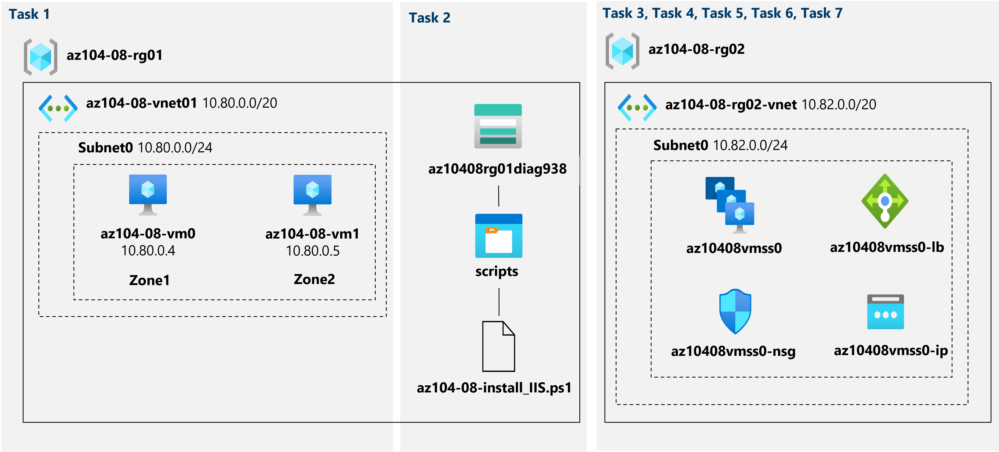

---
lab:
  title: '08 : Gérer des machines virtuelles'
  module: Module 08 - Virtual Machines
ms.openlocfilehash: a710fbaf4ea888651012bad592d34667a190c68f
ms.sourcegitcommit: 6df80c7697689bcee3616cdd665da0a38cdce6cb
ms.translationtype: HT
ms.contentlocale: fr-FR
ms.lasthandoff: 06/26/2022
ms.locfileid: "146587446"
---
# <a name="lab-08---manage-virtual-machines"></a>Labo 08 : Gérer des machines virtuelles
# <a name="student-lab-manual"></a>Manuel de labo de l’étudiant

## <a name="lab-scenario"></a>Scénario du labo

Vous avez été chargé d’identifier différentes options pour déployer et configurer des machines virtuelles Azure. Tout d’abord, vous devez déterminer différentes options de résilience et de scalabilité du calcul et du stockage que vous pouvez implémenter lors de l’utilisation de machines virtuelles Azure. Ensuite, vous devez examiner les options de résilience et de scalabilité du calcul et du stockage disponibles lors de l’utilisation de groupes de machines virtuelles identiques Azure. Vous souhaitez également explorer la possibilité de configurer automatiquement des machines virtuelles et des groupes de machines virtuelles identiques à l’aide de l’extension de script personnalisé de machine virtuelle Azure.

## <a name="objectives"></a>Objectifs

Dans ce labo, vous allez :

+ Tâche 1 : Déployer des machines virtuelles Azure résilientes aux zones à l’aide du portail Azure et d’un modèle Azure Resource Manager
+ Tâche 2 : Configurer des machines virtuelles Azure à l’aide d’extensions de machine virtuelle
+ Tâche 3 : Mettre à l'échelle le calcul et le stockage des machines virtuelles Azure
+ Tâche 4 : Inscrire les fournisseurs de ressources Microsoft.Insights et Microsoft.AlertsManagement
+ Tâche 5 : Déployer des groupes de machines virtuelles identiques Azure résilients aux zones à l’aide du portail Azure
+ Tâche 6 : Configurer des groupes de machines virtuelles identiques Azure à l’aide d’extensions de machine virtuelle
+ Tâche 7 : Mettre à l’échelle le calcul et le stockage pour les groupes de machines virtuelles identiques Azure (facultatif)

## <a name="estimated-timing-50-minutes"></a>Durée estimée : 50 minutes

## <a name="architecture-diagram"></a>Diagramme de l'architecture




## <a name="instructions"></a>Instructions

### <a name="exercise-1"></a>Exercice 1

#### <a name="task-1-deploy-zone-resilient-azure-virtual-machines-by-using-the-azure-portal-and-an-azure-resource-manager-template"></a>Tâche 1 : Déployer des machines virtuelles Azure résilientes aux zones à l’aide du portail Azure et d’un modèle Azure Resource Manager

Dans cette tâche, vous allez déployer des machines virtuelles Azure dans différentes zones de disponibilité à l’aide du portail Azure et d’un modèle Azure Resource Manager.

1. Connectez-vous au [portail Azure](http://portal.azure.com).

1. Dans le portail Azure, recherchez et sélectionnez **Machines virtuelles**, puis, dans le panneau **Machines virtuelles**, cliquez sur **+ Créer**, puis sur **+ Machine virtuelle Azure**.

1. Sous l’onglet **Informations de base** du panneau **Créer une machine virtuelle**, spécifiez les paramètres suivants (conservez les valeurs par défaut pour les autres) :

    | Paramètre | Valeur |
    | --- | --- |
    | Abonnement | Nom de l’abonnement Azure que vous utilisez dans ce labo |
    | Groupe de ressources | le nom d’un nouveau groupe de ressources **az104-08-rg01** |
    | Nom de la machine virtuelle | **az104-08-vm0** |
    | Région | sélectionnez l’une des régions qui prennent en charge les zones de disponibilité et où vous pouvez approvisionner des machines virtuelles Azure |
    | Options de disponibilité | **Zone de disponibilité** |
    | Zone de disponibilité | **Zone 1** |
    | Image | **Windows Server 2019 Datacenter - Gen1/Gen2** |
    | Instance Azure Spot | **Non** |
    | Taille | **Standard D2s v3** |
    | Nom d’utilisateur | **Étudiant** |
    | Mot de passe | **Choisissez un mot de passe sécurisé** |
    | Ports d'entrée publics | **Aucun** |
    | Souhaitez-vous utiliser une licence Windows Server existante ? | **Décoché** |

1. Cliquez sur **Suivant : Disques >** et dans l’onglet **Disques** du panneau **Créer une machine virtuelle**, spécifiez les paramètres suivants (laissez les valeurs par défaut des autres paramètres) :

    | Paramètre | Value |
    | --- | --- |
    | Type de disque du système d’exploitation | **SSD Premium** |
    | Activer la compatibilité avec les disques Ultra | **Décoché** |

1. Cliquez sur **Suivant : Réseau >** et, dans l’onglet **Réseau** du panneau **Créer une machine virtuelle**, cliquez sur **Créer** sous la zone de texte **Réseau virtuel**.

1. Dans le panneau **Créer un réseau virtuel**, spécifiez les paramètres suivants (en laissant les autres avec leur valeur par défaut) :

    | Paramètre | Valeur |
    | --- | --- |
    | Nom | **az104-08-rg01-vnet** |
    | Plage d’adresses | **10.80.0.0/20** |
    | Nom du sous-réseau | **subnet0** |
    | Plage de sous-réseau | **10.80.0.0/24** |

1. Cliquez sur **OK** et, de retour dans l’onglet **Réseau** du panneau **Créer une machine virtuelle**, spécifiez les paramètres suivants (laissez les valeurs par défaut des autres paramètres) :

    | Paramètre | Valeur |
    | --- | --- |
    | Sous-réseau | **subnet0** |
    | Adresse IP publique | **par défaut** |
    | Groupe de sécurité réseau de la carte réseau | **basic** |
    | Ports d’entrée publics | **Aucun** |
    | Mise en réseau accélérée | **Désactivé**
    | Placer cette machine virtuelle derrière une solution d’équilibrage de charge existante ? | **Décoché** |

1. Cliquez sur **Suivant : Gestion >** et sous l’onglet **Gestion** du panneau **Créer une machine virtuelle**, spécifiez les paramètres suivants (laissez les valeurs par défaut des autres paramètres) :

    | Paramètre | Valeur |
    | --- | --- |
    | Diagnostics de démarrage | **Activer avec un compte de stockage personnalisé** |
    | Compte de stockage de diagnostics | accepter la valeur par défaut |
    | Options d'orchestration de patch | **Mises à jour manuelles** |  

    >**Remarque** : Si nécessaire, sélectionnez un compte de stockage existant dans la liste déroulante ou créez un compte de stockage. Enregistrez le nom du compte de stockage. Vous l’utiliserez à la tâche suivante.

1. Cliquez sur **Suivant : Avancé >** , sous l’onglet **Avancé** du panneau **Créer une machine virtuelle**, passez en revue les paramètres disponibles sans les modifier, puis cliquez sur **Vérifier + Créer**.

1. Dans le panneau **Vérifier + créer**, cliquez sur **Créer**.

1. Sur le panneau de déploiement, cliquez sur **Modèle**.

1. Passez en revue le modèle représentant le déploiement en cours, puis cliquez sur **Déployer**.

    >**Remarque** : Vous allez utiliser cette option pour déployer la deuxième machine virtuelle avec la configuration correspondante, à l’exception de la zone de disponibilité.

1. Dans le panneau **Déploiement personnalisé**, spécifiez les paramètres suivants (en laissant les autres avec leur valeur par défaut) :

    | Paramètre | Value |
    | --- | --- |
    | Groupe de ressources | **az104-08-rg01** |
    | Nom de l'interface réseau | **az104-08-vm1-nic1** |
    | Nom de l’adresse IP publique | **az104-08-vm1-ip** |
    | Nom de la machine virtuelle, Nom1 de la machine virtuelle, Nom de l’ordinateur de la machine virtuelle   | **az104-08-vm1** |
    | Groupe de ressources de la machine virtuelle | **az104-08-rg01** |    
    | Nom d’utilisateur d’administrateur | **Étudiant** |
    | Mot de passe d’administrateur | **Choisissez un mot de passe sécurisé**  |
    | Activer la mise à jour corrective à chaud | **false** |
    | Zone | **2** |

    >**Remarque** : Vous devez modifier les paramètres correspondant aux propriétés des ressources distinctes que vous déployez à l’aide du modèle, y compris la machine virtuelle et son interface réseau.

1. Cliquez sur **Vérifier + Créer**, dans le panneau **Vérifier + Créer**, puis sur **Créer**.

    >**Remarque** : Attendez que les deux déploiements se terminent avant de passer à la tâche suivante. Ceci peut prendre environ 5 minutes.

#### <a name="task-2-configure-azure-virtual-machines-by-using-virtual-machine-extensions"></a>Tâche 2 : Configurer des machines virtuelles Azure à l’aide d’extensions de machine virtuelle

Dans cette tâche, vous allez installer le rôle serveur Windows Web sur les deux machines virtuelles Azure que vous avez déployées dans la tâche précédente à l’aide de l’extension de machine virtuelle de script personnalisé.

1. Dans le portail Azure, recherchez et sélectionnez **Comptes de stockage**, puis, dans le panneau **Comptes de stockage**, cliquez sur l’entrée représentant le compte de stockage de diagnostics que vous avez créé dans la tâche précédente.

1. Dans le panneau du compte de stockage, dans la section **Stockage de données**, cliquez sur **Conteneurs**, puis sur **+ Conteneur**.

1. Dans le panneau **Nouveau conteneur**, spécifiez les paramètres suivants (en laissant les autres avec leur valeur par défaut) puis cliquez sur **Créer** :

    | Paramètre | Valeur |
    | --- | --- |
    | Nom | **scripts** |
    | Niveau d'accès public | **Privé (aucun accès anonyme)** |

1. Revenez au panneau du compte de stockage affichant la liste des conteneurs, cliquez sur **scripts**.

1. Dans le panneau **scripts**, cliquez sur **Télécharger**.

1. Dans le panneau **Charger l'objet blob**, cliquez sur l’icône de dossier, dans la boîte de dialogue **Ouvrir**, accédez au dossier **\\Allfiles\\Labs\\08**, sélectionnez **az104-08-install_IIS.ps1**, cliquez sur **Ouvrir**, puis revenez dans le panneau **Charger l'objet blob**, cliquez sur **Télécharger**.

1. Dans le portail Azure, recherchez et sélectionnez **Machines virtuelles**, puis, dans le panneau **Machines virtuelles**, cliquez sur **az104-08-vm0**.

1. Dans le panneau de la machine virtuelle **az104-08-vm0**, dans la section **Paramètres**, cliquez sur **Extensions + applications**, puis sur **+ Ajouter**.

1. Dans le panneau **Installer une extension**, cliquez sur **Extension de script personnalisé**, puis sur **Suivant**.

1. Dans le panneau **Configurer l’extension d’extension de script personnalisé**, cliquez sur **Parcourir**.

1. Dans le panneau **Comptes de stockage**, cliquez sur le nom du compte de stockage dans lequel vous avez chargé le script **az104-08-install_IIS.ps1**, dans le panneau **Conteneurs**, cliquez sur **scripts**, sur le panneau **scripts**, sur **az104-08-install_IIS.ps1**, puis sur **Sélectionner**.

1. Dans le panneau **Installer l’extension** , cliquez sur **Vérifier + créer** et, dans le panneau **Vérifier + créer**, cliquez sur **Créer**.

1. Dans le portail Azure, recherchez et sélectionnez **Machines virtuelles**, puis, dans le panneau **Machines virtuelles**, cliquez sur **az104-08-vm1**.

1. Dans le panneau **az104-08-vm1**, dans la section **Automation**, cliquez sur **Exporter le modèle**.

1. Dans le panneau **az104-08-vm1 - Exporter le modèle**, cliquez sur **Déployer**.

1. Dans le panneau **Déploiement personnalisé**, cliquez sur **Modifier le modèle**.

    >**Remarque** : Ne tenez pas compte du message qui déclare **Le groupe de ressources se trouve dans un emplacement qui n’est pas pris en charge par une ou plusieurs ressources dans le modèle. Choisissez un autre groupe de ressources.** Cet avertissement est normal et peut être ignoré dans ce cas.

1. Dans le panneau **Modifier le modèle**, dans la section affichant le contenu du modèle, insérez le code suivant à partir de la ligne **20** (directement sous la ligne `"resources": [`) :

   >**Remarque** : Si vous utilisez un outil qui colle le code en ligne par ligne IntelliSense peut ajouter des crochets supplémentaires à l’origine d’erreurs de validation. Vous pouvez d’abord coller le code dans le bloc-notes, puis le coller à la ligne 20.

   ```json
        {
            "type": "Microsoft.Compute/virtualMachines/extensions",
            "name": "az104-08-vm1/customScriptExtension",
            "apiVersion": "2018-06-01",
            "location": "[resourceGroup().location]",
            "dependsOn": [
                "az104-08-vm1"
            ],
            "properties": {
                "publisher": "Microsoft.Compute",
                "type": "CustomScriptExtension",
                "typeHandlerVersion": "1.7",
                "autoUpgradeMinorVersion": true,
                "settings": {
                    "commandToExecute": "powershell.exe Install-WindowsFeature -name Web-Server -IncludeManagementTools && powershell.exe remove-item 'C:\\inetpub\\wwwroot\\iisstart.htm' && powershell.exe Add-Content -Path 'C:\\inetpub\\wwwroot\\iisstart.htm' -Value $('Hello World from ' + $env:computername)"
              }
            }
        },

   ```

   >**Remarque** : Cette section du modèle définit la même extension de script personnalisé de machine virtuelle Azure que celle que vous avez déployée précédemment sur la première machine virtuelle via Azure PowerShell.

1. Cliquez sur **Enregistrer** et, dans le panneau **Modèle personnalisé**, cliquez sur **Vérifier + Créer** et, dans le panneau **Vérifier + Créer**, cliquez sur **Créer**

    >**Remarque** : Attendez la fin du déploiement du modèle. Vous pouvez surveiller sa progression à partir du panneau **Extensions** des machines virtuelles **az104-08-vm0** et **az104-08-vm1**. Cette opération ne doit pas prendre plus de 3 minutes.

1. Pour vérifier que la configuration basée sur l’extension de script personnalisé a réussi, revenez dans le panneau **az104-08-vm1**, dans la section **Opérations**, cliquez sur **Run command**, puis, dans la liste des commandes, cliquez sur **RunPowerShellScript**.

1. Dans le panneau **Script Run Command**, tapez ce qui suit, puis cliquez sur **Exécuter** pour accéder au site web hébergé sur **az104-08-vm0** :

   ```powershell
   Invoke-WebRequest -URI http://10.80.0.4 -UseBasicParsing
   ```

    >**Remarque** : Le paramètre **-UseBasicParsing** est nécessaire pour éliminer la dépendance vis-à-vis d’Internet Explorer pour terminer l’exécution de l’applet de commande

    >**Remarque** : Vous pouvez également vous connecter à **az104-08-vm0** et exécuter `Invoke-WebRequest -URI http://10.80.0.5 -UseBasicParsing` pour accéder au site web hébergé sur **az104-08-vm1**.

#### <a name="task-3-scale-compute-and-storage-for-azure-virtual-machines"></a>Tâche 3 : Mettre à l'échelle le calcul et le stockage des machines virtuelles Azure

Dans cette tâche, vous allez mettre à l'échelle le calcul des machines virtuelles Azure en modifiant leur taille et mettre à l'échelle leur stockage en attachant et en configurant leurs disques de données.

1. Dans le portail Azure, recherchez et sélectionnez **Machines virtuelles**, puis, dans le panneau **Machines virtuelles**, cliquez sur **az104-08-vm0**.

1. Dans le panneau **az104-08-vm0** de la machine virtuelle, cliquez sur **Taille** et définissez la taille de la machine virtuelle sur **DS1_v2 standard**, puis cliquez sur **Redimensionner**

    >**Remarque** : Choisissez une autre taille si **DS1_v2 standard** n’est pas disponible.

1. Dans le panneau de la machine virtuelle **az104-08-vm0**, cliquez sur **Disques**, sous **Disques de données**, cliquez sur **+ Créer et attacher un nouveau disque**.

1. Créez un disque managé avec les paramètres suivants (laissez les autres avec leurs valeurs par défaut) :

    | Paramètre | Valeur |
    | --- | --- |
    | Nom du disque | **az104-08-vm0-datadisk-0** |
    | Type de stockage | **SSD Premium** |
    | Taille (Gio)| **1,024** |

1. De retour dans le panneau **az104-08-vm0 - Disques**, sous **Disques de données**, cliquez sur **+ Créer un disque et l'attacher**.

1. Créez un disque managé avec les paramètres suivants (laissez les autres avec leurs valeurs par défaut) et enregistrez les modifications :

    | Paramètre | Valeur |
    | --- | --- |
    | Nom du disque | **az104-08-vm0-datadisk-1** |
    | Type de stockage | **SSD Premium** |
    | Taille (Gio)| **1,024 Gio** |

1. De retour dans le panneau **az104-08-vm0 - Disques**, cliquez sur **Enregistrer**.

1. Dans le panneau **az104-08-vm0**, dans la section **Opérations**, cliquez sur **Run command** et, dans la liste des commandes, cliquez sur **RunPowerShellScript**.

1. Dans le panneau **Script Run Command**, tapez ce qui suit, puis cliquez sur **Exécuter** pour créer un lecteur Z : constitué des deux disques nouvellement attachés avec la disposition simple et l’approvisionnement fixe :

   ```powershell
   New-StoragePool -FriendlyName storagepool1 -StorageSubsystemFriendlyName "Windows Storage*" -PhysicalDisks (Get-PhysicalDisk -CanPool $true)

   New-VirtualDisk -StoragePoolFriendlyName storagepool1 -FriendlyName virtualdisk1 -Size 2046GB -ResiliencySettingName Simple -ProvisioningType Fixed

   Initialize-Disk -VirtualDisk (Get-VirtualDisk -FriendlyName virtualdisk1)

   New-Partition -DiskNumber 4 -UseMaximumSize -DriveLetter Z
   ```

    > **Remarque** : Attendez la confirmation que les commandes se sont terminées correctement.

1. Dans le portail Azure, recherchez et sélectionnez **Machines virtuelles**, puis, dans le panneau **Machines virtuelles**, cliquez sur **az104-08-vm1**.

1. Dans le panneau **az104-08-vm1**, dans la section **Automation**, cliquez sur **Exporter le modèle**.

1. Dans le panneau **az104-08-vm1 - Exporter le modèle**, cliquez sur **Déployer**.

1. Dans le panneau **Déploiement personnalisé**, cliquez sur **Modifier le modèle**.

    >**Remarque** : Ne tenez pas compte du message qui déclare **Le groupe de ressources se trouve dans un emplacement qui n’est pas pris en charge par une ou plusieurs ressources dans le modèle. Choisissez un autre groupe de ressources.** Cet avertissement est normal et peut être ignoré dans ce cas.

1. Dans le panneau **Modifier le modèle**, dans la section affichant le contenu du modèle, remplacez la ligne **30** `"vmSize": "Standard_D2s_v3"` par la ligne suivante :

   ```json
                    "vmSize": "Standard_DS1_v2"

   ```

    >**Remarque** : Cette section du modèle définit la même taille de machine virtuelle Azure que celle que vous avez spécifiée pour la première machine virtuelle via le portail Azure.

1. Dans le panneau **Modifier le modèle**, dans la section affichant le contenu du modèle, remplacez la ligne **51** (ligne `"dataDisks": [ ]`) par le code suivant :

   ```json
                    "dataDisks": [
                      {
                        "lun": 0,
                        "name": "az104-08-vm1-datadisk0",
                        "diskSizeGB": "1024",
                        "caching": "ReadOnly",
                        "createOption": "Empty"
                      },
                      {
                        "lun": 1,
                        "name": "az104-08-vm1-datadisk1",
                        "diskSizeGB": "1024",
                        "caching": "ReadOnly",
                        "createOption": "Empty"
                      }
                    ]
   ```

    >**Remarque** : Si vous utilisez un outil qui colle le code en ligne par ligne IntelliSense peut ajouter des crochets supplémentaires à l’origine d’erreurs de validation. Vous pouvez d’abord coller le code dans le bloc-notes, puis le coller à la ligne 49.

    >**Remarque** : Cette section du modèle crée deux disques managés et les attache à **az104-08-vm1**, de la même façon que la configuration de stockage de la première machine virtuelle via le portail Azure.


1. Cliquez sur **Enregistrer** et, dans le panneau **Déploiement personnalisé**, cliquez sur **Vérifier + Créer** et, dans le panneau **Vérifier + Créer**, cliquez sur **Créer**.

    >**Remarque** : Attendez la fin du déploiement du modèle. Vous pouvez surveiller sa progression à partir du panneau **Disques** de la machine virtuelle **az104-08-vm1**. Cette opération ne doit pas prendre plus de 3 minutes.

1. De retour sur le panneau **az104-08-vm1**, dans la section **Opérations**, cliquez sur **Run command** et, dans la liste des commandes, cliquez sur **RunPowerShellScript**.

1. Dans le panneau **Script Run Command**, tapez ce qui suit, puis cliquez sur **Exécuter** pour créer un lecteur Z : constitué des deux disques nouvellement attachés avec la disposition simple et l’approvisionnement fixe :

   ```powershell
   New-StoragePool -FriendlyName storagepool1 -StorageSubsystemFriendlyName "Windows Storage*" -PhysicalDisks (Get-PhysicalDisk -CanPool $true)

   New-VirtualDisk -StoragePoolFriendlyName storagepool1 -FriendlyName virtualdisk1 -Size 2046GB -ResiliencySettingName Simple -ProvisioningType Fixed

   Initialize-Disk -VirtualDisk (Get-VirtualDisk -FriendlyName virtualdisk1)

   New-Partition -DiskNumber 4 -UseMaximumSize -DriveLetter Z
   ```

    > **Remarque** : Attendez la confirmation que les commandes se sont terminées correctement.

#### <a name="task-4-register-the-microsoftinsights-and-microsoftalertsmanagement-resource-providers"></a>Tâche 4 : Inscrire les fournisseurs de ressources Microsoft.Insights et Microsoft.AlertsManagement

1. Dans le portail Azure, ouvrez **Azure Cloud Shell** en cliquant sur l’icône située en haut à droite du portail Azure.

1. Lorsque vous êtes invité à sélectionner **Bash** ou **PowerShell**, sélectionnez **PowerShell**.

    >**Remarque** : Si c’est la première fois que vous démarrez **Cloud Shell** et que vous voyez le message **Vous n’avez aucun stockage monté**, sélectionnez l’abonnement que vous utilisez dans ce labo, puis sélectionnez **Créer un stockage**.

1. Dans le panneau Cloud Shell, exécutez la commande suivante pour inscrire les fournisseurs de ressources Microsoft.Insights et Microsoft.AlertsManagement.

   ```powershell
   Register-AzResourceProvider -ProviderNamespace Microsoft.Insights

   Register-AzResourceProvider -ProviderNamespace Microsoft.AlertsManagement
   ```

#### <a name="task-5-deploy-zone-resilient-azure-virtual-machine-scale-sets-by-using-the-azure-portal"></a>Tâche 5 : Déployer des groupes de machines virtuelles identiques Azure résilients aux zones à l’aide du portail Azure

Dans cette tâche, vous allez déployer un groupe de machines virtuelles identiques Azure sur des zones de disponibilité à l’aide du portail Azure.

1. Dans le portail Azure, recherchez et sélectionnez **Groupes de machines virtuelles identiques** et, dans le panneau **Groupes de machines virtuelles identiques**, cliquez sur **+ Ajouter** (ou **+ Créer**).

1. Sous l’onglet **Informations de base** du panneau **Créer un groupe de machines virtuelles identiques**, spécifiez les paramètres suivants (laissez les valeurs par défaut des autres paramètres), et cliquez sur **Suivant : Disques >**  :

    | Paramètre | Valeur |
    | --- | --- |
    | Abonnement | le nom de l’abonnement Azure que vous utilisez dans ce labo |
    | Groupe de ressources | le nom d’un nouveau groupe de ressources **az104-08-rg02** |
    | Nom du groupe de machines virtuelles identiques | **az10408vmss0** |
    | Région | sélectionnez l’une des régions qui prennent en charge les zones de disponibilité et où vous pouvez provisionner des machines virtuelles Azure différentes de celles que vous avez utilisées pour déployer des machines virtuelles précédemment dans ce laboratoire |
    | Zone de disponibilité | **Zones 1, 2, 3** |
    | Image | **Windows Server 2019 Datacenter - Gen2** |
    | Instance Azure Spot | **Non** |
    | Taille | **D2s_v3 standard** |
    | Nom d’utilisateur | **Étudiant** |
    | Mot de passe | **Choisissez un mot de passe sécurisé**  |
    | Vous disposez déjà d’une licence Windows Server ? | **Décoché** |

    >**Remarque** : Pour obtenir la liste des régions Azure qui prennent en charge le déploiement de machines virtuelles Windows vers des zones de disponibilité, consultez [Qu’est-ce que Zones de disponibilité dans Azure ?](https://docs.microsoft.com/en-us/azure/availability-zones/az-overview)

1. Sous l’onglet **Disques** du panneau **Créer un groupe de machines virtuelles identiques**, acceptez les valeurs par défaut, puis cliquez sur **Suivant : Mise en réseau >** .

1. Sous l’onglet **Mise en réseau** du panneau **Créer un groupe de machines virtuelles identiques**, cliquez sur le lien **Créer un réseau virtuel** sous la zone de texte **Réseau virtuel** et créez un réseau virtuel avec les paramètres suivants (laissez les autres avec leurs valeurs par défaut) :

    | Paramètre | Valeur |
    | --- | --- |
    | Nom | **az104-08-rg02-vnet** |
    | Plage d’adresses | **10.82.0.0/20** |
    | Nom du sous-réseau | **subnet0** |
    | Plage de sous-réseau | **10.82.0.0/24** |

    >**Remarque** : Une fois que vous avez créé un réseau virtuel et que vous revenez à l’onglet **Mise en réseau** du panneau **Créer un groupe de machines virtuelles identiques**, la valeur du **Réseau virtuel** est automatiquement définie sur **az104-08-rg02-vnet**.

1. Revenez sous l’onglet **Mise en réseau** du panneau **Créer un groupe de machines virtuelles identiques**, cliquez sur l’icône **Modifier l’interface réseau** à droite de l’entrée d’interface réseau.

1. Dans le panneau **Modifier l’interface réseau**, dans la section **Groupe de sécurité réseau de la carte réseau**, cliquez sur **Avancé**, puis sur **Créer** sous la liste déroulante **Configurer le groupe de sécurité réseau**.

1. Dans le panneau **Créer un groupe de sécurité réseau**, spécifiez les paramètres suivants (en laissant les autres avec leur valeur par défaut) :

    | Paramètre | Valeur |
    | --- | --- |
    | Nom | **az10408vmss0-nsg** |

1. Cliquez sur **Ajouter une règle de trafic entrant** et ajoutez une règle de sécurité entrante avec les paramètres suivants (laissez les autres avec leurs valeurs par défaut) :

    | Paramètre | Valeur |
    | --- | --- |
    | Source | **Aucune** |
    | Plages de ports sources | **\*** |
    | Destination | **Aucune** |
    | Plages de ports de destination | **80** |
    | Protocole | **TCP** |
    | Action | **Autoriser** |
    | Priorité | **1010** |
    | Nom | **custom-allow-http** |

1. Cliquez sur **Ajouter** et, dans le panneau **Créer un groupe de sécurité réseau**, cliquez sur **OK**.

1. Revenez dans le panneau **Modifier l’interface réseau**, dans la section **Adresse IP publique**, cliquez sur **Activé**, puis sur **OK**.

1. Dans l’onglet **Mise en réseau** du panneau **Créer un groupe de machines virtuelles identiques**, sous la section **Équilibrage de charge**, vérifiez que l’entrée **Utiliser un équilibreur de charge** est sélectionnée et spécifiez les paramètres d’équilibrage **de** charge suivants (laissez les autres avec leurs valeurs par défaut) et cliquez sur **Suivant : Mise à l’échelle >**  :

    | Paramètre | Valeur |
    | --- | --- |
    | Options d’équilibrage de charge | **Équilibreur de charge Azure** |
    | Sélectionnez un équilibreur de charge | **(nouveau) az10408vmss0-lb** |
    | Sélectionnez un pool principal | **(nouveau) bepool** |

1. Sous l’onglet **Mise à l'échelle** du panneau **Créer un groupe de machines virtuelles identiques**, spécifiez les paramètres suivants (laissez les valeurs par défaut des autres paramètres), et cliquez sur **Suivant : Gestion >**  :

    | Paramètre | Valeur |
    | --- | --- |
    | Nombre initial d’instances | **2** |
    | Stratégie de mise à l’échelle | **Manuel** |

1. Sous l’onglet **Gestion** du panneau **Créer un groupe de machines virtuelles identiques**, spécifiez les paramètres suivants (laissez les valeurs par défaut des autres paramètres) :

    | Paramètre | Valeur |
    | --- | --- |
    | Diagnostics de démarrage | **Activer avec un compte de stockage personnalisé** |
    | Compte de stockage de diagnostics | accepter la valeur par défaut |

    >**Remarque** : Vous aurez besoin du nom de ce compte de stockage dans la tâche suivante.

   Cliquez sur **Suivant : Intégrité >**  :

1. Sous l’onglet **Intégrité** du panneau **Créer un groupe de machines virtuelles identiques**, passez en revue les paramètres par défaut sans apporter de modifications et cliquez sur **Suivant : Avancé >** .

1. Sous l’onglet **Avancé** du panneau **Créer un groupe de machines virtuelles identiques**, spécifiez les paramètres suivants (laissez les valeurs par défaut des autres paramètres), et cliquez sur **Vérifier + créer**.

    | Paramètre | Valeur |
    | --- | --- |
    | Algorithme de diffusion | **Diffusion fixe (non recommandée avec des zones)** |

    >**Remarque** : Le paramètre de **Diffusion maximale** n’est actuellement pas fonctionnel.

1. Sous l’onglet **Vérifier + créer** du panneau **Créer un groupe de machines virtuelles identiques** , vérifiez que la validation a réussi et cliquez sur **Créer**.

    >**Remarque** : Attendez que le déploiement du groupe de machines virtuelles identiques soit terminé. Ce processus prend environ 5 minutes.

#### <a name="task-6-configure-azure-virtual-machine-scale-sets-by-using-virtual-machine-extensions"></a>Tâche 6 : Configurer des groupes de machines virtuelles identiques Azure à l’aide d’extensions de machine virtuelle

Dans cette tâche, vous allez installer le rôle serveur Windows Web sur les instances du groupe de machines virtuelles identiques Azure que vous avez déployées dans la tâche précédente à l’aide de l’extension de machine virtuelle de script personnalisé.

1. Dans le portail Azure, recherchez et sélectionnez **Comptes de stockage**, puis, dans le panneau **Comptes de stockage**, cliquez sur l’entrée représentant le compte de stockage de diagnostics que vous avez créé dans la tâche précédente.

1. Dans le panneau du compte de stockage, dans la section **Stockage de données**, cliquez sur **Conteneurs**, puis sur **+ Conteneur**.

1. Dans le panneau **Nouveau conteneur**, spécifiez les paramètres suivants (en laissant les autres avec leur valeur par défaut) puis cliquez sur **Créer** :

    | Paramètre | Valeur |
    | --- | --- |
    | Nom | **scripts** |
    | Niveau d'accès public | **Privé (aucun accès anonyme)** |

1. Revenez au panneau du compte de stockage affichant la liste des conteneurs, cliquez sur **scripts**.

1. Dans le panneau **scripts**, cliquez sur **Télécharger**.

1. Dans le panneau **Charger l'objet blob**, cliquez sur l’icône de dossier, dans la boîte de dialogue **Ouvrir**, accédez au dossier **\\Allfiles\\Labs\\08**, sélectionnez **az104-08-install_IIS.ps1**, cliquez sur **Ouvrir**, puis revenez dans le panneau **Charger l'objet blob**, cliquez sur **Télécharger**.

1. Dans le portail Azure, revenez au panneau **Groupes identiques de machines virtuelles**, puis cliquez sur **az10408vms0**.

1. Dans le panneau **az10408vmss0**, dans la section **Paramètres**, cliquez sur **Extensions**, puis sur **+ Ajouter**.

1. Dans le panneau **Nouvelle ressource**, cliquez sur **Extension de script personnalisé**, puis sur **Suivant**.

1. Dans le panneau **Installer l’extension**, cliquez sur **Parcourir** et **Sélectionnez** le script **az104-08-install_IIS.ps1** chargé dans le conteneur de **scripts** dans le compte de stockage précédemment dans cette tâche, puis cliquez sur **Créer**.

    >**Remarque** : Attendez que l’installation de l’extension se termine avant de passer à l’étape suivante.

1. Dans la section **Paramètres** du panneau **az10408vmss0**, cliquez sur **Instances**, cochez les cases en regard des deux instances du groupe de machines virtuelles identiques, cliquez sur **Mettre à niveau**, puis, lorsque vous êtes invité à confirmer, cliquez sur **Oui**.

    >**Remarque** : Attendez que la mise à niveau se termine avant de passer à l’étape suivante.

1. Dans le portail Azure, recherchez et sélectionnez **Équilibreurs de charge** et, dans la liste des équilibreurs de charge, cliquez sur **az10408vmss0-lb**.

1. Dans le panneau **az10408vmss0-lb**, notez la valeur de l’**Adresse IP publique** affectée au front-end de l’équilibreur de charge, ouvrez un nouvel onglet de navigateur et accédez à cette adresse IP.

    >**Remarque** : Vérifiez que la page du navigateur affiche le nom de l’une des instances du groupe de machines virtuelles identiques Azure **az10408vms0**.

#### <a name="task-7-scale-compute-and-storage-for-azure-virtual-machine-scale-sets"></a>Tâche 7 : Mettre à l’échelle le calcul et le stockage pour les groupes de machines virtuelles identiques Azure

Dans cette tâche, vous allez modifier la taille des instances de groupes de machines virtuelles identiques, configurer leurs paramètres de mise à l’échelle automatique et y attacher des disques.

1. Dans le portail Azure, recherchez et sélectionnez **Groupes de machines virtuelles identiques**, puis sélectionnez le groupe identique **az10408vmss0**

1. Dans le panneau **az10408vmss0**, dans la section **Paramètres**, cliquez sur **Taille**.

1. Dans la liste des tailles disponibles, sélectionnez **DS1_v2 standard**, puis cliquez sur **Redimensionner**.

1. Dans la section **Paramètres**, cliquez sur **Instances**, cochez les cases en regard des deux instances du groupe de machines virtuelles identiques, cliquez sur **Mettre à niveau**, puis, lorsque vous êtes invité à confirmer, cliquez sur **Oui**.

1. Dans la liste des instances, cliquez sur l’entrée représentant la première instance et, dans le panneau de l’instance de groupe identique, notez son **Emplacement** (il doit s’agir de l’une des zones de la région Azure cible dans laquelle vous avez déployé le groupe de machines virtuelles identiques Azure).

1. Revenez au panneau **az10408vmss0 - Instances**, cliquez sur l’entrée représentant la deuxième instance et, dans le panneau de l’instance de groupe identique, notez son **Emplacement** (il doit s’agir de l’une des zones de la région Azure cible dans laquelle vous avez déployé le groupe de machines virtuelles identiques Azure).

1. Revenez au panneau **az10408vmss0 - Instances**, puis, dans la section **Paramètres**, cliquez sur **Mise à l’échelle**.

1. Dans le panneau **az10408vms0 - Mise à l’échelle**, sélectionnez l’option **Mise à l’échelle automatique personnalisée** et configurez la mise à l’échelle automatique avec les paramètres suivants (laissez les autres avec leurs valeurs par défaut) :

    | Paramètre | Valeur |
    | --- |--- |
    | Mode de mise à l’échelle | **Mettre à l'échelle selon une mesure** |

1. Cliquez sur le lien **+ Ajouter une règle** et, dans le panneau **Règle de mise à l'échelle**, spécifiez les paramètres suivants (laissez les autres avec leurs valeurs par défaut) :

    | Paramètre | Valeur |
    | --- |--- |
    | Source de la mesure | **Ressource actuelle (az10480vmss0)** |
    | Agrégation du temps | **Moyenne** |
    | Espace de noms de métrique | **Hôte de machine virtuelle** |
    | Nom de métrique | **Octets entrants réseau totaux** |
    | Opérateur | **Supérieur à** |
    | Seuil de métrique pour déclencher l’action de mise à l'échelle | **10** |
    | Durée (en minutes) | **1** |
    | Statistique de fragment de temps | **Moyenne** |
    | Opération | **Augmenter le nombre de** |
    | Nombre d’instances | **1** |
    | Refroidissement (minutes) | **5** |

    >**Remarque** : Évidemment, ces valeurs ne représentent pas une configuration réaliste, car leur objectif est de déclencher la mise à l’échelle automatique dès que possible, sans période d’attente prolongée.

1. Cliquez sur **Ajouter** et, dans le panneau  **az10408vmss0 - Mise à l’échelle**, spécifiez les paramètres suivants (laissez les autres avec leurs valeurs par défaut) :

    | Paramètre | Valeur |
    | --- |--- |
    | Minimum des limites d’instance | **1** |
    | Maximum des limites d’instance | **3** |
    | Limites d’instance par défaut | **1** |

1. Cliquez sur **Enregistrer**.

1. Dans le portail Azure, ouvrez **Azure Cloud Shell** en cliquant sur l’icône située en haut à droite du portail Azure.

1. Lorsque vous êtes invité à sélectionner **Bash** ou **PowerShell**, sélectionnez **PowerShell**.

1. Dans le panneau Cloud Shell, exécutez ce qui suit pour identifier l’adresse IP publique de l’équilibreur de charge devant le groupe de machines virtuelles identiques Azure **az10408vms0**.

   ```powershell
   $rgName = 'az104-08-rg02'

   $lbpipName = 'az10408vmss0-ip'

   $pip = (Get-AzPublicIpAddress -ResourceGroupName $rgName -Name $lbpipName).IpAddress
   ```

1. Dans le panneau Cloud Shell, exécutez ce qui suit pour démarrer une boucle infinie qui envoie les requêtes HTTP aux sites web hébergés sur les instances du groupe de machines virtuelles identiques Azure **az10408vmss0.**

   ```powershell
   while ($true) { Invoke-WebRequest -Uri "http://$pip" }
   ```

1. Réduisez le panneau Cloud Shell, mais ne le fermez pas, revenez au panneau **az10408vmss0 - Instances** et surveillez le nombre d’instances.

    >**Remarque** : Vous devrez peut-être attendre quelques minutes et cliquer sur **Actualiser**.

1. Une fois la troisième instance approvisionnée, accédez à son panneau pour déterminer son **Emplacement** (il doit être différent des deux premières zones que vous avez identifiées précédemment dans cette tâche.

1. Fermez le panneau Cloud Shell.

1. Dans le panneau **az10408vmss0**, dans la section **Paramètres**, cliquez sur **Disques**, puis sur **+ Créer un disque et l'attacher**, puis attachez un nouveau disque managé avec les paramètres suivants (laissez les autres avec leur valeur par défaut) :

    | Paramètre | Valeur |
    | --- | --- |
    | Numéro d'unité logique | **0** |
    | Type de stockage | **HDD Standard** |
    | Taille (Gio) | **32** |

1. Dans la section **Paramètres** du panneau **az10408vmss0**, cliquez sur **Instances**, cochez les cases en regard des deux instances du groupe de machines virtuelles identiques, cliquez sur **Mettre à niveau**, puis, lorsque vous êtes invité à confirmer, cliquez sur **Oui**.

    >**Remarque** : Le disque attaché à l’étape précédente est un disque brut. Avant de pouvoir être utilisé, il est nécessaire de créer une partition, de créer un système de fichiers et de le monter. Pour ce faire, vous allez utiliser l’extension de script personnalisé de machine virtuelle Azure. Tout d’abord, vous devez supprimer l’extension de script personnalisé existante.

1. Dans la section **Paramètres** du panneau **az10408vmss0**, cliquez sur **Extensions**, cliquez sur **CustomScriptExtension**, puis sur **Désinstaller**.

    >**Remarque** : Attendez la fin de l’installation.

1. Dans le portail Azure, ouvrez **Azure Cloud Shell** en cliquant sur l’icône située en haut à droite du portail Azure.

1. Lorsque vous êtes invité à sélectionner **Bash** ou **PowerShell**, sélectionnez **PowerShell**.

1. Dans la barre d'outils du panneau Cloud Shell, cliquez sur l'icône **Charger/Télécharger des fichiers**, dans le menu déroulant, cliquez sur **Charger** et chargez le fichier **\\Allfiles\\Labs\\08\\az104-08-configure_VMSS_disks.ps1** dans le répertoire d'origine de Cloud Shell.

1. Dans le panneau Cloud Shell, exécutez ce qui suit pour afficher le contenu du script :

   ```powershell
   Set-Location -Path $HOME

   Get-Content -Path ./az104-08-configure_VMSS_disks.ps1
   ```

    >**Remarque** : Le script installe une extension de script personnalisée qui configure le disque attaché.

1. Dans le panneau Cloud Shell, exécutez ce qui suit pour exécuter le script et configurer les disques du groupe de machines virtuelles identiques Azure :

   ```powershell
   ./az104-08-configure_VMSS_disks.ps1
   ```

1. Fermez le panneau Cloud Shell.

1. Dans la section **Paramètres** du panneau **az10408vmss0**, cliquez sur **Instances**, cochez les cases en regard des instances du groupe de machines virtuelles identiques, cliquez sur **Mettre à niveau**, puis, lorsque vous êtes invité à confirmer, cliquez sur **Oui**.

#### <a name="clean-up-resources"></a>Nettoyer les ressources

>**Remarque** : N’oubliez pas de supprimer toutes les nouvelles ressources Azure que vous n’utilisez plus. La suppression des ressources inutilisées vous évitera d’encourir des frais inattendus.

>**Remarque** :  Ne vous inquiétez pas si les ressources de labo ne peuvent pas être immédiatement supprimées. Parfois, les ressources ont des dépendances et leur suppression prend plus de temps. Il s’agit d’une tâche d’administrateur courante pour surveiller l’utilisation des ressources. Il vous suffit donc de consulter régulièrement vos ressources dans le portail pour voir comment se passe le nettoyage. 
1. Dans le portail Azure, ouvrez la session **PowerShell** dans le panneau **Cloud Shell**.

1. Supprimez az104-08-configure_VMSS_disks.ps1 en exécutant la commande suivante :

   ```powershell
   rm ~\az104-08*
   ```

1. Listez tous les groupes de ressources créés dans les labos de ce module en exécutant la commande suivante :

   ```powershell
   Get-AzResourceGroup -Name 'az104-08*'
   ```

1. Supprimez tous les groupes de ressources que vous avez créés dans les labos de ce module en exécutant la commande suivante :

   ```powershell
   Get-AzResourceGroup -Name 'az104-08*' | Remove-AzResourceGroup -Force -AsJob
   ```

    >**Remarque** : La commande s’exécute de façon asynchrone (tel que déterminé par le paramètre -AsJob). Vous pourrez donc exécuter une autre commande PowerShell immédiatement après au cours de la même session PowerShell, mais la suppression effective du groupe de ressources peut prendre quelques minutes.

#### <a name="review"></a>Révision

Dans cet exercice, vous avez :

+ Déployé des machines virtuelles Azure résilientes aux zones à l’aide du portail Azure et d’un modèle Azure Resource Manager
+ Configuré des machines virtuelles Azure à l’aide d’extensions de machine virtuelle
+ Mis à l'échelle le calcul et le stockage des machines virtuelles Azure
+ Déployé des groupes de machines virtuelles identiques Azure résilients aux zones à l’aide du portail Azure
+ Configuré des groupes de machines virtuelles identiques Azure à l’aide d’extensions de machine virtuelle
+ Mis à l’échelle le calcul et le stockage pour les groupes de machines virtuelles identiques Azure
