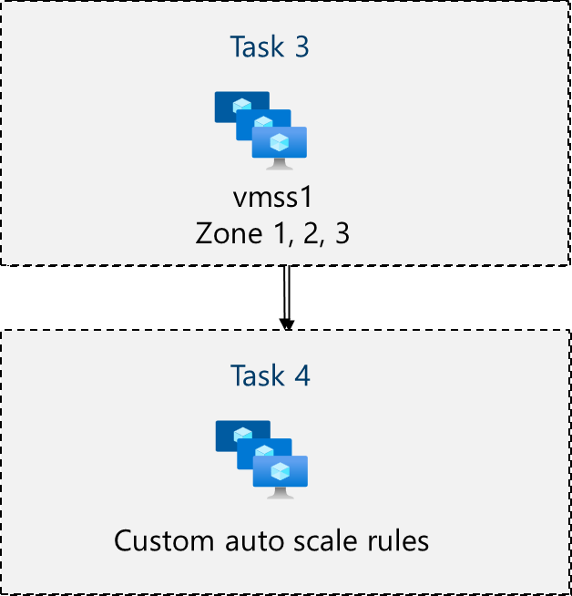

---
lab:
  title: "Labo\_08\_: Gérer les machines virtuelles"
  module: Administer Virtual Machines
---

# Labo 08 : Gérer des machines virtuelles

## Présentation du labo

Dans ce labo, vous créez et comparez des machines virtuelles à des groupes de machines virtuelles identiques. Vous apprenez à créer, configurer et redimensionner une seule machine virtuelle. Vous découvrez comment créer un groupe de machines virtuelles identiques et configurer une mise à l’échelle automatique.

Ce labo nécessite un abonnement Azure. Le type de votre abonnement peut affecter la disponibilité des fonctionnalités dans ce labo. Vous pouvez changer la région, mais les étapes sont écrites de façon à utiliser **USA Est**.

## Durée estimée : 50 minutes

## Scénario du labo

Votre organisation souhaite découvrir le déploiement et la configuration de machines virtuelles Azure. Vous implémentez d’abord une machine virtuelle Azure avec une mise à l’échelle manuelle. Ensuite, vous implémentez un groupe de machines virtuelles identiques et explorez la mise à l’échelle automatique.

## Simulations de labo interactives

Il existe des simulations de labo interactives qui peuvent vous être utiles pour cette rubrique. La simulation vous permet de parcourir un scénario similaire, à votre propre rythme. Il existe des différences entre la simulation interactive et ce labo, mais bon nombre des principaux concepts sont les mêmes. Un abonnement Azure n’est pas nécessaire.

+ [Créez une machine virtuelle dans le portail](https://mslearn.cloudguides.com/en-us/guides/AZ-900%20Exam%20Guide%20-%20Azure%20Fundamentals%20Exercise%201). Créez une machine virtuelle, connectez et installez le rôle serveur web.

+ [Déployez une machine virtuelle avec un modèle](https://mslearn.cloudguides.com/en-us/guides/AZ-900%20Exam%20Guide%20-%20Azure%20Fundamentals%20Exercise%209). Explorez la galerie QuickStart (Démarrage rapide) et localisez un modèle de machine virtuelle. Déployez le modèle et vérifiez le déploiement.

+ [Créez une machine virtuelle avec PowerShell](https://mslearn.cloudguides.com/en-us/guides/AZ-900%20Exam%20Guide%20-%20Azure%20Fundamentals%20Exercise%2010). Utilisez Azure PowerShell pour déployer une machine virtuelle. Examinez les suggestions d’Azure Advisor.

+ [Créez une machine virtuelle avec l’interface CLI](https://mslearn.cloudguides.com/en-us/guides/AZ-900%20Exam%20Guide%20-%20Azure%20Fundamentals%20Exercise%2011). Utilisez l’interface CLI pour déployer une machine virtuelle. Examinez les suggestions d’Azure Advisor.

## Compétences de tâche

+ Tâche 1 : déployer des machines virtuelles Azure résilientes à l’aide du Portail Azure.
+ Tâche 2 : gérer la mise à l’échelle des capacités de calcul et de stockage des machines virtuelles.
+ Tâche 3 : créer et configurer Azure Virtual Machine Scale Sets.
+ Tâche 4 : mettre à l’échelle Azure Virtual Machine Scale Sets.
+ Tâche 5 : Créez une machine virtuelle en utilisant Azure PowerShell (option 1).
+ Tâche 6 : Créez une machine virtuelle en utilisant l’interface CLI (option 2).

## Diagramme d’architecture de machines virtuelles Azure


## Tâche 1 : Déployez des machines virtuelles Azure résilientes aux zones en utilisant le Portail Azure.

Dans cette tâche, vous allez déployer deux machines virtuelles Azure dans des zones de disponibilité différentes en utilisant le Portail Azure. Les zones de disponibilité offrent le niveau de contrat SLA le plus élevé de durée de bon fonctionnement pour des machines virtuelles à 99,99 %. Pour obtenir ce contrat SLA, vous devez déployer au moins deux machines virtuelles sur différentes zones de disponibilité.

1. Connectez-vous au Portail Azure : `https://portal.azure.com`.

1. Recherchez et sélectionnez `Virtual machines`, puis sur le panneau **Machines virtuelles**, cliquez sur **+ Créer**, enfin sélectionnez **Machine virtuelle Azure** dans la liste déroulante. Notez vos autres choix.

1. Sous l’onglet **Informations de base**, dans le menu déroulant **Zone de disponibilité**, cochez la case à côté **Zone 2**. Cette option doit sélectionner la **Zone 1** et la **Zone 2**.

    >**Remarque** : Cette opération va déployer deux machines virtuelles dans la région sélectionnée, une dans chaque zone. Vous obtenez le contrat SLA de 99,99 % de durée de bon fonctionnement, car vous avez au moins deux machines virtuelles réparties entre au moins deux zones. Dans le cas où vous n’avez besoin que d’une seule machine virtuelle, il est recommandé de toujours déployer la machine virtuelle vers une autre zone.

1. Sous l’onglet Informations de base, poursuivez la configuration :

    | Paramètre | Valeur |
    | --- | --- |
    | Abonnement | nom de votre abonnement Azure |
    | Resource group |  **az104-rg8** (si nécessaire, cliquer sur **Créer**) |
    | Noms des machines virtuelles | `az104-vm1` et `az104-vm2` (Après avoir sélectionné les deux zones de disponibilité, sélectionnez **Modifier les noms** sous le champ de nom de la machine virtuelle.) |
    | Région | **USA Est** |
    | Options de disponibilité | **Zone de disponibilité** |
    | Zone de disponibilité | **Zone 1, 2** (parcourez la note sur l’utilisation de groupes de machines virtuelles identiques) |
    | Type de sécurité | **Standard** |
    | Image | **Windows Server 2019 Datacenter : x64 Gen2** |
    | Instance Azure Spot | **non cochée** |
    | Taille | **Standard D2s v3** |
    | Nom d’utilisateur | `localadmin` |
    | Mot de passe | **Choisissez un mot de passe sécurisé** |
    | Aucun port d’entrée public | **Aucun** |
    | Souhaitez-vous utiliser une licence Windows Server existante ? | **Décoché** |

    

1. Cliquez sur **Suivant : Disques >**, spécifiez les paramètres suivants (conservez les valeurs par défaut pour les autres) :

    | Paramètre | Value |
    | --- | --- |
    | Type de disque du système d’exploitation | **SSD Premium** |
    | Supprimer avec la machine virtuelle | **vérifié** (par défaut) |
    | Activer la compatibilité avec les disques Ultra | **Décoché** |

1. Cliquez sur **Suivant : Mise en réseau >** prennent les valeurs par défaut, mais n’offrent aucun équilibreur de charge.

    | Paramètre | Valeur |
    | --- | --- |
    | Supprimer une adresse IP publique et une carte réseau une fois la machine virtuelle supprimée | **Activée** |
    | Options d’équilibrage de charge | **Aucun** |


1. Cliquez sur **Suivant : Gestion >**, puis spécifiez les paramètres suivants (conservez les valeurs par défaut pour les autres) :

    | Paramètre | Valeur |
    | --- | --- |
    | Options d'orchestration de patch | **Orchestré par Azure** |  

1. Cliquez sur **Suivant : Monitoring >**, puis spécifiez les paramètres suivants (conservez les valeurs par défaut pour les autres) :

    | Paramètre | Valeur |
    | --- | --- |
    | Diagnostics de démarrage | **Disable** |

1. Cliquez sur **Suivant : Avancé >**, prenez les valeurs par défaut, puis cliquez sur **Vérifier + créer**.

1. Après la validation, cliquez sur **Créer**.

    >**Remarque :** Notez que lors du déploiement de la machine virtuelle, la carte réseau, le disque et l’adresse IP publique (si configurée) sont des ressources managées et créées de manière indépendante.

1. Attendez la fin du déploiement, puis sélectionnez **Accéder à la ressource**.

   >**Remarque :** Surveillez les messages de **Notification**.

## Tâche 2 : Gérez la mise à l’échelle du calcul et du stockage des machines virtuelles.

Dans cette tâche, vous allez mettre à l’échelle une machine virtuelle en ajustant sa taille à une autre référence SKU. Azure offre une souplesse dans la sélection de la taille de machine virtuelle afin que vous puissiez ajuster une machine virtuelle pendant certaines périodes si elle a besoin d’une allocation supérieure (ou inférieure) de calcul et de mémoire. Ce concept s’étend aux disques, où vous pouvez modifier les performances du disque ou augmenter la capacité allouée.

1. Sur la machine virtuelle **az104-vm1**, dans le panneau **Disponibilité + mise à l’échelle**, sélectionnez **Taille**.

1. Définissez la taille de la machine virtuelle sur **DS1_v2**, puis cliquez sur **Redimensionner**. Quand vous y êtes invité, confirmez la modification.

    >**Remarque** : Choisissez une autre taille si **DS1_v2 standard** n’est pas disponible. Le redimensionnement est également appelé mise à l’échelle verticale, scale-up ou scale-down.

    

1. Dans la zone **Paramètres**, sélectionnez **Disques**.

1. Sous **Disque de données**, sélectionnez **+ Créer et attacher un disque**. Configurez les paramètres (conservez les valeurs par défaut pour les autres).

    | Paramètre | Valeur |
    | --- | --- |
    | Nom du disque | `vm1-disk1` |
    | Type de stockage | **HDD Standard** |
    | Taille (Gio) | `32` |

1. Cliquez sur **Appliquer**.

1. Une fois le disque créé, cliquez sur **Détacher** (si nécessaire, faites défiler vers la droite de l’écran pour afficher l’icône de détachement), puis sur **Appliquer**.

    >**Remarque** : Le détachement supprime le disque de la machine virtuelle, mais il le conserve dans le stockage pour une utilisation ultérieure.

1. Recherchez et sélectionnez `Disks`. Dans la liste des disques, sélectionnez l’objet **vm1-disk1**.

    >**Remarque :** Le panneau **Vue d’ensemble** fournit également des informations sur les performances et l’utilisation du disque.

1. Dans le panneau **Paramètres**, sélectionnez **Taille + performances**.

1. Définissez le type de stockage sur **SSD Standard**, puis cliquez sur **Enregistrer**.

1. Revenez à la machine virtuelle **az104-vm1**, puis sélectionnez **Disques**.

1. Dans la section **Disque de données**, sélectionnez **Joindre des disques existants**.

1. Dans la liste déroulante **Nom du disque**, sélectionnez **VM1-DISK1**. 

1. Vérifiez que le disque est désormais **SSD Standard**.

1. Sélectionnez **Appliquer** pour enregistrer vos modifications. 

    >**Remarque :** Vous avez maintenant créé une machine virtuelle, mis à l’échelle la référence SKU et la taille du disque de données. Dans la tâche suivante, nous utilisons des groupes de machines virtuelles identiques pour automatiser le processus de mise à l’échelle.

## Diagramme de l’architecture des groupes de machines virtuelles identiques Azure



## Tâche 3 : Créez et configurez des groupes de machines virtuelles identiques Azure.

Dans cette tâche, vous allez déployer un groupe de machines virtuelles identiques Azure sur des zones de disponibilité. Les groupes de machines virtuelles identiques diminuent la surcharge administrative de l’automatisation en vous permettant de configurer des métriques ou des conditions autorisant le groupe identique à mettre à l’échelle horizontalement, d’effectuer un scale-in ou d’effectuer un scale-out.

1. Dans le Portail Azure, recherchez et sélectionnez `Virtual machine scale sets`, puis dans le panneau **Groupes de machines virtuelles identiques**, cliquez sur **+ Créer**.

1. Sous l’onglet **Informations de base** du volet **Créer un groupe de machines virtuelles identiques**, spécifiez les paramètres suivants (laissez les valeurs par défaut des autres paramètres), et cliquez sur **Suivant : Spot >** :

    | Paramètre | Valeur |
    | --- | --- |
    | Abonnement | nom de votre abonnement Azure  |
    | Resource group | **az104-rg8**  |
    | Nom du groupe de machines virtuelles identiques | `vmss1` |
    | Région | **(États-Unis) USA Est** |
    | Zone de disponibilité | **Zones 1, 2, 3** |
    | Mode d’orchestration | **Uniforme** |
    | Type de sécurité | **Standard** |
    | Image | **Windows Server 2019 Datacenter : x64 Gen2** |
    | Exécuter avec la remise Azure Spot | **Décoché** |
    | Taille | **D2s_v3 standard** |
    | Nom d’utilisateur | `localadmin` |
    | Mot de passe | **Choisissez un mot de passe sécurisé**  |
    | Vous disposez déjà d’une licence Windows Server ? | **Décoché** |

    >**Remarque** : Pour obtenir la liste des régions Azure qui prennent en charge le déploiement de machines virtuelles Windows vers des zones de disponibilité, consultez [Qu’est-ce que Zones de disponibilité dans Azure ?](https://docs.microsoft.com/en-us/azure/availability-zones/az-overview)

    

1. Sous l’onglet **Spot**, acceptez les valeurs par défaut, puis sélectionnez **Suivant : Disques >**.

1. Sous l’onglet **Disques**, acceptez les valeurs par défaut et cliquez sur **Suivant : Mise en réseau >**.

1. Dans la page **Mise en réseau**, cliquez sur le lien **Créer un réseau virtuel** sous la zone de texte **Réseau virtuel** et créez un réseau virtuel avec les paramètres suivants (conservez les valeurs par défaut pour les autres).  Lorsque vous avez terminé, sélectionnez **OK**.

    | Paramètre | Valeur |
    | --- | --- |
    | Nom | `vmss-vnet` |
    | Plage d’adresses | `10.82.0.0/20` (modifiez ce qui s’y trouve) |
    | Nom du sous-réseau | `subnet0` |
    | Plage de sous-réseau | `10.82.0.0/24` |

1. Sous l’onglet **Mise en réseau**, cliquez sur l’icône **Modifier l’interface réseau** à droite de l’entrée d’interface réseau.

1. Pour la section **Groupe de sécurité réseau de carte réseau**, sélectionnez **Avancé**, puis cliquez sur **Créer** sous la liste déroulante **Configurer un groupe de sécurité réseau**.

1. Dans le panneau **Créer un groupe de sécurité réseau**, spécifiez les paramètres suivants (en laissant les autres avec leur valeur par défaut) :

    | Paramètre | Valeur |
    | --- | --- |
    | Nom | **vmss1-nsg** |

1. Cliquez sur **Ajouter une règle de trafic entrant** et ajoutez une règle de sécurité entrante avec les paramètres suivants (laissez les autres avec leurs valeurs par défaut) :

    | Paramètre | Valeur |
    | --- | --- |
    | Source | **Any** |
    | Plages de ports source | * |
    | Destination | **Any** |
    | Service | **HTTP** |
    | Action | **Autoriser** |
    | Priorité | **1010** |
    | Nom | `allow-http` |

1. Cliquez sur **Ajouter** et, dans le panneau **Créer un groupe de sécurité réseau**, cliquez sur **OK**.

1. Dans le panneau **Modifier l’interface réseau**, dans la section **Adresse IP publique**, cliquez sur **Activé**, puis sur **OK**.

1. Sous l’onglet **Mise en réseau**, sous la section **Équilibrage de charge**, spécifiez ce qui suit (conservez les valeurs par défaut pour les autres).

    | Paramètre | Valeur |
    | --- | --- |
    | Options d’équilibrage de charge | **Équilibreur de charge Azure** |
    | Sélectionnez un équilibreur de charge | **Créer un équilibreur de charge** |

1. Dans la page **Créer un équilibreur de charge**, spécifiez le nom de l’équilibreur de charge et prenez les valeurs par défaut. Cliquez sur **Créer** lorsque vous avez terminé, puis sur **Suivant : Gestion >**.

    | Paramètre | Valeur |
    | --- | --- |
    | Nom de l’équilibreur de charge | `vmss-lb` |

    >**Remarque :** Interrompez-vous pendant une minute et passez en revue ce que vous avez effectué. À ce stade, vous avez configuré un groupe de machines virtuelles identiques avec des disques et une mise en réseau. Dans la configuration réseau, vous avez créé un groupe de sécurité réseau et autorisé HTTP. Vous avez également créé un équilibreur de charge avec une adresse IP publique.

1. Sous l’onglet **Gestion**, spécifiez les paramètres suivants (conservez les valeurs par défaut pour les autres) :

    | Paramètre | Valeur |
    | --- | --- |
    | Diagnostics de démarrage | **Désactiver** |

1. Cliquez sur **Suivant : Intégrité >**.

1. Sous l’onglet **Intégrité**, passez en revue les paramètres par défaut sans apporter de modifications, puis cliquez sur **Suivant : Avancé >**.

1. Sous l’onglet **Avancé**, cliquez sur **Vérifier + créer**.

1. Sous l’onglet **Vérifier + Créer**, vérifiez que la validation a réussi, puis cliquez sur **Créer**.

    >**Remarque** : Attendez que le déploiement du groupe de machines virtuelles identiques soit terminé. Cette opération doit prendre environ 5 minutes. Pendant que vous attendez pour passer en revue la [documentation](https://learn.microsoft.com/azure/virtual-machine-scale-sets/overview).

## Tâche 4 : Mettez à l’échelle des groupes de machines virtuelles identiques Azure.

Dans cette tâche, vous mettez à l’échelle le groupe de machines virtuelles identiques en utilisant une règle de mise à l’échelle personnalisée.

1. Sélectionnez **Accéder à la ressource** ou recherchez et sélectionnez le groupe identique **vmss1**.

1. Choisissez **Disponibilité + mise à l’échelle** dans le menu de gauche, puis **Mise à l’échelle**.

>**Le saviez-vous ?** Vous pouvez effectuer une **Mise à l’échelle manuelle** ou une **Mise à l’échelle automatique**. Dans des groupes identiques avec un petit nombre d’instances de machine virtuelle, l’augmentation ou la diminution du nombre d’instances (mise à l’échelle manuelle) peut être préférable. Dans des groupes identiques avec un grand nombre d’instances de machine virtuelle, la mise à l’échelle basée sur les métriques (mise à l’échelle automatique personnalisée) peut être plus appropriée.

### Effectuez un scale-out

1. Sélectionnez **Mise à l’échelle automatique personnalisée**. Puis remplacez le **Mode de mise à l’échelle** par **Mise à l’échelle en fonction de la métrique**. Sélectionnez ensuite **Ajouter une règle**.

1. Nous allons créer une règle qui augmente automatiquement le nombre d’instances de machine virtuelle. Cette règle effectue un scale-out quand la charge moyenne du processeur est supérieure à 70 % sur une période de 10 minutes. Lorsque la règle déclenche l’opération, le nombre d’instances de machine virtuelle est augmenté de 20 %.

    | Paramètre | Valeur |
    | --- | --- |
    | Source de la mesure | **Ressource actuelle (vmss1)** |
    | Espace de noms de la métrique | **Hôte de machine virtuelle** |
    | Nom de métrique | **Pourcentage de processeur** (passer en revue vos autres choix) |
    | Opérateur | **Supérieur à** |
    | Seuil de métrique pour déclencher l’action de mise à l'échelle | **70** |
    | Durée (minutes) | **10** |
    | Statistique de fragment de temps | **Average** |
    | Opération | **Augmenter le pourcentage de** (passer en revue d’autres choix) |
    | Refroidissement (minutes) | **5** |
    | Percentage | **20** |

    

1. Veillez à **Enregistrer** vos modifications.

### Règle de scale-in

1. Pendant les soirées ou les week-ends, la demande peut diminuer, de sorte qu’il est important de créer une règle de scale-in.

1. Nous allons créer une règle qui diminue le nombre d’instances de machine virtuelle dans un groupe identique. Le nombre d’instances doit diminuer lorsque la charge moyenne du processeur descend sous 30 % sur une période de 10 minutes. Lorsque la règle déclenche l’opération, le nombre d’instances de machine virtuelle est réduit de 20 %.

1. Sélectionnez **Ajouter une règle**, ajustez les paramètres, puis sélectionnez **Ajouter**.

    | Paramètre | Valeur |
    | --- | --- |
    | Opérateur | **Inférieur à** |
    | Seuil | **30** |
    | Opération | **diminuer le pourcentage de** (passer en revue vos autres choix) |
    | Percentage | **20** |

1. Veillez à **Enregistrer** vos modifications.

### Définir les limites de l’instance

1. Lorsque vos règles de mise à l’échelle automatique sont appliquées, les limites d’instance veillent à ce que votre scale-out ne dépasse pas le nombre maximal d’instances ou que votre scale-in ne descende pas en dessous du nombre minimal d’instances.

1. **Les limites d’instance** sont affichées sur la page **Mise à l’échelle** après les règles.

    | Paramètre | Valeur |
    | --- | --- |
    | Minimum | **2** |
    | Maximum | **10** |
    | Par défaut | **2** |

1. Veillez à **Enregistrer** vos modifications.

1. Dans la page **vmss1**, sélectionnez **Instances**. Il s’agit de l’emplacement où vous surveillez le nombre d’instances de machine virtuelle.

    >**Remarque :** Si vous souhaitez utiliser Azure PowerShell pour la création de machines virtuelles, essayez la Tâche 5. Si vous souhaitez utiliser l’interface CLI pour créer des machines virtuelles, essayez la Tâche 6.

## Tâche 5 : créer une machine virtuelle en utilisant Azure PowerShell (option 1)

1. Utilisez l’icône (en haut à droite) pour lancer une session **Cloud Shell**. Vous pouvez également directement accéder à `https://shell.azure.com`.

1. Veillez à sélectionner **PowerShell**. Si nécessaire, configurez l’espace de stockage shell.

1. Exécutez la commande suivante pour créer une machine virtuelle. Lorsque vous y êtes invité, saisissez un nom d’utilisateur et un mot de passe pour la machine virtuelle. Pendant que vous attendez l’extraction de la référence de commande [New-AzVM](https://learn.microsoft.com/powershell/module/az.compute/new-azvm?view=azps-11.1.0) pour tous les paramètres associés à la création d’une machine virtuelle.

    ```powershell
    New-AzVm `
    -ResourceGroupName 'az104-rg8' `
    -Name 'myPSVM' `
    -Location 'East US' `
    -Image 'Win2019Datacenter' `
    -Zone '1' `
    -Size 'Standard_D2s_v3' `
    -Credential (Get-Credential)
    ```

1. Une fois la commande terminée, utilisez **Get-AzVM** pour répertorier les machines virtuelles dans votre groupe de ressources.

    ```powershell
    Get-AzVM `
    -ResourceGroupName 'az104-rg8' `
    -Status
    ```

1. Vérifiez que votre nouvelle machine virtuelle est répertoriée et que l’**État** est **En cours d’exécution**.

1. Utilisez **Stop-AzVM** pour désallouer votre machine virtuelle. Tapez **Oui** pour confirmer.

    ```powershell
    Stop-AzVM `
    -ResourceGroupName 'az104-rg8' `
    -Name 'myPSVM' 
    ```

1. Utilisez **Get-AzVM** avec le paramètre **-Status** pour vérifier que la machine est **désallouée**.

    >**Le saviez-vous ?** Lorsque vous utilisez Azure pour arrêter votre machine virtuelle, l’état est *désalloué*. Cela signifie que les adresses IP publiques non statiques sont publiées et que vous cessez de payer les coûts de calcul pour la machine virtuelle.

## Tâche 6 : Créez une machine virtuelle en utilisant l’interface CLI (option 2).

1. Utilisez l’icône (en haut à droite) pour lancer une session **Cloud Shell**. Vous pouvez également directement accéder à `https://shell.azure.com`.

1. Veillez à sélectionner **Bash**. Si nécessaire, configurez l’espace de stockage shell.

1. Exécutez la commande suivante pour créer une machine virtuelle. Lorsque vous y êtes invité, saisissez un nom d’utilisateur et un mot de passe pour la machine virtuelle. Pendant que vous attendez l’extraction de la référence de commande [az vm create](https://learn.microsoft.com/cli/azure/vm?view=azure-cli-latest#az-vm-create) pour tous les paramètres associés à la création d’une machine virtuelle.

    ```sh
    az vm create --name myCLIVM --resource-group az104-rg8 --image Ubuntu2204 --admin-username localadmin --generate-ssh-keys
    ```

1. Une fois la commande terminée, utilisez **az vm show** pour vérifier la création de votre machine.

    ```sh
    az vm show --name  myCLIVM --resource-group az104-rg8 --show-details
    ```

1. Vérifiez que l’état **powerState** est **Exécution de la machine virtuelle**.

1. Utilisez **az vm deallocate** pour désallouer votre machine virtuelle. Tapez **Oui** pour confirmer.

    ```sh
    az vm deallocate --resource-group az104-rg8 --name myCLIVM
    ```

1. Utilisez **az vm show** pour veiller à ce que **powerState** est **Machine virtuelle désallouée**.

    >**Le saviez-vous ?** Lorsque vous utilisez Azure pour arrêter votre machine virtuelle, l’état est *désalloué*. Cela signifie que les adresses IP publiques non statiques sont publiées et que vous cessez de payer les coûts de calcul pour la machine virtuelle.

## Nettoyage de vos ressources

Si vous travaillez avec **votre propre abonnement**, prenez un moment pour supprimer les ressources du labo. Ceci garantit que les ressources sont libérées et que les coûts sont réduits. Le moyen le plus simple de supprimer les ressources du labo est de supprimer le groupe de ressources du labo. 

+ Dans le Portail Azure, sélectionnez le groupe de ressources, **Supprimer le groupe de ressources**, **Entrer le nom du groupe de ressources**, puis cliquez sur **Supprimer**.
+ `Remove-AzResourceGroup -Name resourceGroupName` en utilisant Azure PowerShell.
+ `az group delete --name resourceGroupName` en utilisant l’interface CLI.

## Développer votre apprentissage avec Copilot
Copilot peut vous aider à apprendre à utiliser les outils de script Azure. Copilot peut également aider dans des domaines non couverts dans le labo ou quand vous avez besoin de plus d’informations. Ouvrez un navigateur Edge et choisissez Copilot (en haut à droite), ou accédez à *copilot.microsoft.com*. Prenez quelques minutes pour essayer ces invites.

+ Fournissez les étapes et les commandes Azure CLI pour créer une machine virtuelle Linux. 
+ Examinez vos moyens de mettre à l’échelle des machines virtuelles et d’améliorer les performances.
+ Décrivez les stratégies de gestion du cycle de vie du stockage Azure et comment elles peuvent optimiser les coûts.

## En savoir plus grâce à l’apprentissage auto-rythmé

+ [Créez une machine virtuelle Windows dans Azure](https://learn.microsoft.com/training/modules/create-windows-virtual-machine-in-azure/). Créer une machine virtuelle Windows à partir du portail Azure. Vous connecter à une machine virtuelle Windows en cours d’exécution à l’aide du Bureau à distance
+ [Générer une application évolutive avec des groupes de machines virtuelles identiques](https://learn.microsoft.com/training/modules/build-app-with-scale-sets/). Utilisez Virtual Machine Scale Sets pour que votre application s’adapte automatiquement aux changements de charge tout en réduisant les coûts.
+ [Se connecter aux machines virtuelles à travers le portail Azure en utilisant Azure Bastion](https://learn.microsoft.com/en-us/training/modules/connect-vm-with-azure-bastion/). Déployez Azure Bastion pour vous connecter en toute sécurité aux machines virtuelles Azure directement sur le Portail Azure afin de remplacer efficacement une solution de jumpbox existante, surveiller des sessions distantes en utilisant les journaux de diagnostic et gérer des sessions distantes en déconnectant la session d’un utilisateur.

## Points clés

Félicitations, vous avez terminé le labo. Voici les principaux points à retenir pour ce labo.

+ Les machines virtuelles Azure sont des ressources de calcul à la demande et évolutives.
+ Les machines virtuelles Azure offrent des options de mise à l’échelle verticale et horizontale.
+ La configuration des machines virtuelles Azure comprend le choix d’un système d’exploitation, d’une taille, d’un stockage et des paramètres de mise en réseau.
+ Les groupes de machines virtuelles identiques Azure vous permettent de créer et de gérer un groupe de machines virtuelles à charge équilibrée.
+ Les machines virtuelles d’un groupe de machines virtuelles identiques sont créées à partir de la même image et de la même configuration.
+ Dans un groupe de machines virtuelles identiques, le nombre d’instances de machine virtuelle peut augmenter ou diminuer automatiquement en fonction de la demande ou d’une planification définie.
