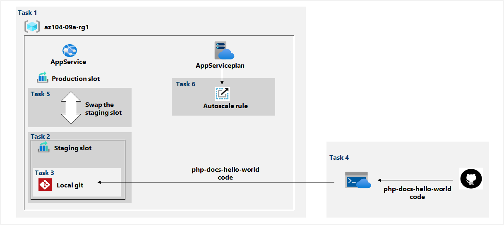

---
lab:
  title: "09a\_: Implémenter Web Apps"
  module: Administer Serverless Computing
---

# Labo 09a : Implémenter Web Apps
# Manuel de labo de l’étudiant

## Scénario du labo

Vous devez évaluer l’utilisation d’applications web Azure pour héberger les sites web de Contoso, qui sont actuellement hébergés dans les centres de données locaux de l’entreprise. Les sites web s’exécutent sur des serveurs Windows à l’aide de la pile de runtime PHP. Vous devez également déterminer comment implémenter des pratiques DevOps en tirant parti des emplacements de déploiement des applications web Azure.

**Remarque :** Une **[simulation de labo interactive](https://mslabs.cloudguides.com/guides/AZ-104%20Exam%20Guide%20-%20Microsoft%20Azure%20Administrator%20Exercise%2013)** est disponible et vous permet de progresser à votre propre rythme. Il peut exister de légères différences entre la simulation interactive et le labo hébergé. Toutefois, les concepts et idées de base présentés sont identiques. 

## Objectifs

Dans ce labo, vous allez :

+ Tâche 1 : Créer une application web Azure
+ Tâche 2 : Créer un emplacement de déploiement de préproduction
+ Tâche 3 : Configurer les paramètres de déploiement de l’application web
+ Tâche 4 : Déployer du code sur l’emplacement de déploiement de transit
+ Tâche 5 : Remplacer les emplacements de préproduction
+ Tâche 6 : Configurer et tester la mise à l’échelle automatique de l’application web Azure

## Durée estimée : 30 minutes

## Diagramme de l'architecture



### Instructions

## Exercice 1

## Tâche 1 : Créer une application web Azure

Dans cette tâche, vous allez créer une application web Azure.

1. Connectez-vous au [**portail Azure**](http://portal.azure.com).

1. Dans le portail Azure, recherchez et sélectionnez **App Services**, puis, dans le panneau **App Services**, cliquez sur **+ Créer**.

1. Sous l’onglet **Informations de base** du panneau **Créer une application web**, spécifiez les paramètres suivants (laissez les valeurs par défaut des autres paramètres) :

    | Paramètre | Valeur |
    | --- | ---|
    | Abonnement | le nom de l’abonnement Azure que vous utilisez dans ce labo |
    | Groupe de ressources | le nom d’un nouveau groupe de ressources **az104-09a-rg1** |
    | Nom de l’application web | tout nom global unique |
    | Publier | **Code** |
    | Pile d’exécution | **PHP 8.0** |
    | Système d’exploitation | **Linux** |
    | Région | le nom d’une région Azure dans laquelle vous pouvez approvisionner des applications web Azure |
    | Plan App Service | acceptez la configuration par défaut |

1. Cliquez sur **Vérifier + créer**. Sous l’onglet **Vérifier + créer** du panneau **Créer une application web**, vérifiez que la validation a réussi et cliquez sur **Créer**.

    >**Remarque** : Attendez que l’application web soit créée avant de passer à la tâche suivante. Ce processus prend environ une minute.

1. Dans le panneau de déploiement, cliquez sur **Accéder à la ressource**.

## Tâche 2 : Créer un emplacement de déploiement de préproduction

Dans cette tâche, vous allez créer un emplacement de déploiement de transit.

1. Dans le panneau de l’application web que vous venez de déployer, cliquez sur le lien **URL** pour afficher la page web par défaut dans un nouvel onglet de navigateur.

1. Fermez le nouvel onglet du navigateur puis, dans le portail Azure, dans la section **Déploiement** du panneau de l’application web, cliquez sur **Emplacements de déploiement**.

    >**Remarque** : L’application web, à ce stade, a un emplacement de déploiement unique intitulé **PRODUCTION**.

1. Cliquez sur **+ Ajouter un emplacement**, puis ajoutez un nouvel emplacement avec les paramètres suivants :

    | Paramètre | Valeur |
    | --- | ---|
    | Nom | **staging** |
    | Cloner les paramètres à partir de | **Ne pas cloner les paramètres**|

1. De retour dans le panneau **Emplacements de déploiement** de l’application web, cliquez sur l’entrée représentant l’emplacement de préproduction que vous venez de créer.

    >**Remarque** : Cette opération va ouvrir le panneau affichant les propriétés de l’emplacement de préproduction.

1. Passez en revue le panneau de l’emplacement de préproduction et notez que son URL diffère de celle affectée à l’emplacement de production.

## Tâche 3 : Configurer les paramètres de déploiement de l’application web

Dans cette tâche, vous allez configurer les paramètres de déploiement de l’application web.

1. Dans le panneau de l’emplacement de déploiement de transit, dans la section **Déploiement**, cliquez sur **Centre de déploiement**, puis sélectionnez l’onglet **Paramètres**.

    >**Remarque :** Vérifiez que vous êtes sur le panneau de l’emplacement de préproduction (plutôt que sur l’emplacement de production).
    
1. Sous l’onglet **Paramètres**, dans la liste déroulante **Source**, sélectionnez **Git local**, puis cliquez sur le bouton **Enregistrer**

1. Dans le panneau **Centre de déploiement**, copiez l’entrée **URL Git Clone** dans le Bloc-notes.

    >**Remarque :** Vous aurez besoin de la valeur d’URL Git Clone dans la tâche suivante de ce labo.

1. Dans le panneau **Centre de déploiement**, sélectionnez l’onglet **Informations d’identification Git/FTPS local**. Dans la section **Étendue utilisateur**, spécifiez les paramètres suivants, puis cliquez sur **Enregistrer**.

    | Paramètre | Valeur |
    | --- | ---|
    | Nom d’utilisateur | n’importe quel nom global unique (ne doit pas contenir de caractère `@`) |
    | Mot de passe | tout mot de passe répondant aux exigences de complexité|

    >**Remarque :** Vous aurez besoin de ces informations d’identification dans la tâche suivante de ce labo.

## Tâche 4 : Déployer du code sur l’emplacement de déploiement de transit

Dans cette tâche, vous allez déployer du code sur l’emplacement de déploiement de préproduction.

1. Dans le portail Azure, ouvrez **Azure Cloud Shell** en cliquant sur l’icône située en haut à droite du portail Azure.

1. Lorsque vous êtes invité à sélectionner **Bash** ou **PowerShell**, sélectionnez **PowerShell**.

    >**Remarque** : Si c’est la première fois que vous démarrez **Cloud Shell** et que vous voyez le message **Vous n’avez aucun stockage monté**, sélectionnez l’abonnement que vous utilisez dans ce labo, puis sélectionnez **Créer un stockage**.

1. Dans le panneau Cloud Shell, exécutez la commande suivante pour cloner le référentiel distant contenant le code de l’application web.

   ```powershell
   git clone https://github.com/Azure-Samples/php-docs-hello-world
   ```

1. Dans le panneau Cloud Shell, exécutez la commande suivante pour définir l’emplacement actuel sur le clone que vous venez de créer du référentiel local contenant l’exemple de code d’application web.

   ```powershell
   Set-Location -Path $HOME/php-docs-hello-world/
   ```

1. Dans le panneau Cloud Shell, exécutez la commande suivante pour ajouter le git distant (veillez à remplacer les espaces réservés `[deployment_user_name]` et `[git_clone_url]` par la valeur du nom d’utilisateur des **Informations d’identification de déploiement** et de l’**URL Git Clone**, respectivement, que vous avez identifiée dans la tâche précédente) :

   ```powershell
   git remote add [deployment_user_name] [git_clone_url]
   ```

    >**Remarque** : La valeur qui suit `git remote add` n’a pas besoin de correspondre au nom d’utilisateur des **Informations d’identification de déploiement**, mais doit être unique

1. Dans le panneau Cloud Shell, exécutez la commande suivante pour envoyer (en mode push) l’exemple de code d’application web du référentiel local à l’emplacement de déploiement de transit de l’application web Azure (veillez à remplacer l’espace `[deployment_user_name]` réservé par la valeur du nom d’utilisateur des **Informations d’identification de déploiement**, que vous avez identifiée lors de la tâche précédente) :

   ```powershell
   git push [deployment_user_name] master
   ```

1. Si vous êtes invité à vous authentifier, tapez `[deployment_user_name]` et le mot de passe correspondant (que vous avez défini dans la tâche précédente).

1. Fermez le volet Cloud Shell.

1. Dans le panneau de l’emplacement de préproduction, cliquez sur **Vue d’ensemble**, puis cliquez sur le lien **URL** pour afficher la page web par défaut dans un nouvel onglet de navigateur.

1. Vérifiez que la page du navigateur affiche le message **Hello World !** et fermez le nouvel onglet.

## Tâche 5 : Remplacer les emplacements de préproduction

Dans cette tâche, vous allez remplacer l’emplacement de préproduction par l’emplacement de production.

1. Revenez au panneau affichant l’emplacement de production de l’application web.

1. Dans la section **Déploiement**, cliquez sur **Emplacements de déploiement**, puis sur l’icône **Permuter** de la barre d’outils.

1. Dans le panneau **Permuter**, passez en revue les paramètres par défaut, puis cliquez sur **Permuter**.

1. Cliquez sur **Vue d’ensemble** dans le panneau de l’emplacement de production de l’application web, puis cliquez sur le lien **URL** pour afficher la page d’accueil du site web dans un nouvel onglet de navigateur.

1. Vérifiez que la page web par défaut a été remplacée par la page **Hello World !** .

## Tâche 6 : Configurer et tester la mise à l’échelle automatique de l’application web Azure

Dans cette tâche, vous allez configurer et tester la mise à l’échelle automatique de l’application web Azure.

1. Dans le panneau affichant l’emplacement de production de l’application web, dans la section **Paramètres**, cliquez sur **Monter en charge (plan App Service)**.

1. Cliquez sur **Mise à l’échelle automatique personnalisée**.

    >**Remarque** : Vous avez également la possibilité de mettre à l’échelle l’application web manuellement.

1. Sélectionnez **Mettre à l’échelle selon une métrique** et cliquez sur **+ Ajouter une règle**.

1. Dans le panneau **Règle de mise à l’échelle**, spécifiez les paramètres suivants (conservez les valeurs par défaut pour les autres) :

    | Paramètre | Valeur |
    | --- |--- |
    | Source de la métrique | **Ressource actuelle** |
    | Espace de noms de la métrique | **Métriques standard** |
    | Nom de métrique | **Pourcentage UC** |
    | Opérateur | **Supérieur à** |
    | Seuil de métrique pour déclencher l’action de mise à l'échelle | **10** |
    | Durée (en minutes) | **1** |
    | Statistique de fragment de temps | **Maximum** |
    | Agrégation du temps | **Maximum** |
    | Opération | **Augmenter le nombre de** |
    | Nombre d’instances | **1** |
    | Refroidissement (minutes) | **5** |

    >**Remarque** : Évidemment, ces valeurs ne représentent pas une configuration réaliste, car leur objectif est de déclencher la mise à l’échelle automatique dès que possible, sans période d’attente prolongée.

1. Cliquez sur **Ajouter** et, dans le panneau de mise à l’échelle du plan App Service, spécifiez les paramètres suivants (laissez les autres avec leurs valeurs par défaut) :

    | Paramètre | Valeur |
    | --- |--- |
    | Minimum des limites d’instance | **1** |
    | Maximum des limites d’instance | **2** |
    | Limites d’instance par défaut | **1** |

1. Cliquez sur **Enregistrer**.

    >**Remarque** : Si vous rencontrez une erreur concernant le fournisseur de ressources « microsoft.insights » qui n’est pas inscrit, exécutez `az provider register --namespace 'Microsoft.Insights'` dans votre cloudshell et réessayez d’enregistrer vos règles de mise à l’échelle automatique.

1. Dans le portail Azure, ouvrez **Azure Cloud Shell** en cliquant sur l’icône située en haut à droite du portail Azure.

1. Lorsque vous êtes invité à sélectionner **Bash** ou **PowerShell**, sélectionnez **PowerShell**.

1. Dans le panneau Cloud Shell, exécutez la commande suivante pour identifier l’URL de l’application web Azure.

   ```powershell
   $rgName = 'az104-09a-rg1'

   $webapp = Get-AzWebApp -ResourceGroupName $rgName
   ```

1. Dans le panneau Cloud Shell, exécutez la commande suivante pour démarrer et exécuter une boucle infinie qui envoie les requêtes HTTP à l’application web :

   ```powershell
   while ($true) { Invoke-WebRequest -Uri $webapp.DefaultHostName }
   ```

1. Réduisez le volet Cloud Shell (sans le fermer) et, dans le volet de l’application web, dans la section Paramètres, cliquez sur **Effectuer un scale-out (plan App Service)**.

1. Sélectionnez l’onglet **Historique des exécutions** et vérifiez le **Nombre d’instances de ressources observées**.

1. Surveillez l’utilisation et le nombre d’instances pendant quelques minutes. 

    >**Remarque** : Il peut être nécessaire de cliquer sur **Actualiser** pour actualiser la page.

1. Une fois que vous avez remarqué que le nombre d’instances est passé à 2, rouvrez le panneau Cloud Shell et terminez le script en appuyant sur **Ctrl+C**.

1. Fermez le volet Cloud Shell.

## Nettoyer les ressources

>**Remarque** : N’oubliez pas de supprimer toutes les nouvelles ressources Azure que vous n’utilisez plus. La suppression des ressources inutilisées vous évitera d’encourir des frais inattendus.

>**Remarque** :  Ne vous inquiétez pas si les ressources de laboratoire ne peuvent pas être immédiatement supprimées. Parfois, les ressources ont des dépendances et leur suppression prend plus de temps. Il s’agit d’une tâche d’administrateur courante pour surveiller l’utilisation des ressources. Il vous suffit donc de consulter régulièrement vos ressources dans le portail pour voir comment se passe le nettoyage. 

1. Dans le portail Azure, ouvrez la session **PowerShell** dans le volet **Cloud Shell**.

1. Listez tous les groupes de ressources créés dans les labos de ce module en exécutant la commande suivante :

   ```powershell
   Get-AzResourceGroup -Name 'az104-09a*'
   ```

1. Supprimez tous les groupes de ressources que vous avez créés dans les labos de ce module en exécutant la commande suivante :

   ```powershell
   Get-AzResourceGroup -Name 'az104-09a*' | Remove-AzResourceGroup -Force -AsJob
   ```

    >**Remarque** : La commande s’exécute de façon asynchrone (tel que déterminé par le paramètre -AsJob). Vous pourrez donc exécuter une autre commande PowerShell immédiatement après au cours de la même session PowerShell, mais la suppression effective du groupe de ressources peut prendre quelques minutes.

## Révision

Dans cet exercice, vous avez :

+ Créé une application web Azure
+ Créé un emplacement de déploiement de préproduction
+ Configuré les paramètres de déploiement de l’application web
+ Déployé du code sur l’emplacement de déploiement de transit
+ Permuté les emplacements de préproduction
+ Configuré et testé la mise à l’échelle automatique de l’application web Azure
