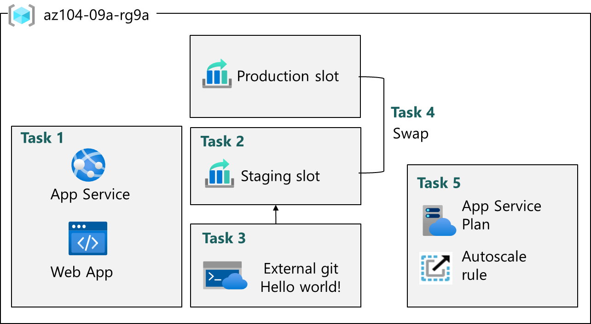

---
lab:
  title: 'Labo 09a : Implémenter Web Apps'
  module: Administer PaaS Compute Options
---

# Labo 09a : Implémenter Web Apps

## Présentation du labo

Dans ce labo, vous allez découvrir les applications web Azure. Vous apprenez à configurer une application web pour afficher une application Hello World dans un référentiel GitHub externe. Vous apprenez à créer un emplacement de préproduction et échanger avec l’emplacement de production. Vous découvrez également la mise à l’échelle automatique pour vous adapter aux changements de demande.

Ce labo nécessite un abonnement Azure. Le type de votre abonnement peut affecter la disponibilité des fonctionnalités dans ce labo. Vous pouvez changer la région, mais notez que les étapes sont écrites de façon à utiliser USA Est.

## Durée estimée : 20 minutes

## Scénario du labo

Votre organisation s’intéresse aux applications web Azure pour l’hébergement de sites web de votre entreprise. Les sites web sont actuellement hébergés dans un centre de données local. Les sites web s’exécutent sur des serveurs Windows à l’aide de la pile de runtime PHP. Le matériel est proche de sa fin de vie et devra bientôt être remplacé. Votre organisation souhaite éviter les nouveaux coûts matériels à l’aide d’Azure pour héberger les sites web. 

## Simulations de labo interactives

Il existe des simulations de labo interactives qui peuvent vous être utiles pour cette rubrique. La simulation vous permet de parcourir un scénario similaire, à votre propre rythme. Il existe des différences entre la simulation interactive et ce labo, mais bon nombre des principaux concepts sont les mêmes. Un abonnement Azure n’est pas nécessaire.

+ [Créez une application web](https://mslearn.cloudguides.com/en-us/guides/AZ-900%20Exam%20Guide%20-%20Azure%20Fundamentals%20Exercise%202). Créez une application Web qui exécute un conteneur Docker.
    
+ [Implémentez des applications web Azure](https://mslabs.cloudguides.com/guides/AZ-104%20Exam%20Guide%20-%20Microsoft%20Azure%20Administrator%20Exercise%2013). Créez une application web Azure, gérez le déploiement et mettez à l’échelle l’application. 

## Diagramme de l'architecture

## Compétences de tâche

+ Tâche 1 : Créer et configurer une application web Azure.
+ Tâche 2 : Créez et configurez un emplacement de déploiement.
+ Tâche 3 : Configurer les paramètres du déploiement de l’application web.
+ Tâche 4 : Échangez des emplacements de déploiement.
+ Tâche 5 : Configurez et testez la mise à l’échelle automatique de l’application web Azure.

## Tâche 1 : Créer et configurer une application web Azure

Dans cette tâche, vous créez une application web Azure. Azure App Services est une solution PaaS (Platform As a Service) pour les applications web, mobiles et autres applications web. Les applications web Azure font partie d’Azure App Services hébergeant la plupart des environnements d’exécution, tels que PHP, Java et .NET. Le plan App Service que vous sélectionnez détermine le calcul, le stockage et les fonctionnalités de l’application web. 

1. Connectez-vous au **portail Azure** - `https://portal.azure.com`.

1. Recherchez et sélectionnez `App services`.

1. Sélectionnez **+ Créer**, dans le menu déroulant **Application web**. Examinez les autres choix. 

1. Sous l’onglet **Informations de base** du panneau **Créer une application web**, spécifiez les paramètres suivants (laissez les valeurs par défaut des autres paramètres) :

    | Paramètre | Valeur |
    | --- | ---|
    | Abonnement | votre abonnement Azure |
    | Resource group | `az104-rg9` (Si nécessaire, sélectionnez **Créer**) |
    | Nom de l’application web | tout nom global unique |
    | Publier | **Code** |
    | Pile d’exécution | **PHP 8.2** |
    | Système d’exploitation | **Linux** |
    | Région | **USA Est** |
    | Plans tarifaires | **Premium V3 P1V3** |
    | Redondance de zone | acceptez les valeurs par défaut |

 1. Cliquez sur **Vérifier et créer**, puis sur **Créer**.

    >**Remarque** : Attendez que l’application web soit créée avant de passer à la tâche suivante. Ce processus prend environ une minute.
    
    >**Remarque** : si le déploiement échoue, passez à une autre région et réessayez. Cela est dû aux quotas dans différentes régions.  

1. Une fois le déploiement terminé, sélectionnez **Accéder à la ressource**.

## Tâche 2 : Créer et configurer un emplacement de déploiement

Dans cette tâche, vous allez créer un emplacement de déploiement de transit. Les emplacements de déploiement vous permettent d’effectuer des tests avant de rendre votre application accessible au public (ou à vos utilisateurs finaux). Une fois que vous avez effectué les tests, vous pouvez échanger l’emplacement du développement ou de préproduction avec l’emplacement de production. De nombreuses organisations utilisent des emplacements pour effectuer des tests de préproduction. En outre, de nombreuses organisations exécutent plusieurs emplacements pour chaque application (par exemple, développement, AQ, test et production).

1. Dans le volet de l’application web nouvellement déployée, cliquez sur le lien **Domaine par défaut** pour afficher la page web par défaut dans un nouvel onglet du navigateur.

1. Fermez le nouvel onglet du navigateur puis, dans le portail Azure, dans la section **Déploiement** du volet de l’application web, cliquez sur **Emplacements de déploiement**.

1. Cliquez sur **Ajouter un emplacement**, puis ajoutez un nouvel emplacement avec les paramètres suivants :

    | Paramètre | Valeur |
    | --- | ---|
    | Nom | `staging` |
    | Cloner les paramètres à partir de | **Ne pas cloner les paramètres**|

1. Sélectionnez **Ajouter** pour créer l’emplacement.

1. Actualisez la page pour afficher les emplacements de production et de préproduction. 

1. Sélectionnez l’entrée représentant l’emplacement de préproduction nouvellement créé.

    >**Remarque** : Cette opération va ouvrir le panneau affichant les propriétés de l’emplacement de préproduction.

1. Passez en revue le panneau de l’emplacement de préproduction et notez que son URL diffère de celle affectée à l’emplacement de production.

## Tâche 3 : Configurer les paramètres de déploiement d’application web

Dans cette tâche, vous allez configurer les paramètres de déploiement d’application web. Les paramètres de déploiement autorisent le déploiement continu. Cela garantit que le service d’application dispose de la dernière version de l’application.

1. Dans l’emplacement de préproduction, sélectionnez **Centre de déploiement**, puis **Paramètres**.

    >**Remarque :** Vérifiez que vous êtes sur le volet de l’emplacement de préproduction (au lieu de l’emplacement de production).
    
1. Dans la liste déroulante **Source**, sélectionnez **Git externe**. Examinez les autres choix. 

1. Dans le champ Référentiel, entrez `https://github.com/Azure-Samples/php-docs-hello-world`

1. Dans le champ Branche, entrez `master`.

1. Sélectionnez **Enregistrer**.

1. Dans l’emplacement de préproduction, sélectionnez **Vue d’ensemble**.

1. Sélectionnez le lien de **domaine par défaut**, puis ouvrez l’URL dans un nouvel onglet. 

1. Vérifiez que l’emplacement de préproduction affiche **Hello World**. 

>**Remarque :** Ce déploiement peut prendre une minute. Veillez à **actualiser** la page de l’application.

## Tâche 4 : Échanger des emplacements de déploiement

Dans cette tâche, vous allez remplacer l’emplacement de préproduction par l’emplacement de production. L’échange d’un emplacement vous permet d’utiliser le code que vous avez testé dans votre emplacement de préproduction et de le déplacer vers la production. Le portail Azure vous demande également si vous devez déplacer d’autres paramètres d’application que vous avez personnalisés pour l’emplacement. L’échange d’emplacements est une tâche courante pour les équipes d’application et les équipes de support d’application, en particulier celles qui déploient des mises à jour d’application de routine et des correctifs de bogues.

1. Revenez au panneau **Emplacements de déploiements**, puis sélectionnez **Échanger**.

1. Examinez les paramètres par défaut et cliquez sur **Commencer l’échange**. Attendez la notification indiquant que l’échange est terminé.

1. Revenez à la page d’accueil du portail. Vous devez disposer à la fois d’une application web de production et de l’emplacement de préproduction.

1. Recherchez `App Services` et sélectionnez votre application web Azure App Service. Vous êtes alors renvoyé à l’emplacement de déploiement de production.

1. Sélectionnez l’application web Azure App Service et, dans le panneau **Vue d’ensemble** de l’application web, sélectionnez le lien **Domaine par défaut** pour afficher la page d’accueil du site web.

1. Vérifiez que la page web de production affiche désormais **Hello World!** .

    >**Remarque :** Copiez l’**URL** de domaine par défaut. Vous en aurez besoin pour le test de charge dans la tâche suivante. 

## Tâche 5 : Configurer et tester la mise à l’échelle automatique de l’application web Azure

Dans cette tâche, vous allez configurer la mise à l’échelle automatique de l’application web Azure. La mise à l’échelle automatique vous permet de maintenir des performances optimales pour votre application web lorsque le trafic vers l’application web augmente. Pour déterminer quand l’application doit être mise à l’échelle, vous pouvez surveiller les métriques telles que l’utilisation du processeur, la mémoire ou la bande passante.

1. Dans la section **Paramètres**, sélectionnez **Scale-out (plan App Service)**.

    >**Remarque :** Vérifiez que vous travaillez sur l’emplacement de production et non sur l’emplacement de préproduction.  

1. Dans la section **Mise à l’échelle**, sélectionnez **Automatique**. Examinez l’option **Basée sur les règles**. La mise à l’échelle basée sur des règles peut être configurée pour différentes métriques d’application. 

1. Dans le champ **Maximum de rafales**, sélectionnez **2**.

    

1. Sélectionnez **Enregistrer**.

1. Sélectionnez **Diagnostiquer et résoudre les problèmes** (volet de gauche).

1. Dans la zone **Test de charge de votre application**, sélectionnez **Créer un test de charge**.

    + Sélectionnez **+ Créer** et donnez un **nom** à votre test de charge.  Le nom doit être unique.
    + Sélectionnez **Vérifier + créer**, puis **Créer**.

1. Attendez que le test de charge soit créé, puis sélectionnez **Accéder à la ressource**.

1. Dans **Vue d’ensemble** | **Créer en ajoutant des requêtes HTTP**, sélectionnez **Créer**.

1. Sous l’onglet **Plan de test**, cliquez sur **Ajouter une demande**. Dans le **champ URL**, collez l’URL de votre **Domaine par défaut**. Vérifiez la mise en forme et assurez-vous qu’elle commence par **https://**. Sélectionnez **Ajouter** pour enregistrer vos changements. 

1. Sélectionnez **Vérifier + créer**, puis **Créer**.

    >**Remarque :** La création du test peut prendre quelques minutes. Surveillez les notifications.

1. Accédez au test (il est répertorié sur la page d’accueil). 

1. Actualisez et passez en revue les métriques en temps réel, notamment les **utilisateurs virtuels**, le **temps de réponse** et les **requêtes/seconde**.

1. Sélectionnez **Arrêter** pour terminer l’exécution du test. Vous n’avez pas besoin d’attendre que le test soit terminé. 

## Nettoyage de vos ressources

Si vous travaillez avec **votre propre abonnement**, prenez un moment pour supprimer les ressources du labo. Ceci garantit que les ressources sont libérées et que les coûts sont réduits. Le moyen le plus simple de supprimer les ressources du labo est de supprimer le groupe de ressources du labo. 

+ Dans le Portail Azure, sélectionnez le groupe de ressources, **Supprimer le groupe de ressources**, **Entrer le nom du groupe de ressources**, puis cliquez sur **Supprimer**.
+ `Remove-AzResourceGroup -Name resourceGroupName` en utilisant Azure PowerShell.
+ `az group delete --name resourceGroupName` en utilisant l’interface CLI.

## Développer votre apprentissage avec Copilot
Copilot peut vous aider à apprendre à utiliser les outils de script Azure. Copilot peut également aider dans des domaines non couverts dans le labo ou quand vous avez besoin de plus d’informations. Ouvrez un navigateur Edge et choisissez Copilot (en haut à droite), ou accédez à *copilot.microsoft.com*. Prenez quelques minutes pour essayer ces prompts.

+ Résumez les étapes pour créer et configurer une application web Azure.
+ Quels sont les moyens de mettre à l’échelle dans Azure Web App ?

## En savoir plus grâce à l’apprentissage auto-rythmé

+ [Indexez le déploiement d'une application web pour le test et la restauration en utilisant les emplacements de déploiement de l'App Service](https://learn.microsoft.com/training/modules/stage-deploy-app-service-deployment-slots/). Utilisez des emplacements de déploiement pour simplifier le déploiement et la restauration d’une application web dans Azure App Service.
+ [Effectuer le scale-up et le scale-out d’une application web App Service pour répondre efficacement à la demande](https://learn.microsoft.com/training/modules/app-service-scale-up-scale-out/). Augmentez de façon incrémentielle les ressources disponibles pour répondre à des périodes d’activité accrue, puis réduisez les coûts en diminuant ces ressources quand l’activité baisse.

## Points clés

Félicitations, vous avez terminé le labo. Voici les principaux points à retenir de ce labo. 

+ Azure App Services vous permet de créer, de déployer et de mettre à l’échelle rapidement des applications web.
+ App Service prend en charge de nombreux environnements de développement, notamment ASP.NET, Java, PHP et Python.
+ Les emplacements de déploiement vous permettent de créer des environnements distincts pour le déploiement et le test de votre application web.
+ Vous pouvez mettre à l’échelle manuellement ou automatiquement une application web pour gérer une demande supplémentaire.
+ Un large éventail d’outils de diagnostic et de test est disponible. 
