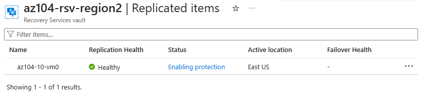

---
lab:
  title: "Labo\_10 : Implémenter la protection des données"
  module: Administer Data Protection
---

# Labo 10 - Implémenter la protection des données

## Présentation du labo    

Dans ce labo, vous découvrez la sauvegarde et la récupération de machines virtuelles Azure. Vous apprenez à créer un coffre Recovery Services et une stratégie de sauvegarde pour des machines virtuelles Azure. Vous découvrez la reprise d’activité avec Azure Site Recovery. 

Ce labo nécessite un abonnement Azure. Le type de votre abonnement peut affecter la disponibilité des fonctionnalités dans ce labo. Vous pouvez changer la région, mais les étapes sont écrites de façon à utiliser **USA Est** et **USA Ouest**.

## Durée estimée : 50 minutes

## Scénario du labo

Votre organisation évalue comment sauvegarder et restaurer des machines virtuelles Azure à partir d’une perte de données accidentelle ou malveillante. En outre, l’organisation souhaite explorer l’utilisation d’Azure Site Recovery pour des scénarios de récupération d’urgence. 

## Simulation de labo interactif

Il existe une simulation de labo interactive qui peut vous être utile pour cette rubrique. La simulation vous permet de parcourir un scénario similaire, à votre propre rythme. Il existe des différences entre la simulation interactive et ce labo, mais bon nombre des principaux concepts sont les mêmes. Un abonnement Azure n’est pas nécessaire.

+ **[Sauvegardez des machines virtuelles et des fichiers locaux](https://mslabs.cloudguides.com/guides/AZ-104%20Exam%20Guide%20-%20Microsoft%20Azure%20Administrator%20Exercise%2016)**. Créez un coffre Recovery Services et implémentez une sauvegarde de machines virtuelles Azure. Implémentez une sauvegarde de dossier et de dossier local en utilisant l’agent Microsoft Azure Recovery Services. Les sauvegardes locales se trouvent en dehors de l’étendue de ce labo, mais il peut être utile d’afficher ces étapes. 

## Compétences de tâche

+ Tâche 1 : Utilisez un modèle pour approvisionner une infrastructure.
+ Tâche 2 : Créer et configurer un coffre Recovery Services
+ Tâche 3 : Configurez une sauvegarde au niveau d’une machine virtuelle Azure.
+ Tâche 4 : Surveillez Sauvegarde Azure.
+ Tâche 5 : Activez la réplication de machines virtuelles. 

## Durée estimée : 40 minutes

## Diagramme de l'architecture

## Tâche 1 : Utilisez un modèle pour approvisionner une infrastructure.

Dans cette tâche, vous allez utiliser un modèle pour déployer une machine virtuelle. Cette machine virtuelle sera utilisée pour tester différents scénarios de sauvegarde.

1. Téléchargez les fichiers de labo **\\Allfiles\\Lab10\\**.

1. Connectez-vous au **portail Azure** - `https://portal.azure.com`.

1. Recherchez et sélectionnez `Deploy a custom template`.

1. Dans la page du déploiement personnalisé, sélectionnez **Créer votre propre modèle dans l’éditeur**.

1. Sur la page de modification du modèle, sélectionnez **Charger le fichier**.

1. Recherchez et sélectionnez le fichier **\\Allfiles\\Lab10\\az104-10-vms-edge-template.json**, puis sélectionnez **Ouvrir**.

   >**Remarque :** Prenez un moment pour passer en revue le modèle. Nous déployons un réseau virtuel et une machine virtuelle afin d’illustrer la sauvegarde et la récupération. 

1. **Enregistrez** les changements apportés.

1. Sélectionnez **Modifier les paramètres**, puis **Charger le fichier**.

1. Chargez et sélectionnez le fichier **\\Allfiles\\Lab10\\az104-10-vms-edge-parameters.json**.

1. **Enregistrez** les changements apportés.

1. Utilisez les informations suivantes pour remplir les champs du déploiement personnalisé, en laissant tous les autres champs avec leur valeur par défaut :

    | Paramètre       | Valeur         | 
    | ---           | ---           |
    | Abonnement  | Votre abonnement Azure |
    | Resource group| `az104-rg-region1` (Si nécessaire, sélectionnez **Créer**)
    | Région        | **USA Est**   |
    | Nom d’utilisateur      | **localadmin**   |
    | Mot de passe      | Fournir un mot de passe complexe |

1. Sélectionnez **Vérifier + créer**, puis **Créer**.

    >**Remarque :** Attendez que le modèle soit déployé, puis sélectionnez **Accéder à la ressource**. Vous devez disposer d’une machine virtuelle dans un réseau virtuel. 

## Tâche 2 : Créer et configurer un coffre Recovery Services

Dans cette tâche, vous allez créer un coffre Recovery Services. Un coffre Recovery Services offre un stockage pour les données de machine virtuelle. 

1. Dans le Portail Azure, recherchez et sélectionnez `Recovery Services vaults`, puis dans le volet **Coffres Recovery Services**, cliquez sur **+ Créer**.

1. Dans le panneau **Créer un coffre Recovery Services**, spécifiez les paramètres suivants :

    | Paramètres | Valeur |
    | --- | --- |
    | Abonnement | nom de votre abonnement Azure |
    | Resource group | `az104-rg-region1`  |
    | Nom du coffre | `az104-rsv-region1` |
    | Région | **USA Est** |

    >**Remarque** : Vérifiez que vous spécifiez la même région dans laquelle vous avez déployé des machines virtuelles dans la tâche précédente.

    

1. Cliquez sur **Vérifier + Créer**, vérifiez que la validation réussit, puis cliquez sur **Créer**.

    >**Remarque** : Attendez la fin du déploiement. Le déploiement doit prendre quelques minutes. 

1. Une fois le déploiement terminé, cliquez sur **Accéder à la ressource**.

1. Dans le volet du coffre Recovery Services, dans la section **Paramètres**, cliquez sur **Propriétés**.

1. Sélectionnez le lien **Mettre à jour** sous l’étiquette **Configuration de la sauvegarde**.

1. Dans le panneau **Configuration de la sauvegarde** , passez en revue les choix pour le **type de réplication stockage**. Conservez le paramètre **Géoredondant** par défaut et fermez le volet.

    >**Remarque** : Ce paramètre peut être configuré uniquement s’il n’existe aucun élément de sauvegarde existant.
    
    >**Le saviez-vous ?** L’option Restauration interrégion vous permet de restaurer des données dans une [région secondaire, appariée à Azure](https://learn.microsoft.com/azure/backup/backup-create-recovery-services-vault#set-cross-region-restore). 

1. Revenez au panneau du coffre Recovery Services, cliquez sur le lien **Mettre à jour** sous l’étiquette **Paramètre de sécurité > Suppression réversible et paramètres de sécurité**.

1. Dans le panneau **Paramètres de sécurité**, notez que l’option **Suppression réversible (pour les charges de travail s’exécutant dans Azure)** est **activée**. Notez que la **période de rétention de suppression réversible** est de **14** jours. 

1. Revenez au panneau du coffre Recovery Services, sélectionnez le panneau **Vue d’ensemble**.

>**Le saviez-vous ?** Azure dispose de deux types de coffres : Coffres Recovery Services et coffres de sauvegarde. La principale différence réside dans les sources de données que vous pouvez sauvegarder. Découvrez plus d’informations sur [les différences](https://learn.microsoft.com/answers/questions/405915/what-is-difference-between-recovery-services-vault).

## Tâche 3 : Configurez une sauvegarde au niveau d’une machine virtuelle Azure.

Dans cette tâche, vous allez implémenter une sauvegarde au niveau de la machine virtuelle Azure. Dans le cadre d’une sauvegarde de machine virtuelle, vous devez définir la stratégie de rétention et de sauvegarde qui s’applique à la sauvegarde. Différentes machines virtuelles peuvent se voir affecter des stratégies de rétention et de sauvegarde différentes.

   >**Remarque** : Avant de commencer cette tâche, assurez-vous que le déploiement que vous avez lancé dans la première tâche de ce laboratoire a réussi.

1. Dans le volet du coffre Recovery Services, cliquez sur **Vue d’ensemble**, puis sur **+ Sauvegarde**.

1. Dans le panneau **Objectif de la sauvegarde**, spécifiez les paramètres suivants :

    | Paramètres | Valeur |
    | --- | --- |
    | Où s'exécute votre charge de travail ? | **Azure** (notez vos autres options) |
    | Que souhaitez-vous sauvegarder ? | **Machine virtuelle** (notez vos autres options) |

1. Sélectionnez **Sauvegarder**.

1. Notez qu’il existe deux **Sous-types de stratégie** : **Amélioré** et **Standard**. Passez en revue les choix, puis sélectionnez **Standard**. 

1. Dans **Stratégie de sauvegarde**, sélectionnez **Créer une stratégie**.

1. Définissez une nouvelle stratégie de sauvegarde avec les paramètres suivants (laissez les autres avec leur valeur par défaut) :

    | Paramètre | Valeur |
    | ---- | ---- |
    | Nom de la stratégie | `az104-backup` |
    | Fréquence | **Tous les jours** |
    | Temps | **12 h 00** |
    | Fuseau horaire | nom de votre fuseau horaire local |
    | Conserver le ou les instantanés de récupération instantanée pour | **2** jour(s) |

    

1. Cliquez sur **OK** pour créer la stratégie, puis, dans la section **Machines virtuelles**, sélectionnez **Ajouter**.

1. Dans le volet **Sélectionner des machines virtuelles**, sélectionnez **az-104-10-vm0**, cliquez sur **OK**, puis, de retour dans le volet **Sauvegarde**, cliquez sur **Activer la sauvegarde**.

    >**Remarque** : Attendez que la sauvegarde soit activée. Cette opération doit prendre environ 2 minutes.

1. Dans la section **Éléments protégés**, cliquez sur **Éléments de sauvegarde**, puis sur l’entrée de **Machine virtuelle Azure**.

1. Sélectionnez le lien **Afficher les détails** pour **az104-10-vm0**, puis passez en revue les valeurs des entrées **Prévérification de sauvegarde** et **État de la dernière sauvegarde**.

    >**Remarque :** Notez que la sauvegarde est en attente.
    
1. Sélectionnez **Sauvegarder maintenant**, acceptez la valeur par défaut dans la liste déroulante **Conserver la sauvegarde jusqu’au**, puis cliquez sur **OK**.

    >**Remarque** : N’attendez pas que la sauvegarde se termine. Passez à la tâche suivante.

## Tâche 4 : Surveillez Sauvegarde Azure.

Dans cette tâche, vous allez déployer un compte de stockage Azure. Vous allez ensuite configurer le coffre pour envoyer les journaux et les métriques au compte de stockage. Vous pouvez utiliser ce référentiel par la suite avec Log Analytics ou d’autres solutions de monitoring tierces.

1. Dans le Portail Azure, recherchez et sélectionnez `Storage accounts`.

1. Dans la page des comptes de stockage, sélectionnez **Créer**.

1. Utilisez les informations suivantes pour définir le compte de stockage, puis sélectionnez **Vérifier**.

    | Paramètres | Valeur |
    | --- | --- | 
    | Abonnement          | *Votre abonnement*    |
    | Resource group        | **az104-rg-region1**        |
    | Nom du compte de stockage  | Fournir un nom globalement unique   |
    | Région                | **USA Est**   |

1. Sous l’onglet Vérifier, sélectionnez **Créer**.

    >**Remarque** : Attendez la fin du déploiement. Le processus prend environ une minute.

1. Recherchez et sélectionnez votre coffre Recovery Services.

1. Sélectionnez **Paramètres de diagnostic**, puis **Ajouter un paramètre de diagnostic**.

1. Nommez le paramètre `Logs and Metrics to storage`.

1. Placez une coche à côté des catégories de journaux et de métriques suivantes :

    - **Données de rapport de sauvegarde Azure**
    - **Extension Données du travail de sauvegarde Azure**
    - **Extension Données d’alerte de sauvegarde Azure**
    - **Travaux Azure Site Recovery**
    - **Événements Azure Site Recovery**
    - **Intégrité**

1. Dans les détails de destination, placez une coche à côté de **Archiver dans un compte de stockage**.

1. Dans le champ déroulant du compte de stockage, sélectionnez le compte de stockage déployé plus tôt dans cette tâche.

1. Sélectionnez **Enregistrer**.

1. Revenez à votre coffre Recovery Services, dans le panneau **Surveillance**, sélectionnez **Travaux de sauvegarde**.

1. Recherchez l’opération de sauvegarde de la machine virtuelle **az104-10-vm0**. 

1. Passez en revue les détails du travail de sauvegarde.

## Tâche 5 : Activer la réplication des machines virtuelles

1. Dans le Portail Azure, recherchez et sélectionnez `Recovery Services vaults`, puis dans le volet **Coffres Recovery Services**, cliquez sur **+ Créer**.

1. Dans le panneau **Créer un coffre Recovery Services**, spécifiez les paramètres suivants :

    | Paramètres | Valeur |
    | --- | --- |
    | Abonnement | nom de votre abonnement Azure |
    | Resource group | `az104-rg-region2` (Si nécessaire, sélectionnez **Créer**) |
    | Nom du coffre | `az104-rsv-region2` |
    | Région | **USA Ouest** |

    >**Remarque** : Vérifiez que vous spécifiez une région **différente** de celle de la machine virtuelle.

1. Cliquez sur **Vérifier + Créer**, vérifiez que la validation réussit, puis cliquez sur **Créer**.

    >**Remarque** : Attendez la fin du déploiement. Le déploiement doit prendre quelques minutes. 

1. Recherchez et sélectionnez la machine virtuelle `az104-10-vm0`.

1. Dans le panneau **Sauvegarde + Récupération d’urgence**, sélectionnez **Récupération d’urgence**. 

1. Sélectionnez **Activer la réplication**.

1. Sous l’onglet **Informations de base**, notez la **Région cible**.

1. Passez à l’onglet **Paramètres avancés**. Nous avons effectué des sélections de ressources pour vous. Il est important de les examiner. 

1. Vérifiez vos paramètres d’abonnement, de groupe de ressources de machine virtuelle, de réseau virtuel et de disponibilité (prenez les valeurs par défaut).

1. Dans **Paramètres de stockage**, sélectionnez **Afficher les détails**.

    | Paramètre | Valeur |
    | ---- | ---- |
    | Attrition pour la machine virtuelle | **Attrition normale**  |
    | Compte de stockage de cache | **(nouveau) xxx**  |

   >**Remarque :** Il est important que ces deux paramètres soient renseignés. Sinon, la validation échoue. Si les valeurs ne sont pas présentes, essayez d’actualiser la page. Si cela ne fonctionne pas, créez un compte de stockage vide, puis revenez à cette page.

1. Dans **Paramètres de réplication**, sélectionnez **Afficher les détails**. Notez que le coffre de vos ressources de récupération dans la région 2 a été automatiquement sélectionné.

1. Sélectionnez **Examiner + démarrer la réplication**, puis **Activer la réplication**.

    >**Remarque** : L’activation de la réplication prend entre 10 et 15 minutes. Regardez les messages de notification dans le coin supérieur droit du portail. Pendant que vous attendez, vous pouvez examiner des liens de formation auto-rythmée à la fin de cette page.
    
1. Une fois la réplication terminée, recherchez et localisez votre coffre Recovery Services, **az104-rsv-region2**. Vous devrez peut-être **actualiser** la page. 

1. Dans la section **Éléments protégés**, sélectionnez **Éléments répliqués**.

1. Vérifiez que la machine virtuelle s’affiche comme saine pour l’intégrité de la réplication. Notez que l’état affiche l’état de synchronisation (à partir de 0 %) et affiche finalement **Protégé** une fois la synchronisation initiale terminée.

   

1. Sélectionnez la machine virtuelle pour afficher plus d’informations.
   
>**Le saviez-vous ?** Il est conseillé de [tester le basculement d’une machine virtuelle protégée](https://learn.microsoft.com/azure/site-recovery/tutorial-dr-drill-azure#run-a-test-failover-for-a-single-vm).

## Nettoyage de vos ressources

Si vous travaillez avec **votre propre abonnement**, prenez un moment pour supprimer les ressources du labo. Ceci garantit que les ressources sont libérées et que les coûts sont réduits. Le moyen le plus simple de supprimer les ressources du labo est de supprimer le groupe de ressources du labo. 

+ Dans le Portail Azure, sélectionnez le groupe de ressources, **Supprimer le groupe de ressources**, **Entrer le nom du groupe de ressources**, puis cliquez sur **Supprimer**.
+ `Remove-AzResourceGroup -Name resourceGroupName` en utilisant Azure PowerShell.
+ `az group delete --name resourceGroupName` en utilisant l’interface CLI.

## Points clés

Félicitations, vous avez terminé le labo. Voici les principaux points à retenir de ce labo. 

+ Le service Sauvegarde Azure fournit des solutions simples, sécurisées et rentables pour sauvegarder et récupérer vos données.
+ Sauvegarde Azure peut protéger des ressources locales et cloud, notamment les machines virtuelles et les partages de fichiers.
+ Les stratégies Sauvegarde Azure configurent la fréquence des sauvegardes et la période de rétention des points de récupération. 
+ Azure Site Recovery est une solution de récupération d’urgence qui fournit une protection pour vos machines virtuelles et applications.
+ Azure Site Recovery réplique vos charges de travail sur un site secondaire et, en cas de panne ou de sinistre, vous pouvez basculer vers le site secondaire et reprendre vos opérations avec un temps d’arrêt minimal.
+ Un coffre Recovery Services stocke vos données de sauvegarde et réduit la surcharge de gestion.

## En savoir plus grâce à l’apprentissage auto-rythmé

+ [Protéger vos machines virtuelles en utilisant Sauvegarde Azure](https://learn.microsoft.com/training/modules/protect-virtual-machines-with-azure-backup/). Utilisez la sauvegarde Azure pour vous aider à protéger des serveurs locaux, des machines virtuelles, un SQL Server, des partages de fichiers Azure et d’autres charges de travail.
+ [Protégez votre infrastructure Azure avec Azure Site Recovery](https://learn.microsoft.com/en-us/training/modules/protect-infrastructure-with-site-recovery/). Assurez la reprise d’activité de votre infrastructure Azure en personnalisant la réplication, le basculement et la restauration automatique des machines virtuelles Azure avec Azure Site Recovery.
