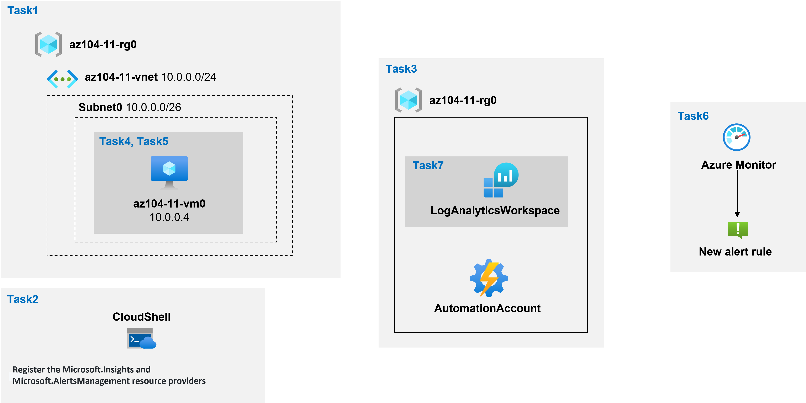

---
lab:
  title: '11 : Implémenter la supervision'
  module: Administer Monitoring
---

# <a name="lab-11---implement-monitoring"></a>Labo 11 : Implémenter la supervision
# <a name="student-lab-manual"></a>Manuel de labo de l’étudiant

## <a name="lab-scenario"></a>Scénario du labo

Vous devez évaluer les fonctionnalités Azure qui fournissent des insights sur les performances et la configuration des ressources Azure, et plus particulièrement les machines virtuelles Azure. Pour ce faire, vous voulez examiner les fonctionnalités d’Azure Monitor, y compris Log Analytics.

**Remarque :** Une **[simulation de labo interactive](https://mslabs.cloudguides.com/guides/AZ-104%20Exam%20Guide%20-%20Microsoft%20Azure%20Administrator%20Exercise%2017)** est disponible et vous permet de progresser à votre propre rythme. Il peut exister de légères différences entre la simulation interactive et le labo hébergé. Toutefois, les concepts et idées de base présentés sont identiques. 

## <a name="objectives"></a>Objectifs

Dans ce labo, vous allez :

+ Tâche 1 : Approvisionner l’environnement de laboratoire
+ Tâche 2 : Inscrire les fournisseurs de ressources Microsoft.Insights et Microsoft.AlertsManagement
+ Tâche 3 : Créer et configurer un espace de travail Azure Log Analytics et des solutions basées sur Azure Automation
+ Tâche 4 : Passer en revue les paramètres de supervision par défaut des machines virtuelles Azure
+ Tâche 5 : Configurer les paramètres de diagnostic des machines virtuelles Azure
+ Tâche 6 : Passer en revue les fonctionnalités d’Azure Monitor
+ Tâche 7 : Passer en revue les fonctionnalités d’Azure Log Analytics

## <a name="estimated-timing-45-minutes"></a>Durée estimée : 45 minutes

## <a name="architecture-diagram"></a>Diagramme de l'architecture



## <a name="instructions"></a>Instructions

### <a name="exercise-1"></a>Exercice 1

#### <a name="task-1-provision-the-lab-environment"></a>Tâche 1 : Approvisionner l’environnement de laboratoire

Dans cette tâche, vous allez déployer une machine virtuelle qui sera utilisée pour tester les scénarios de supervision.

1. Connectez-vous au [portail Azure](https://portal.azure.com).

1. Dans le portail Azure, ouvrez **Azure Cloud Shell** en cliquant sur l’icône située en haut à droite du portail Azure.

1. Lorsque vous êtes invité à sélectionner **Bash** ou **PowerShell**, sélectionnez **PowerShell**.

    >**Remarque** : Si c’est la première fois que vous démarrez **Cloud Shell** et que vous voyez le message **Vous n’avez aucun stockage monté**, sélectionnez l’abonnement que vous utilisez dans ce labo, puis sélectionnez **Créer un stockage**.

1. Dans la barre d'outils du volet Cloud Shell, cliquez sur l'icône **Charger/Télécharger des fichiers**, dans le menu déroulant, cliquez sur **Charger** et hargez les fichiers **\\Allfiles\\Labs\\11\\az104-11-vm-template.json** et **\\Allfiles\\Labs\\11\\az104-11-vm-parameters.json** dans le répertoire d'origine de Cloud Shell.

1. Modifiez le fichier de paramètres que vous venez de charger et modifiez le mot de passe. Si vous avez besoin d’aide pour modifier le fichier dans Shell, demandez à votre instructeur de l’aide. Comme meilleure pratique, les secrets, comme les mots de passe, doivent être stockés de manière plus sécurisée dans le Key Vault. 

1. Dans le volet Cloud Shell, exécutez la commande suivante pour créer le groupe de ressources qui hébergera les machines virtuelles (remplacez l’espace réservé `[Azure_region]` par le nom d’une région Azure dans laquelle vous envisagez de déployer des machines virtuelles Azure) :

    >**Remarque** : Veillez à choisir l’une des régions répertoriées en tant que **région d’espace de travail Log Analytics** dans la documentation référencée dans la [documentation sur les mappages d’espace de travail](https://docs.microsoft.com/en-us/azure/automation/how-to/region-mappings)

   ```powershell
   $location = '[Azure_region]'

   $rgName = 'az104-11-rg0'

   New-AzResourceGroup -Name $rgName -Location $location
   ```

1. Dans le volet Cloud Shell, exécutez la commande suivante pour créer le premier réseau virtuel et déployer une machine virtuelle dans celui-ci à l’aide du modèle et des fichiers de paramètres que vous avez chargés :

   ```powershell
   New-AzResourceGroupDeployment `
      -ResourceGroupName $rgName `
      -TemplateFile $HOME/az104-11-vm-template.json `
      -TemplateParameterFile $HOME/az104-11-vm-parameters.json `
      -AsJob
   ```

    >**Remarque** : N’attendez pas que le déploiement se termine, mais passez à la tâche suivante. Le déploiement doit prendre environ 3 minutes.

#### <a name="task-2-register-the-microsoftinsights-and-microsoftalertsmanagement-resource-providers"></a>Tâche 2 : Inscrire les fournisseurs de ressources Microsoft.Insights et Microsoft.AlertsManagement.

1. Dans le volet Cloud Shell, exécutez la commande suivante pour inscrire les fournisseurs de ressources Microsoft.Insights et Microsoft.AlertsManagement.

   ```powershell
   Register-AzResourceProvider -ProviderNamespace Microsoft.Insights

   Register-AzResourceProvider -ProviderNamespace Microsoft.AlertsManagement
   ```

1. Réduisez le volet Cloud Shell (mais sans le fermer).

#### <a name="task-3-create-and-configure-an-azure-log-analytics-workspace-and-azure-automation-based-solutions"></a>Tâche 3 : Créer et configurer un espace de travail Azure Log Analytics et des solutions basées sur Azure Automation

Dans cette tâche, vous allez créer et configurer un espace de travail Azure Log Analytics et des solutions basées sur Azure Automation

1. Dans le Portail Azure, recherchez et sélectionnez **Espaces de travail Log Analytics** puis, dans le volet **Espaces de travail Log Analytics**, cliquez sur **+ Créer**.

1. Sous l’onglet **Informations de base** du volet **Créer un espace de travail Log Analytics**, entrez les paramètres suivants, cliquez sur **Vérifier + Créer**, puis sur **Créer** :

    | Paramètres | Valeur |
    | --- | --- |
    | Abonnement | le nom de l’abonnement Azure que vous utilisez dans ce labo |
    | Groupe de ressources | le nom d’un nouveau groupe de ressources **az104-11-rg1** |
    | Espace de travail Log Analytics | tout nom unique |
    | Région | le nom de la région Azure dans laquelle vous avez déployé la machine virtuelle dans la tâche précédente |

    >**Remarque** : Vérifiez que vous spécifiez la même région dans laquelle vous avez déployé des machines virtuelles dans la tâche précédente.

    >**Remarque** : Attendez la fin du déploiement. Le déploiement doit prendre environ 1 minute.

1. Dans le portail Azure, recherchez et sélectionnez **Comptes Automation** puis, dans le panneau **Comptes Automation**, cliquez sur **+ Créer**.

1. Dans le volet **Créer un compte Automation**, spécifiez les paramètres suivants, cliquez sur **Vérifier + Créer** lors de la validation, puis cliquez sur **Créer** :

    | Paramètres | Valeur |
    | --- | --- |
    | Nom du compte Automation | tout nom unique |
    | Abonnement | le nom de l’abonnement Azure que vous utilisez dans ce labo |
    | Groupe de ressources | **az104-11-rg1** |
    | Région | le nom de la région Azure déterminée en fonction de la [documentation sur les mappages d’espace de travail](https://docs.microsoft.com/en-us/azure/automation/how-to/region-mappings) |

    >**Remarque** : Vérifiez que vous spécifiez la région Azure en fonction de la [documentation sur les mappages d’espace de travail](https://docs.microsoft.com/en-us/azure/automation/how-to/region-mappings)

    >**Remarque** : Attendez la fin du déploiement. Le déploiement peut prendre environ 3 minutes.

1. Cliquez sur **Accéder à la ressource**.

1. Dans le volet du compte Automation, dans la section **Gestion de la configuration**, cliquez sur **Inventaire**.

1. Dans le volet **Inventaire**, dans la liste déroulante **Espace de travail Log Analytics**, sélectionnez l’espace de travail Log Analytics que vous avez créé précédemment dans cette tâche, puis cliquez sur **Activer**.

    >**Remarque** : Attendez que l’installation de la solution Log Analytics correspondante se termine. Ceci peut prendre environ 3 minutes.

    >**Remarque** : Cette opération installe automatiquement la solution **Suivi des modifications**.

1. Dans le volet du compte Automation, dans la section **Update Management**, cliquez sur **Update Management**, puis sur **Activer**.

    >**Remarque** : Attendez que l’installation se termine. Ceci peut prendre environ 5 minutes.

#### <a name="task-4-review-default-monitoring-settings-of-azure-virtual-machines"></a>Tâche 4 : Passer en revue les paramètres de supervision par défaut des machines virtuelles Azure

Dans cette tâche, vous allez passer en revue les paramètres de supervision par défaut des machines virtuelles Azure

1. Dans le Portail Azure, recherchez et sélectionnez **Machines virtuelles** puis, dans le volet **Machines virtuelles**, cliquez sur **az104-11-vm0**.

1. Dans le volet **az104-11-vm0**, dans la section **Supervision**, cliquez sur **Métriques**.

1. Dans le volet **az104-11-vm0 \| Métriques**, dans le graphique par défaut, notez que le seul **Espace de noms de métriques** disponible est **Hôte de machine virtuelle**.

    >**Remarque** : Cela est attendu, car aucun paramètre de diagnostic au niveau de l’invité n’a encore été configuré. Toutefois, vous avez la possibilité d’activer les métriques de mémoire d'invité directement à partir de la liste déroulante **Espace de noms de métriques**. Vous l’activerez plus tard dans cet exercice.

1. Dans la liste déroulante **Métriques**, passez en revue la liste des métriques disponibles.

    >**Remarque** : La liste inclut une plage de métriques liées au processeur, au disque et au réseau qui peuvent être collectées à partir de l’hôte de machine virtuelle, sans avoir accès aux métriques au niveau de l’invité.

1. Dans la liste déroulante **Métriques**, sélectionnez **Pourcentage d’UC**, dans la liste déroulante **Agrégation**, sélectionnez **Moy** et examinez le graphique obtenu.

#### <a name="task-5-configure-azure-virtual-machine-diagnostic-settings"></a>Tâche 5 : Configurer les paramètres de diagnostic des machines virtuelles Azure

Dans cette tâche, vous allez configurer les paramètres de diagnostic des machines virtuelles Azure.

1. Dans le volet **az104-11-vm0**, dans la section **Supervision**, cliquez sur **Paramètres de diagnostic**.

1. Sous l’onglet **Vue d’ensemble** du volet **az104-11-vm0 \| Paramètres de diagnostic**, cliquez sur **Activer la supervision d’invités**.

    >**Remarque** : Attendez que l’opération s’applique. Ceci peut prendre environ 3 minutes.

1. Basculez vers l’onglet **Compteurs de performances** du volet **az104-11-vm0 \| Paramètres de diagnostic** et passez en revue les compteurs disponibles.

    >**Remarque** : Par défaut, les compteurs d’UC, de mémoire, de disque et réseau sont activés. Vous pouvez basculer vers l’affichage **Personnalisé** pour obtenir une liste plus détaillée.

1. Basculez vers l’onglet **Journaux** du volet **az104-11-vm0 \| Paramètres de diagnostic** et passez en revue les options de collecte des journaux d’événements disponibles.

    >**Remarque** : Par défaut, la collecte des journaux inclut les entrées critiques, d’erreur et d’avertissement du journal des applications et du journal système, ainsi que les entrées d’échec d’audit du journal de sécurité. Vous pouvez également basculer vers l’affichage **Personnalisé** pour obtenir des paramètres de configuration plus détaillés.

1. Dans le volet **az104-11-vm0**, dans la section **Supervision**, cliquez sur **Agent Log Analytics**, puis sur **Activer**.

1. Dans le volet **az104-11-vm0 - Journaux**, vérifiez que l’espace de travail Log Analytics que vous avez créé précédemment dans ce labo est sélectionné dans la liste déroulante **Choisir un espace de travail Log Analytics**, puis cliquez sur **Activer**.

    >**Remarque** : N’attendez pas que l’opération se termine, mais passez à la tâche suivante. L’opération peut prendre environ 5 minutes.

1. Dans le volet **az104-11-vm0 \| Journaux**, dans la section **Supervision**, cliquez sur **Métriques**.

1. Dans le volet **az104-11-vm0 \| Métriques**, dans le graphique par défaut, notez qu’à ce stade la liste déroulante **Espace de noms de métriques**, en plus de l’entrée **Hôte de machine virtuelle**, inclut également l’entrée **Invité (classique)** .

    >**Remarque** : Cela est attendu, étant donné que vous avez activé les paramètres de diagnostic au niveau de l’invité. Vous avez également la possibilité d’**activer de nouvelles métriques de la mémoire invité**.

1. Dans la liste déroulante **Espace de noms de métriques**, sélectionnez l’entrée **Invité (classique)** .

1. Dans la liste déroulante **Métriques**, passez en revue la liste des métriques disponibles.

    >**Remarque** : La liste inclut des métriques supplémentaires au niveau de l’invité qui ne sont pas disponibles lorsque vous vous appuyez uniquement sur la supervision au niveau de l’hôte.

1. Dans la liste déroulante **Métriques**, sélectionnez **Mémoire\\Octets disponibles**, dans la liste déroulante **Agrégation**, sélectionnez **Max** et examinez le graphique obtenu.

#### <a name="task-6-review-azure-monitor-functionality"></a>Tâche 6 : Passer en revue les fonctionnalités d’Azure Monitor

1. Dans le Portail Azure, recherchez et sélectionnez **Superviser** puis, dans le volet **Superviser \| Vue d’ensemble**, cliquez sur **Métriques**.

1. Dans le volet **Sélectionner une étendue**, sous l’onglet **Parcourir**, accédez au groupe de ressources **az104-11-rg0**, développez-le, cochez la case en regard de l’entrée de machine virtuelle **az104-11-vm0** dans ce groupe de ressources, puis cliquez sur **Appliquer**.

    >**Remarque** : Vous obtenez le même affichage et les mêmes options que celles disponibles dans le volet **az104-11-vm0 - Métriques**.

1. Dans la liste déroulante **Métriques**, sélectionnez **Pourcentage d’UC**, dans la liste déroulante **Agrégation**, sélectionnez **Moy** et examinez le graphique obtenu.

1. Dans le volet **Superviser \| Métriques**, dans le volet **Pourcentage d’UC moyen pour az104-11-vm0**, cliquez sur **Nouvelle règle d’alerte**.

    >**Remarque** : La création d’une règle d’alerte à partir de métriques n’est pas prise en charge pour les métriques de l’espace de noms de métrique Invité (classique). Pour ce faire, vous pouvez utiliser des modèles Azure Resource Manager, comme décrit dans le document [Envoyer des métriques de système d’exploitation invité vers le magasin de métriques d’Azure Monitor à l’aide d’un modèle Resource Manager pour une machine virtuelle Windows](https://docs.microsoft.com/en-us/azure/azure-monitor/platform/collect-custom-metrics-guestos-resource-manager-vm)

1. Dans le volet **Créer une règle d’alerte**, dans la section **Condition**, cliquez sur l’entrée de condition existante.

1. Dans le volet **Configurer la logique du signal**, dans la liste des signaux, dans la section **Logique d’alerte**, spécifiez les paramètres suivants (conservez les valeurs par défaut pour les autres) et cliquez sur **Terminé** :

    | Paramètres | Valeur |
    | --- | --- |
    | Seuil | **Statique** |
    | Opérateur | **Supérieur à** |
    | Type d’agrégation | **Average** |
    | Valeur du seuil | **2** |
    | Précision d’agrégation (période) | **1 minute** |
    | Fréquence d’évaluation | **Toutes les minutes** |

1. Cliquez sur **Suivant : Actions >** , dans le volet **Créer une règle d’alerte**, dans la section **Groupe d’actions**, cliquez sur le bouton **+ Créer un groupe d’actions**.

1. Sous l’onglet **Informations de base**, dans le volet **Créer un groupe d’actions**, spécifiez les paramètres suivants (conservez les valeurs par défaut pour les autres), puis sélectionnez **Suivant : Notifications >** :

    | Paramètres | Valeur |
    | --- | --- |
    | Abonnement | le nom de l’abonnement Azure que vous utilisez dans ce labo |
    | Groupe de ressources | **az104-11-rg1** |
    | Nom du groupe d’actions | **az104-11-ag1** |
    | Nom d’affichage | **az104-11-ag1** |

1. Sous l’onglet **Notifications** du volet **Créer un groupe d’actions**, dans la liste déroulante **Type de notification**, sélectionnez **E-mail/SMS/Push/Voice**. Dans la zone de texte **Nom**, tapez **adresse e-mail administrateur**. Cliquez sur l’icône **Modifier les détails** (crayon).

1. Dans le volet **E-mail/SMS/Push/Voice**, cochez la case **E-mail**, tapez votre adresse e-mail dans la zone de texte **E-mail**, conservez les valeurs par défaut pour les autres personnes, cliquez sur **OK**. Revenez sous l’onglet **Notifications** du volet **Créer un groupe d’actions** et sélectionnez **Suivant : Actions  >** .

1. Sous l’onglet **Actions** du volet **Créer un groupe d’actions**, passez en revue les éléments disponibles dans la liste déroulante **Type d’action** sans apporter de modifications, puis sélectionnez **Vérifier + créer**.

1. Sous l’onglet **Vérifier + créer** du volet **Créer un groupe d’actions**, sélectionnez **Créer**.

1. Revenez dans le volet **Créer une règle d’alerte** et cliquez sur **Suivant : Détails >**  puis, dans la section **Détails des règles d’alerte**, spécifiez les paramètres suivants (conservez les valeurs par défaut pour les autres) :

    | Paramètres | Valeur |
    | --- | --- |
    | Nom de la règle d’alerte | **Pourcentage d’UC supérieur au seuil de test** |
    | Description de la règle d'alerte | **Pourcentage d’UC supérieur au seuil de test** |
    | severity | **Gravité 3** |
    | Activer à la création | **Oui** |

1. Cliquez sur **Vérifier + créer** puis, dans le volet **Vérifier + créer**, cliquez sur **Créer**.

    >**Remarque** : L’activation d’une règle d’alerte de métrique peut prendre jusqu’à 10 minutes.

1. Dans le Portail Azure, recherchez et sélectionnez **Machines virtuelles** puis, dans le volet **Machines virtuelles**, cliquez sur **az104-11-vm0**.

1. Dans le volet **az104-11-vm0**, cliquez sur **Connecter**, dans la liste déroulante, cliquez sur **RDP**, dans le volet **Connecter avec RDP**, cliquez sur **Télécharger le fichier RDP** et suivez les invites pour démarrer la session Bureau à distance.

    >**Remarque** : Cette étape fait référence à la connexion via le Bureau à distance à partir d’un ordinateur Windows. Sur un Mac, vous pouvez utiliser le client Bureau à distance disponible sur le Mac App Store. Sur un ordinateur Linux, vous pouvez utiliser un logiciel client RDP open source.

    >**Remarque** : Vous pouvez ignorer toutes les invites d’avertissement lors de la connexion aux machines virtuelles cibles.

1. Lorsque vous y êtes invité, connectez-vous à l’aide du nom d’utilisateur **étudiant** et du mot de passe du fichier de paramètres.

1. Dans la session Bureau à distance, cliquez sur **Démarrer**, développez le dossier **Système Windows**, puis cliquez sur **Invite de commandes**.

1. Dans l’invite de commandes, exécutez la commande suivante pour déclencher une utilisation accrue du processeur sur la machine virtuelle Azure **az104-11-vm0** :

   ```sh
   for /l %a in (0,0,1) do echo a
   ```

    >**Remarque** : Cette opération lance la boucle infinie qui doit augmenter l’utilisation du processeur au-dessus du seuil de la règle d’alerte nouvellement créée.

1. Laissez la session Bureau à distance ouverte et revenez à la fenêtre du navigateur affichant le Portail Azure sur votre ordinateur de labo.

1. Dans le Portail Azure, revenez au volet **Superviser**, puis cliquez sur **Alertes**.

1. Notez le nombre d’alertes **Sev 3**, puis cliquez sur la ligne **Sev 3**.

    >**Remarque** : Vous devrez peut-être attendre quelques minutes et cliquer sur **Actualiser**.

1. Dans le volet **Toutes les alertes**, passez en revue les alertes générées.

#### <a name="task-7-review-azure-log-analytics-functionality"></a>Tâche 7 : Passer en revue les fonctionnalités d’Azure Log Analytics

1. Dans le Portail Azure, revenez au volet **Superviser**, puis cliquez sur **Journaux**.

    >**Remarque** : Vous devrez peut-être cliquer sur **Démarrer** si vous accédez à Log Analytics pour la première fois.

1. Si nécessaire, cliquez sur **Sélectionner une étendue**. Dans le volet **Sélectionner une étendue**, sélectionnez l’onglet **Récent**, sélectionnez **az104-11-vm0**, puis cliquez sur **Appliquer**.

1. Dans la fenêtre de requête, collez la requête suivante, cliquez sur **Exécuter** et examinez le graphique obtenu :

   ```sh
   // Virtual Machine available memory
   // Chart the VM's available memory over the last hour.
   InsightsMetrics
   | where TimeGenerated > ago(1h)
   | where Name == "AvailableMB"
   | project TimeGenerated, Name, Val
   | render timechart
   ```

    > **Remarque** : La requête ne doit pas comporter d’erreurs (indiquées par des blocs rouges sur la barre de défilement droite). Si la requête ne colle pas sans erreurs directement à partir des instructions, collez le code de requête dans un éditeur de texte tel que le Bloc-notes, puis copiez et collez-le dans la fenêtre de requête à partir de là.


1. Cliquez sur **Requêtes** dans la barre d’outils. Dans le volet **Requêtes**, recherchez la vignette **Suivre la disponibilité des machines virtuelles** et double-cliquez dessus pour remplir la fenêtre de requête. Cliquez sur le bouton **Exécuter la commande** dans la vignette, puis passez en revue les résultats.

1. Sous l’onglet **Nouvelle requête 1**, sélectionnez l’en-tête **Tables** et passez en revue la liste des tables dans la section **Machines virtuelles**.

    >**Remarque** : Les noms de plusieurs tables correspondent aux solutions que vous avez installées précédemment dans ce labo.

1. Pointez la souris sur l’entrée **VMComputer** et cliquez sur l’icône **Afficher un aperçu des données**.

1. Si des données sont disponibles, dans le volet **Mettre à jour**, cliquez sur **Utiliser dans l’éditeur**.

    >**Remarque** : Vous devrez peut-être attendre quelques minutes avant que les données de mise à jour ne soient disponibles.

#### <a name="clean-up-resources"></a>Nettoyer les ressources

>**Remarque** : N’oubliez pas de supprimer toutes les nouvelles ressources Azure que vous n’utilisez plus. La suppression des ressources inutilisées vous évitera d’encourir des frais inattendus.

>**Remarque** :  Ne vous inquiétez pas si les ressources de laboratoire ne peuvent pas être immédiatement supprimées. Parfois, les ressources ont des dépendances et leur suppression prend plus de temps. Il s’agit d’une tâche d’administrateur courante pour surveiller l’utilisation des ressources. Il vous suffit donc de consulter régulièrement vos ressources dans le portail pour voir comment se passe le nettoyage. 

1. Dans le portail Azure, ouvrez la session **PowerShell** dans le volet **Cloud Shell**.

1. Listez tous les groupes de ressources créés dans les labos de ce module en exécutant la commande suivante :

   ```powershell
   Get-AzResourceGroup -Name 'az104-11*'
   ```

1. Supprimez tous les groupes de ressources que vous avez créés dans les labos de ce module en exécutant la commande suivante :

   ```powershell
   Get-AzResourceGroup -Name 'az104-11*' | Remove-AzResourceGroup -Force -AsJob
   ```

    >**Remarque** : La commande s’exécute de façon asynchrone (tel que déterminé par le paramètre -AsJob). Vous pourrez donc exécuter une autre commande PowerShell immédiatement après au cours de la même session PowerShell, mais la suppression effective du groupe de ressources peut prendre quelques minutes.

#### <a name="review"></a>Révision

Dans cet exercice, vous avez :

+ Approvisionné l’environnement de labo
+ Créé et configuré un espace de travail Azure Log Analytics et des solutions basées sur Azure Automation
+ Passé en revue les paramètres de supervision par défaut des machines virtuelles Azure
+ Configuré les paramètres de diagnostic des machines virtuelles Azure
+ Passé en revue les fonctionnalités d’Azure Monitor
+ Passé en revue les fonctionnalités d’Azure Log Analytics
